# h4 Aktiivista tiedustelua, active recon.

Ole huolellinen näiden työkalujen kanssa. Porttiskannereita ja vastaavia ohjelmia saa käyttää vain harjoitusmaaleihin. Liikennettä tulee seurata toisella ohjelmalla (esim snifferi, kaikki verkkokortit on usein "any"). Osoitteiden (esim. IP-numeroiden) kanssa tulee olla tarkkana. Voit käyttää vain sellaisia työkaluja, joiden toiminnan ymmärrät kohtuullisesti. Missään tehtävässä ei tehdä palvelunestohyökkäyksiä, eli älä lähetä kohdekoneille järjetöntä määrää dataa tai pyyntöjä järjettömällä nopeudella. Lue ja tallenna itsellesi HackTheBoxin säännöt ennenkuin aloitat. Kurssin säännöissä ja oppitunnilla on annettu tarkempia ohjeita.

## z) Lue artikkelit ja katso videot, tee kustakin muistiinpanot (muutama ranskalainen viiva per artikkeli/video). Tässä z-kohdassa ei tarvitse tehdä mitään kokeita koneella.

    € Santos et al: The Art of Hacking (Video Collection): [..] 4.3 Surveying Essential Tools for Active Reconnaissance. Sisältää porttiskannauksen. 5 videota, yhteensä noin 20 min.
    Lyon 2009: Nmap Network Scanning: Chapter 1. Getting Started with Nmap Suoraan hevosen suusta: Gordon Lyon aka Fyodor Vaskovich on kirjoittanut tuon menestyneen kirjan lisäksi nmapin. Kirja maksaa 40 eur, mutta reiluna kaverina Gordon oli laittanut juuri tähän sopivat luvut ilmaiseksi nettiin.
    Silmäile (ei tarvitse lukea kokonaan, 40 liuskaa pitkä): Lyon 2009: Nmap Network Scanning: Chapter 15. Nmap Reference Guide
        Port Scanning Basics (opettele, mitä tarkoittavat: open, closed, filtered; muuten vain silmäily)
        Port Scanning Techniques (opettele, mitä ovat: -sS -sT -sU; muuten vain silmäily)
    Silmäile (ei tarvitse lukea kokonaan): man nmap

Tee ja raportoi:

Miten nmap toimii? Tee nmapilla seuraavat testit, sieppaa liikenne snifferillä (wireshark) ja analysoi tulokset. Tee testit mahdollisimman suppeasti, jotta analysointi on helpompaa. Esimerkiksi skannaa vain yksi portti yhdestä koneesta, jos ominaisuuden esittely ei hyöydy laajemmasta skannauksesta. Selitä myös, miksi nmap lähettää tuollaisia paketteja. Käytä nmap:ia normaalisti sudo:n kanssa. Kannattaa tietysti aloittaa lukemalla man-sivulta tai Nmap Reference Guidesta, mitä noilla toiminnoilla on ylipäänsä tarkoitus tehdä. Porttiskannaa ainoastaan omaa konetta omassa verkossa ja harjoitusmaaleja.

Analyysi ja selittäminen on tärkeää. Toki tarvitaan ote snifferin lokista, komento ja ote sen tulosteesta, mutta ne eivät riitä ilman selitystä.

### a) nmap TCP connect scan -sT  

    "This is the same high-level system call that web browsers, P2P clients, and most other network-enabled applications use to establish a connection"  
    Lähde: https://nmap.org/book/man-port-scanning-techniques.html  

Kyseessä siis skannaus, joka imitoi normaalia verkkosovellusten liikennettä.  
  
#### Three-Way-Handshake (port 80):

Lähde joka selittää Three-Way-Handshaken erittäin selkokielisesti: https://www.guru99.com/tcp-3-way-handshake.html

Porttiskannaus Metasploitable 2 koneen 80(HTTP) porttiin:  
```
$ sudo nmap -sT -p 80 192.168.56.8                            
Starting Nmap 7.92 ( https://nmap.org ) at 2022-05-06 09:26 EEST
mass_dns: warning: Unable to determine any DNS servers. Reverse DNS is disabled. Try using --system-dns or specify valid servers with --dns-servers
Nmap scan report for 192.168.56.8
Host is up (0.00062s latency).

PORT   STATE SERVICE
80/tcp open  http

Nmap done: 1 IP address (1 host up) scanned in 0.05 seconds
```

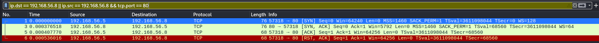

nmap lähettää TCP connect skannauksella ensin yhteydenavauspyynnöt(SYN) portille 80.  

Portin 80 palvelu hyväksyy yhteydenavauspyynnön lähettämällä takaisin Ack -numeron, jonka arvo on vastaanotettu Seq+1. Samassa paketissa on mukana myös kohteen oma yhteydenavauspyyntö (Seq). Tämä vaihe on nimeltään SYN-ACC.

Alkuperäisen pyynnön lähettäjä hyväksyy seuraavaksi yhteyspyynnön palauttamalla Acc -numero (vastaanotettu Seq+1). Näin on muodostettu turvallinen TCP -protokollaa käyttävä yhteys koneiden välille (Three-Way-Handshake).

Lopuksi kättelyn aloittanut osapuoli sulkee yhteyden ilman yhteistä neuvottelua kohteen kanssa(RST, ACK). Normaalisti yhteys suljetaan käyttäen tekniikka FIN, FIN-ACK, ACK, jossa molemmat osapuolet lähettävät yhteyden terminointipyynnöt toisilleen ja vastavuoroisesti hyväksyvät ne. Lähde: https://osqa-ask.wireshark.org/questions/1652/what-would-cause-rstack/

#### Three-Way-Handshake (port 443):  

Porttiskannaus Metasploitable 2 koneen 443(HTTPS) porttiin:
```
$ sudo nmap -sT -p 443 196.168.56.8
## Karsittu tuloste
PORT    STATE  SERVICE                                                                       
443/tcp closed https                                                                                                
``` 
  
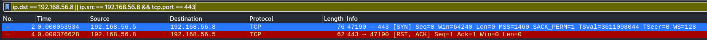
  
Porttia 443 skannatessa Three-Way-Handshakessa ei päästy edes kunnolla alkuun. Kun kohdekone vastaanotti nmap -skannausta tekevän koneen SYN -paketin, vastasi se heti hyväksymällä vastaanotetun SYN -tunnuksen lähettämällä oman ACK tunnuksensa ja samalla resetoimalla yhteyden (RST, ACK). Tämä voi tarkoittaa esimerkiksi sitä, ettei kohteen portissa 443 ole mitään palvelua käynnissä. Esimerkkitapauksessa on kyse juuri tästä, kuten aiemmasta tulosteesta. 

### b) nmap TCP SYN "used to be stealth" scan, -sS (tätä käytetään skannatessa useimmin)

    "relatively unobtrusive and stealthy since it never completes TCP connections."
    Lähde: https://nmap.org/book/man-port-scanning-techniques.html

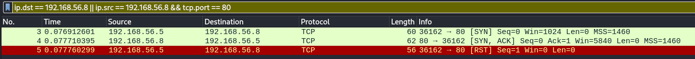

Hiljaisempi skannaus kuin TCP connect. Suurimpana erona, on ettei skannaus tee kättelyä loppuun vaan keskeyttää sen, kun kohde on lähettänyt takaisin SYN-ACC pakettinsa. Skannaus siis vain tarkistaa, että portissa on palvelu, joka vastaa pyyntöihin, mutta ei luo itse TCP -yhteyttä.  


### c) nmap ping sweep -sn 

    "This option tells Nmap not to do a port scan after host discovery, and only print out the available hosts that responded to the host discovery probes."
    Lähde: https://nmap.org/book/man-host-discovery.html

Kyseessä siis skannaus, joka jättää itse porttiskannauksen tekemättä. Ilman lisäsäätöjä komento suorittaa periaatteessa ping -komennon määritetylle IP-avaruudelle.  

Skannasin ping sweepillä virtuaalikoneeni paikallisesta verkosta kymmenen IP-osoitetta:  
```
$ sudo nmap -sn 192.168.56.1-10                                                            
Starting Nmap 7.92 ( https://nmap.org ) at 2022-05-06 11:18 EEST
mass_dns: warning: Unable to determine any DNS servers. Reverse DNS is disabled. Try using --system-dns or specify valid servers with --dns-servers
Nmap scan report for 192.168.56.1
Host is up (0.00038s latency).
MAC Address: 0A:00:27:00:00:00 (Unknown)
Nmap scan report for 192.168.56.2
Host is up (0.00046s latency).
MAC Address: 08:00:27:3A:DA:91 (Oracle VirtualBox virtual NIC)
Nmap scan report for 192.168.56.8
Host is up (0.00040s latency).
MAC Address: 08:00:27:D8:C6:08 (Oracle VirtualBox virtual NIC)
Nmap scan report for 192.168.56.5
Host is up.
Nmap done: 10 IP addresses (4 hosts up) scanned in 1.33 seconds``
```

Skannatusta osoiteavaruudesta löytyi siis neljä konetta jotka vastasivat ping -kutsuun. Yksi näistä .5 on oma koneeni.  

Wiresharkin puolella tämä näytti seuraavalta:  
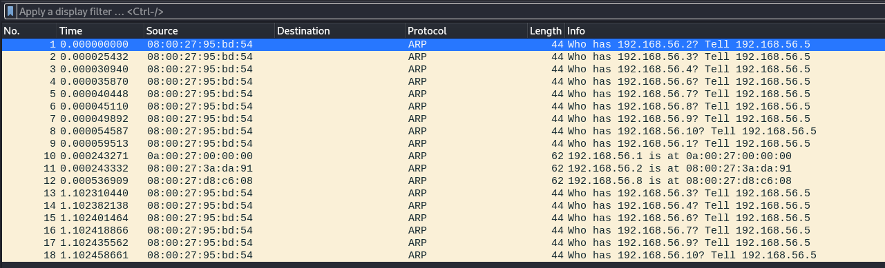  

* HUOM! Minulla on Wiresharkista kytkettynä pois asetus Resolve MAC Addresses (Edit > Preferences > Name Resolution), koska tässä virtuaalikoneympäristössä kyseinen tieto on minulle turha. Koneiden nimet ovat vain PCSCompu_95 + MAC-osoitteen loppu muodossa. Mieluummin näen koko MAC -osoitteen.  

Protokolla jolla pingauksen paketit lähetetään on ARP (Address Resolution Protocol) ja kuten kuvakaappauksesta nähdään, oma koneeni lähettää paketin jokaiseen IP-avaruuden osoitteeseen viestillä "Kenelle tämä IP-osoite kuuluu, kerro minulle", minkä jälkeen nmap skannauksessa nähtävät kolme muuta konetta vastaavat "IP osoite kuuluu laitteelle xx:xx:xx:xx.xx:xx". Tässä tapauksessa jokainen laite vastaa omasta puolestaan.

Esimerkki yhdestä pyynnöstä:  
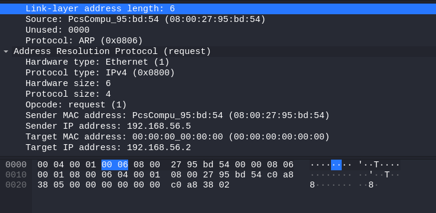

Tässä huomataan, että vastaanottajan MAC-osoite kenttä on tyhjä, koska se on asia jota pyynnöllä yritetään selvittää. 
Palautuspaketissa kyseinen kenttä on täytetty molempien koneiden osalta.  

Oma koneeni lähettää pyyntöjä useampiakin. Toisella kierroksella huomataan, että vastanneet osoitteet 1, 2 ja 8 puuttuvat listalta, koska nämä ovat jo tiedossa.

IP | MAC | Selitys
---|---|---
192.168.56.1 | 0A:00:27:00:00:00 | Virtuaalikoneeni isäntä
192.168.56.2 | 08:00:27:3A:DA:91 | vhostnet0 verkkoni DHCP-palvelin
192.168.56.8 | 08:00:27:D8:C6:08 | Metasploitable 2 

### d) nmap don't ping -Pn

    "Disabling host discovery with -Pn causes Nmap to attempt the requested scanning functions against every target IP address specified"
    Lähde: https://nmap.org/book/man-host-discovery.html

Pingauksen poisto nmap skannauksesta. Normaalisti nmap tekee porttiskannauksen vaiheittain, joista ensimmäisenä on host-discovery (ping) ja vain vastanneille koneille suoritetaan itse porttien skannaus. Mikäli kohteiden IP-osoitteet ovat jo tiedossa ja niiden tiedetään olevan käynnissä voi -Pn nopeuttaa skannausta huomattavasti, kun jokaisen kuolleen IP-osoitteen kohdalla nmap ei useampaan kertaan jää odottamaan vastausta. Toisaalta skannaus voi olla todella hidas, jos sitä tehdään osoiteavaruuteen jossa on kuolleita hosteja.

Koska koneet ovat paikallisessa verkossa, ARP-ping skannaus tehdään joka tapauksessa.  

Tein havainnollistamisen vuoksi kaksi skannausta kymmmenen IP-osoitteen osoiteavaruudelle. Tässä havainnollistan vain skannauksen nopeuseroja, joten näytän vain skannaukseen käytetyn ajan ja tarpeelliset esimerkit: 
```
$ nmap -Pn 192.168.56.0-10

### Esimerkki IP-osoitteen tuloste skannauksesta (kaikki kiinni olevat hostit palauttivat saman tekstin)
Nmap scan report for 192.168.56.1
Host is up.
All 1000 scanned ports on 192.168.56.1 are in ignored states.
Not shown: 1000 filtered tcp ports (no-response)
...
Nmap done: 11 IP addresses (11 hosts up) scanned in 16.28 seconds

$ nmap 192.168.56.0-10
Nmap done: 11 IP addresses (2 hosts up) scanned in 1.58 seconds
```

Aikaisemmista pingauksista verkkoon tiesin jo, että vain muutama kone verkossa on päällä. Kuten tuloksesta huomataan -Pn option käyttäminen saa nmapin kohtelemaan jokaista IP-osoitetta kuin siinä oleva host olisi käynnissä ja täten yrittää skannata jokaisesta koneesta 1000 yleisintä porttia vaikka konetta ei olisi olemassa. Lopputulos on molemmissa sama, mutta -Pn option käyttämä aika tässä tilanteessa moninkertainen.

Seuraavaksi rajasin testin yhteen IP-osoitteeseen ja yhteen porttiin, jonka tiedetään olevan auki:
```
$ sudo nmap -p 21 192.168.56.8
Nmap done: 1 IP address (1 host up) scanned in 0.27 seconds
$ sudo nmap -Pn -p 21 192.168.56.8 
Nmap done: 1 IP address (1 host up) scanned in 0.28 seconds
```

Wireshark loki (normaali):  
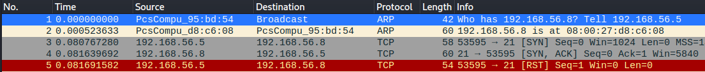  

En oikeastaan nähnyt mitään eroa näiden skannaustyyppien välillä Wiresharkin lokeissa, joten jätän kuvakaappauksen tuosta -Pn skannauksesta laittamatta. Lokirivit olivat timestamppeja lukuunottamatta identtiset, joten tätä pitäisi ilmeisesti testata muualla kuin paikallisessa verkossa toiminnan havainnollistamiseksi.  

### e) nmap version detection -sV (esimerkki yhdestä palvelusta yhdessä portissa riittää)

nmapin komento -sV pyrkii selvittämään skannattavassa portissa olevan palvelun ja sen versionumeron, käyttäen sovelluksen tietokannassa nmap-service-probe olevaa informaatiota eri palveluiden tukemista kyselyistä ja muista ominaisuuksista. 
Lähde: https://nmap.org/book/man-port-scanning-techniques.html

Skannasin taas Metasploitable2 koneen portin 21:  
```
$ sudo nmap -sV -p 21 192.168.56.8
Starting Nmap 7.92 ( https://nmap.org ) at 2022-05-06 13:37 EEST                              
mass_dns: warning: Unable to determine any DNS servers. Reverse DNS is disabled. Try using --system-dns or specify valid servers with --dns-servers                                         
Nmap scan report for 192.168.56.8                                                             
Host is up (0.00062s latency).                                                                
                                                                                              
PORT   STATE SERVICE VERSION                                                                  
21/tcp open  ftp     vsftpd 2.3.4                                                             
MAC Address: 08:00:27:D8:C6:08 (Oracle VirtualBox virtual NIC)                                
Service Info: OS: Unix                                                                        
                                                                                              
Service detection performed. Please report any incorrect results at https://nmap.org/submit/ .
Nmap done: 1 IP address (1 host up) scanned in 0.60 seconds 
```

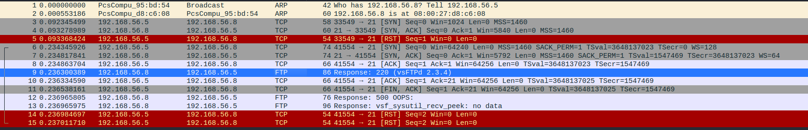 

nmap tulosteesta nähdään, että kyseinen portti on auki ja sitä kuuntelee palvelu vsftp 2.3.4. 

Wiresharkin lokeista näkee järjestyksen, jossa nmap tekee skannaustaan: 
1. 1-2. ARP -pingaus johon saadaan vastauksena kohdekoneelta sen MAC -osoite.
2. 3-5 Porttiin 21 kohdistuva TCP -yhteyspyyntö, joka keskeytetään, kun portissa oleva palvelu vastaa olevansa elossa eli kohteen lähettämään SYN-ACK pakettiin ei vastata. 
3. 6-8 Porttiin 21 kohdistuva TCP -yhteyspyyntö, joka suoritetaan loppuun lähettämällä oma ACK -paketti vastineeksi kohteen lähettämälle SYN-ACK -paketille. Three-Way-Handshake siis suoritetaan loppuun ja TCP-yhteys muodostetaan kohteen ja oman koneen välille.  
4. 9 Palvelu portissa 21 vastaa koodilla 220 olevansa käynnissä ja valmiina uusiin käyttäjäyhteyksiin (https://support.solarwinds.com/SuccessCenter/s/article/220-FTP-response-code?language=en_US). Tässä kohdassa myös palvelun tarkempi nimi ja versionumero näkyvillä.

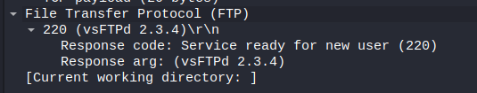

5. 10-11 ACK ja FIN-ACK paketit edellisen kohdan FTP-palvelun paketille jonka tiedoista löytyy sen LEN-numero ja sarjan seuraava numero (Acknowledgement (ACK) tapahtuu aina käyttämällä tällaisia sarjoja joissa seuraavalla numerolla hyväksytään lähetetty yhteys). FIN-ACK sulkee yhteyden, mutta käsittääkseni järjestyksen harmonisessa sulkemisessa pitäisi olla FIN, FIN-ACK, ACK, joten tämä jää vähän hämäräksi.  

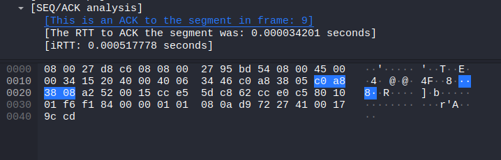

6. 12-13 FTP palvelu ilmoittaa sisäisestä palvelinvirheestä sekä tiedon, ettei vsf_sysutil_recv_peek palauttanut mitään dataa. En oikein tiedä mistä nämä tiedot tulevat. Esittikö nmap jotain pyyntöjä FTP -palvelulle, ja jos niin missä paketissa? Vai onko tämä vain sisäänrakennettu kohdekoneen FTP -palveluun, että informaatio annetaan, kun TCP yhteys muodostetaan.

7. Suljetaan kaikki yhteydet kohteeseen Resetillä (RST) sen sijaan, että neuvoteltaisiin yhteyden sulku.  


### f) nmap porttien valinta -p1-100, --top-ports 5, -p-

nmapin voi määrittää skannamaan vain haluamansa portit käyttämällä erilaisia optioita. Tässä listattuna tehtävänannossa pyydetyt portit.

Optio | Selitys
---|---
-p1-100 | Skannaa kohteen portit 1-100
--top-ports 5 | Skannaa 5 yleisintä porttia kuten on määritetty nmapin nmap-services tiedostossa
-p- | Skannaa kaikki portit 1-65535 

Lähde: https://nmap.org/book/man-port-specification.html

### g) nmap ip-osoitteiden valinta; luettelo, verkkomaskilla 10.10.10.0/24, alku- ja loppuosoitteella 10.10.10.100-130 (ipcalc auttaa ymmärtämään, miten verkkomaskia tulkitaan)

IP-osoitteiden valintaa olen demonstroinut jo tässä dokumentissa kohdassa *d) nmap don't ping -Pn*.
Esimerkkikomento joka skannaa kymmenen porttia osoiteavaruudesta 192.168.56.0/24:
`nmap -Pn 192.168.56.0-10`

/24 IP-osoitteen lopussa tarkoittaa sitä, että osoite sijaitsee verkossa 196.168.56.0 jonka pienin hostin osoitearvo on 196.168.56.1 ja suurin 196.168.56.254. Verkossa voi siis olla 254 laitetta eli jokainen osoiteavaruuden osa on yhden tavun kokoinen (8 bittiä). Suurin kymmenjärjestelmän luku joka voidaan esittää yhdellä tavulla on 255.

### h) nmap output files -oA foo. Mihin kukin tiedostotyyppi sopii?

-oA optiolla voidaan määrittää tallentamaan skannauksen tulos .xml, .nmap ja .gnmap muodossa.  

Esimerkki: 
```
$ sudo nmap -oA metaScan 192.168.56.8
$ ls | grep meta
metaScan.gnmap
metaScan.nmap
metaScan.xml
```
gnmap eli grepable format laittaa mahdollisimman paljon tietoa yhdelle riville. Tämä voisi omasta mielestäni olla käytännöllinen, kun skannataan useita kohteita ja halutaan kaikki samaan tiedostoon helposti etsittävässä muodossa.  

```
$ cat metaScan.gnmap                                                                        
# Nmap 7.92 scan initiated Fri May  6 14:35:07 2022 as: nmap -oA metaScan 192.168.56.8
Host: 192.168.56.8 ()   Status: Up
Host: 192.168.56.8 ()   Ports: 21/open/tcp//ftp///, 22... #Jatkuu pitkään
```

nmap formaatti tulostaa tiedostoon saman tulosteen kuin komentorivillekin. Tämä lienee hyvä formaatti esimerkiksi raportteja kirjoittaessa.

xml formaatti on helposti koneluettavissa, jos tietoa pitää esimerkiksi ajaa jonkin analytiikka työkalun läpi.  

Lähde: https://nmap.org/book/man-output.html

### k) nmap ajonaikaiset toiminnot (man nmap: runtime interaction): verbosity v/V, help ?, packet tracing p/P, status s (ja moni muu nappi)

Komento | Selitys
---|---
v / V | Lisää skannauksen verbositeettiä
help ? | Antaa tietoa ajonaikaisista komennoista
p / P | Pakettien jäljityksen pois ja päällekytkentä. Päällekytkettynä tulostaa kaikki nmapin lähettämät / vastaanottamat paketit ja niiden tiedot.  
s | Tulostaa tällä hetkellä käynnissä olevan vaiheen ja kuinka kauan vaihetta on jäljellä
d | Lisää skannauksen debug tasoa

### l) normaalisti 'sudo nmap'. Miten nmap toiminta eroaa, jos sitä ajaa ilman sudoa? Suorita ja analysoi esimerkki.

Lähdin testaamaan vertailua käyttämällä nmapin -Av optiota saadakseni mahdollisimman paljon tietoa ja tallensin molemmat -oN optiolla omiin tiedostoihinsa.

Tämän jälkeen vertasin tiedostoja diff komennolla. Valitettavasti ensimmäisenä silmään pisti, että nmap tulosti osan porttien lisätiedoista hieman eri järjestyksessä. Ajoin kuitenkin molemmat tiedostot diff -komennolla läpi ja katsoin pistääkö mikään silmään.

Tähän kasattuna silmiin pistävät erot. Esimerkiksi joissain ajoaikoja ja kellonaikoja sisältävissä riveissä oli totta kai eroja, joten tällaiset karsittu pois. 
```
# Ei sudo loki <
# sudo loki >

$ diff -i metascanNoSudo metascanSudo               ## -i optio jättää huomioimatta isot ja pienet kirjaimet
< Not shown: 977 closed tcp ports (conn-refused)  
> Not shown: 977 closed tcp ports (reset)

> MAC Address: 08:00:27:D8:C6:08 (Oracle VirtualBox virtual NIC)
> Device type: general purpose
> Running: Linux 2.6.X
> OS CPE: cpe:/o:linux:linux_kernel:2.6
> OS details: Linux 2.6.9 - 2.6.33
> Uptime guess: 0.251 days (since Fri May  6 09:19:23 2022)
> Network Distance: 1 hop
> TCP Sequence Prediction: Difficulty=187 (Good luck!)
> IP ID Sequence Generation: All zeros

> TRACEROUTE
> HOP RTT     ADDRESS
> 1   0.96 ms 192.168.56.8

< Service detection performed. Please report any incorrect results at https://nmap.org/submit/ .
< # Nmap done at Fri May  6 15:21:06 2022 -- 1 IP address (1 host up) scanned in 20.30 seconds
---
> OS and Service detection performed. Please report any incorrect results at https://nmap.org/submit/ .
> # Nmap done at Fri May  6 15:20:08 2022 -- 1 IP address (1 host up) scanned in 21.89 seconds

```
Näyttäisi, että sudolla ajettuna nmap antaa paljon enemmän tietoa kohteen käyttöjärjestelmästä ja tästä on tulosteen lopussa myös maininta.

Sudo oikeuksilla myös suljettuja portteja käsitellään eri tavalla, sillä ilman sudoa kerrotaan vain conn-refused, kun taas sudo oikeuksilla syyksi mainitaan reset, jonka oletan olevan kohteelta palautunut RST -paketti, jonka kone lähettää mm. kun portissa ei ole palvelua.

Koska en luota taitoihini diff:in kanssa kävin vielä silmäillen vertailun läpi ja nuo olivat tosiaan ainoat löytyneet erot.  

nmappia siis pitää aja sudo oikeuksilla jos haluaa saada mahdollisimman tarkkaa dataa.  

### m) nmap, vertaile -sV vs -A kestoa (ja lähetetyn datan määrää jos osaat; time, nethogs, wireshark). Käytä harjoitusmaalina metasploitable2.

Aloitin taas tekemällä skannaukset ja laittamalla niiden syöttämän datan omiin tiedostoihinsa. Tallensin myös molemmista ajoista Wiresharkilla lokitiedoston (.pcapng).  

```
$ ls | grep meta                                                                         
metascanA
metascanA.pcapng
metascansV
metascansV.pcapng
```

Alkuun vain viimeisten rivien vertailu nmap lokista: 
```
$ tail -n 2 metascanA metascansV                                                            
==> metascanA <==
OS and Service detection performed. Please report any incorrect results at https://nmap.org/submit/ .
# Nmap done at Fri May  6 16:06:20 2022 -- 1 IP address (1 host up) scanned in 21.71 seconds

==> metascansV <==
Service detection performed. Please report any incorrect results at https://nmap.org/submit/ .
# Nmap done at Fri May  6 16:06:50 2022 -- 1 IP address (1 host up) scanned in 11.76 seconds
```

-A skannaus tuottaa melkein kaksinkertaisen ajoajan -sV verrattuna.  

Wireshark dumpeista saatua tietoa: 
* -sV ajo:

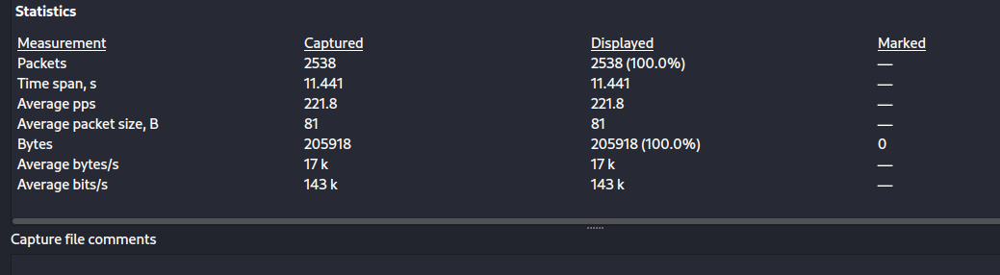

* -A ajo: 

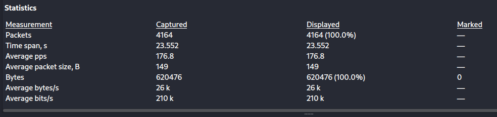

Kuvista huomataan, että -A ajon aikana kaapattiin huomattavasti suurempi määrä paketteja ja sen lisäksi paketit liikkuivat hitaammin.

Samaten pakettien yhteiskoko on lähes kolminkertainen, minkä selittänee se, että kohdekoneella pyritään ajon aikana ajamaan suurempi joukko erilaisia skriptejä, joilla saadaan lisää tietoa järjestelmästä.  

Tämän enempää en aiheesta valitettavasti saa irti. 

### d) Ninjojen tapaan. Piiloutuuko nmap-skannaus hyvin palvelimelta? Vinkkejä: Asenna Apache. Aja nmap-versioskannaus -sV omaan paikalliseen weppipalvelimeen. Etsi Apachen lokista tätä koskevat rivit. Wiresharkissa "http" on kätevä filtteri, se tulee siihen yläreunan "Apply a display filter..." -kenttään. Nmap-ajon aikana p laittaa packet tracing päälle. Vapaaehtoinen lisäkohta: jääkö Apachen lokiin jokin todiste nmap-versioskannauksesta?

Palvelu on käynnissä:  
```
$ curl -sI localhost | grep Server
Server: Apache/2.4.53 (Debian)
```

Laitoin Wiresharkin kuuntelemaan loopback adapteria ja nmap skannauksen:
```
$ sudo nmap -sV mykali
Starting Nmap 7.92 ( https://nmap.org ) at 2022-05-06 17:01 EEST
Nmap scan report for mykali (127.0.0.1)
Host is up (0.000019s latency).
Not shown: 999 closed tcp ports (reset)
PORT   STATE SERVICE VERSION
80/tcp open  http    Apache httpd 2.4.53
Service Info: Host: 127.0.1.1

Service detection performed. Please report any incorrect results at https://nmap.org/submit/ .
Nmap done: 1 IP address (1 host up) scanned in 6.50 seconds
```

Wiresharkin http -filtteriin tarttuneet paketit:
```
2005	6.122716508	127.0.0.1	127.0.0.1	HTTP	84	GET / HTTP/1.0 
2007	6.124327009	127.0.0.1	127.0.0.1	HTTP	807	HTTP/1.1 200 OK  (text/html)
2021	6.141603177	127.0.0.1	127.0.0.1	HTTP	234	GET /nmaplowercheck1651845733 HTTP/1.1 
2023	6.141718916	127.0.0.1	127.0.0.1	HTTP	84	GET / HTTP/1.0 
2025	6.142166870	127.0.0.1	127.0.0.1	HTTP	514	HTTP/1.1 404 Not Found  (text/html)
2028	6.142361222	127.0.0.1	127.0.0.1	HTTP	676	POST /sdk HTTP/1.1 
2030	6.142823482	127.0.0.1	127.0.0.1	HTTP	514	HTTP/1.1 404 Not Found  (text/html)
2031	6.142895066	127.0.0.1	127.0.0.1	HTTP	807	HTTP/1.1 200 OK  (text/html)
2048	6.145554257	127.0.0.1	127.0.0.1	HTTP	215	GET /HNAP1 HTTP/1.1 
2050	6.145784691	127.0.0.1	127.0.0.1	HTTP	220	GET /evox/about HTTP/1.1 
2052	6.146140105	127.0.0.1	127.0.0.1	HTTP	514	HTTP/1.1 404 Not Found  (text/html)
2053	6.146163434	127.0.0.1	127.0.0.1	HTTP	514	HTTP/1.1 404 Not Found  (text/html)
2065	6.148531338	127.0.0.1	127.0.0.1	HTTP	84	GET / HTTP/1.0 
2067	6.149454529	127.0.0.1	127.0.0.1	HTTP	807	HTTP/1.1 200 OK  (text/html)
2075	6.150258182	127.0.0.1	127.0.0.1	HTTP	98	GET / HTTP/1.1 
2077	6.151356373	127.0.0.1	127.0.0.1	HTTP	785	HTTP/1.1 200 OK  (text/html)
```

/var/logs/apache2/access.log:
```
127.0.0.1 - - [06/May/2022:17:00:54 +0300] "HEAD / HTTP/1.1" 200 127 "-" "curl/7.82.0"
127.0.0.1 - - [06/May/2022:17:01:37 +0300] "GET / HTTP/1.0" 200 741 "-" "-"
127.0.0.1 - - [06/May/2022:17:01:37 +0300] "GET /nmaplowercheck1651845697 HTTP/1.1" 404 448 "-" "Mozilla/5.0 (compatible; Nmap Scripting Engine; https://nmap.org/book/nse.html)"
127.0.0.1 - - [06/May/2022:17:01:37 +0300] "GET / HTTP/1.0" 200 741 "-" "-"
127.0.0.1 - - [06/May/2022:17:01:37 +0300] "POST /sdk HTTP/1.1" 404 448 "-" "Mozilla/5.0 (compatible; Nmap Scripting Engine; https://nmap.org/book/nse.html)"
127.0.0.1 - - [06/May/2022:17:01:37 +0300] "GET /HNAP1 HTTP/1.1" 404 448 "-" "Mozilla/5.0 (compatible; Nmap Scripting Engine; https://nmap.org/book/nse.html)"
127.0.0.1 - - [06/May/2022:17:01:37 +0300] "GET /evox/about HTTP/1.1" 404 448 "-" "Mozilla/5.0 (compatible; Nmap Scripting Engine; https://nmap.org/book/nse.html)"
127.0.0.1 - - [06/May/2022:17:01:37 +0300] "GET / HTTP/1.0" 200 741 "-" "-"
127.0.0.1 - - [06/May/2022:17:01:37 +0300] "GET / HTTP/1.1" 200 719 "-" "-"
127.0.0.1 - - [06/May/2022:17:02:13 +0300] "GET / HTTP/1.0" 200 741 "-" "-"
127.0.0.1 - - [06/May/2022:17:02:13 +0300] "GET /nmaplowercheck1651845733 HTTP/1.1" 404 448 "-" "Mozilla/5.0 (compatible; Nmap Scripting Engine; https://nmap.org/book/nse.html)"
127.0.0.1 - - [06/May/2022:17:02:13 +0300] "POST /sdk HTTP/1.1" 404 448 "-" "Mozilla/5.0 (compatible; Nmap Scripting Engine; https://nmap.org/book/nse.html)"
127.0.0.1 - - [06/May/2022:17:02:13 +0300] "GET / HTTP/1.0" 200 741 "-" "-"
127.0.0.1 - - [06/May/2022:17:02:13 +0300] "GET /evox/about HTTP/1.1" 404 448 "-" "Mozilla/5.0 (compatible; Nmap Scripting Engine; https://nmap.org/book/nse.html)"
127.0.0.1 - - [06/May/2022:17:02:13 +0300] "GET /HNAP1 HTTP/1.1" 404 448 "-" "Mozilla/5.0 (compatible; Nmap Scripting Engine; https://nmap.org/book/nse.html)"
127.0.0.1 - - [06/May/2022:17:02:13 +0300] "GET / HTTP/1.0" 200 741 "-" "-"
127.0.0.1 - - [06/May/2022:17:02:13 +0300] "GET / HTTP/1.1" 200 719 "-" "-"
```

Lokitietoja katsomalla on hyvin selvää, ettei nmap piiloudu kovin hyvin. Apachen lokeissa on useita mainintoja Nmap Scripting Enginestä joka tekee useita kutsuja eri alasivuille kuten /nmaplowercheck1651845697 ja /HNAP1. Kuitenkin nämä palauttavat 404 not found erroria hyökkääjälle. Ainoat onnistuneet pyynnöt ovat suoria GET pyyntöjä localhost osoitteeseen, ja Apachen versionumero on ainoa tieto, mikä nmapilla saatiin (Tämän voisi toki saada helpommin esim. curlilla).

## UDP-skannaus. "Mulla olis vitsi UDP:sta, mutta en tiedä menisikö se perille":

### e) Mitkä ovat tavallisimmat tai kiinnostavimmat palvelut, joita UDP-skannauksella voisi löytää? (tässä alakohdassa vain vastaus viitteineen, ei tarvita testiä tietokoneella)

Lähde: https://adminhacks.com/common-ports.html

Portti | Palvelu/Protokolla | Selitys
---|---|---
53 | DNS | Domain Name Service eli nimipalvelu, jonka avulla verkkopalvelut muutetaan IP-osoitteiksi


### f) Miksi UDP-skannaus on hankalaa ja epäluotettavaa? Miksi UDP-skannauksen kanssa kannattaa käyttää --reason flagia? (tässä alakohdassa vain vastaus viitteineen, ei tarvita testiä tietokoneella)

UDP (User Datagram Protocol)-skannaus on hidasta koska yhteyspyyntöihin saadaan harvoin vastausta open tai filtered tilassa olevista porteista jolloin nmap joutuu odottamaan jokaisen pyynnön timeoutia ja koska UDP -pakettien toimituksesta perille ei ole koskaan varmuutta (UDP protokolla ei vahvista vastaanottoa) saattaa nmap yrittää pakettien lähetystä useampaan kertaan.

Suljettujen porttien tapauksessa portit lähettävät yleensä "ICMP port unreachable" -virheen jonka frekvenssiä on useissa käyttöjärjestelmissä rajoitettu, mikä hidastaa skannausta.

--reason flag ilmoittaa nmapin tulosteessa syyn kunkin portin määritykselle. Seuraavaksi esimerkki UDP-skannauksesta Metasploitable 2 koneelta käyttäen 100 tunnetuinta porttia --reason flagilla:
```
$ sudo nmap -sU -top-ports 100 --reason 192.168.56.8

Starting Nmap 7.92 ( https://nmap.org ) at 2022-05-07 11:55 EEST
mass_dns: warning: Unable to determine any DNS servers. Reverse DNS is disabled. Try using --system-dns or specify valid servers with --dns-servers
Stats: 0:00:32 elapsed; 0 hosts completed (1 up), 1 undergoing UDP Scan
UDP Scan Timing: About 99.00% done; ETC: 11:56 (0:00:00 remaining)
Nmap scan report for 192.168.56.8
Host is up, received arp-response (0.0011s latency).
Not shown: 48 closed udp ports (port-unreach), 48 open|filtered udp ports (no-response)
PORT     STATE SERVICE    REASON
53/udp   open  domain     udp-response ttl 64
111/udp  open  rpcbind    udp-response ttl 64
137/udp  open  netbios-ns udp-response ttl 64
2049/udp open  nfs        udp-response ttl 64
MAC Address: 08:00:27:D8:C6:08 (Oracle VirtualBox virtual NIC)

Nmap done: 1 IP address (1 host up) scanned in 45.21 seconds
```

Kuten tulosteesta huomataan siihen tulleen yksi lisäkolumni, jossa syy portin attribuutiolle on ilmoitettu. Syy on tässä tapauksessa udp-response ttl (Time to live) 64, jota en valitettavasti osaa selittää tarkemmin, koska hakukoneillakin löytämäni aihetta käsittelevät sivustot menevät tekniseltä tasoltaan oman osaamiseni yli erittäin pahasti.    

* Time to live (https://www.cloudflare.com/learning/cdn/glossary/time-to-live-ttl/)
    - Lähetetylle paketille asetettu numeerinen arvo, joka määrittää paketin eliniän kohdeverkossa. Joka kerta, kun paketti siirretään reitittimeltä toiselle vähennetään TTL arvosta 1. Kun arvo putoaa nollaan, paketti pudotetaan, eli sen liike loppuu.  

Lähde: https://nmap.org/book/scan-methods-udp-scan.html

### g) Vapaaehtoinen bonuskohta: näytä esimerkki onnistuneesta UDP-skannauksesta, sekä jonkin UDP:n erityisominaisuuden takia epäonnistuneesta tai harhaanjohtavan tuloksen antavasta UDP-skannauksesta.

Aktiivista tiedustelua. Mihin tämä työkalu on tarkoitettu? Kokeile tätä työkalua omaan harjoitusmaaliin ja selitä tulokset:

### h) fuff (hakemistojen kokeilu riittää, vapaaehtoisena bonuksena muutakin)

Fuzz Faster U Fool on avoimen lähdekoodin työkalu verkkosovellusten ja palvelimien elementtien ja sisällön tutkimiseksi. 

Testasin Metasploitable 2 koneella pyörivän Damn Vulnerable Web Applicationin fuzzausta.  
Koko tuloste: [DVWA ffuf skannaus](Scans/L4ffufDWVA.md) 
```
$ ffuf -w /usr/share/wordlists/dirbuster/directory-list-1.0.txt -u http://192.168.56.8/dvwa/FUZZ -of md -o ffufDWVA
 :: Method           : GET
 :: URL              : http://192.168.56.8/dvwa/FUZZ
 :: Wordlist         : FUZZ: /usr/share/wordlists/dirbuster/directory-list-1.0.txt
 :: Output file      : ffufDWVA
 :: File format      : md
 :: Follow redirects : false
 :: Calibration      : false
 :: Timeout          : 10
 :: Threads          : 40
 :: Matcher          : Response status: 200,204,301,302,307,401,403,405,500
## Tässä vain muutama esimerkki löydetyistä kansioista. Koko skannauksen linkki ennen tehtävää.
robots                  [Status: 200, Size: 26, Words: 3, Lines: 2, Duration: 0ms]
security                [Status: 302, Size: 0, Words: 1, Lines: 1, Duration: 85ms]
```
Skannauksessa käytetyt flagit:
Flag | Selitys
---|---
-w | Sanalista jolla kohdetta fuzzataan
-u | Kohde sovellus tai palvelin. Osoitteessa tulee käyttää FUZZ -avainsanaa, johon sanalistan sanoja sijoitetaan skannauksen aikana
-of | Output Format. Tulosteen formaatti. Tässä valittuna md eli markdown. Kaikki formaatit: json, ejson, html, md, csv, ecsv
-o | Output. Tiedosto johon tuloste kirjoitetaan

ffuf siis kokeilee annetun sanalistan jokaista sanaa osoitteeseen määritettyyn FUZZ -kohtaan. Perusmuotoinen skannaus tekee GET pyyntöjä, mutta voidaan myös määrittää tekemään POSTeja. 

Matcher rivillä luetellaan kaikki vastauskoodit joita haetaan. Tästä voidaan myös karsia ne, jotka eivät ole mielenkiintoisia (esim 400-sarjan koodit eivät välttämättä ole tarpeellisia). 

Lähteet:  
https://cybersecnerds.com/ffuf-everything-you-need-to-know/  
ffuf -h

### i) nikto  

Haavoittuvuusskanneri, joka skannaa verkkopalvelimia vaarallisten tiedostojen ja muiden haavoittuvuuksien varalta
https://www.tecmint.com/nikto-a-web-application-vulnerability-and-cgi-scanner-for-web-servers/

Skannasin Metasploitable 2 koneen.
Skannaus ja analyysi [täältä](Scans/L4niktoMeta2.md)


### j) Pizza fantasia: jokin valitsemasi tiedustelutyökalu, esimerkiksi EyeWitness, wpscan, openvas, nucleus tai jokin muu.

#### Wappalyzer  

- Browser plugin for finding out the technology stack of a website.    
- Free but (paid premium version)
    - Suffered an email address data breach in 2019 of registered users. 
- At least on FireFox/Chrome, can be installed from the official plugin store.    

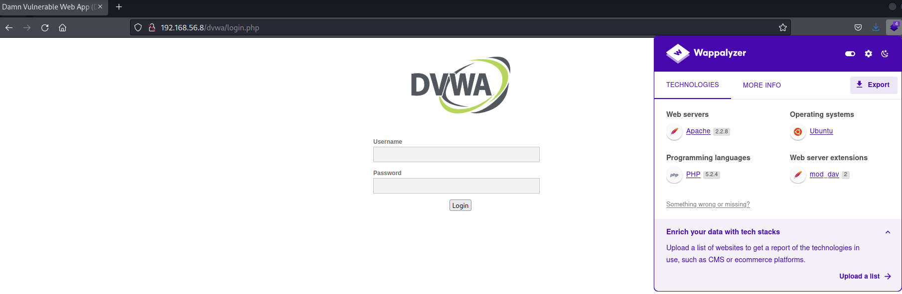  

#### gobuster

- "Gobuster is a tool used to brute-force URIs including directories and files as well as DNS subdomains." -https://www.kali.org/tools/gobuster/  
    * Does not support scanning directories recursively so multiple scans are needed.  
- Free  
- Can be installed on Kali: sudo apt-get install Gobuster 
- Example with DVWA:

I input the handles -u (url) and -w (wordlist to match against). By default gobuster uses the GET method.  
```
gobuster dir -u 192.168.56.8/dvwa/ -w /usr/share/wordlists/dirb/common.txt 
===============================================================
Gobuster v3.1.0
by OJ Reeves (@TheColonial) & Christian Mehlmauer (@firefart)
===============================================================
[+] Url:                     http://192.168.56.8/dvwa/
[+] Method:                  GET
[+] Threads:                 10
[+] Wordlist:                /usr/share/wordlists/dirb/common.txt
[+] Negative Status codes:   404
[+] User Agent:              gobuster/3.1.0
[+] Timeout:                 10s
===============================================================
2022/04/25 10:48:36 Starting gobuster in directory enumeration mode
===============================================================
/.htpasswd            (Status: 403) [Size: 299]
/.hta                 (Status: 403) [Size: 294]
/.htaccess            (Status: 403) [Size: 299]
/about                (Status: 302) [Size: 0] [--> login.php]
/config               (Status: 301) [Size: 323] [--> http://192.168.56.8/dvwa/config/]
/docs                 (Status: 301) [Size: 321] [--> http://192.168.56.8/dvwa/docs/]  
/external             (Status: 301) [Size: 325] [--> http://192.168.56.8/dvwa/external/]
/favicon.ico          (Status: 200) [Size: 1406]                                        
/index.php            (Status: 302) [Size: 0] [--> login.php]                           
/index                (Status: 302) [Size: 0] [--> login.php]                           
/instructions         (Status: 302) [Size: 0] [--> login.php]                           
/logout               (Status: 302) [Size: 0] [--> login.php]                           
/login                (Status: 200) [Size: 1289]                                        
/php.ini              (Status: 200) [Size: 148]                                         
/phpinfo.php          (Status: 302) [Size: 0] [--> login.php]                           
/phpinfo              (Status: 302) [Size: 0] [--> login.php]                           
/README               (Status: 200) [Size: 4934]                                        
/robots               (Status: 200) [Size: 26]                                          
/robots.txt           (Status: 200) [Size: 26]                                          
/security             (Status: 302) [Size: 0] [--> login.php]                           
/setup                (Status: 200) [Size: 3549]                                        
                                                                                        
===============================================================
2022/04/25 10:48:37 Finished
``` 

We can see from the multiple findings that a lot of them are giving the error code 403 (Permissions denied), some redirects (301 and 302) and a few are available (200) for example the /setup page which allows the user to create/reset the database. Also the documentation of the app can be found from /docs with the default password and username.  

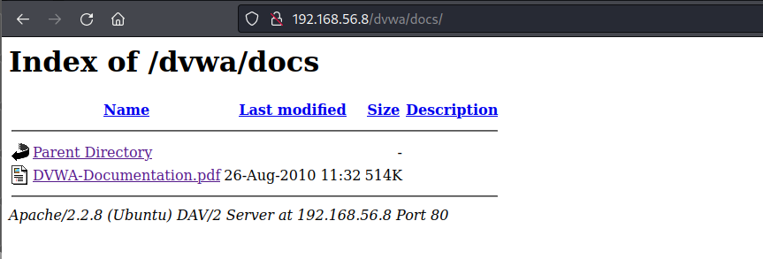

### k) Vapaaehtoinen: Tiedustele aktiivisesti jokin HackTheBoxin maalikone. Analysoi tulokset, pääpaino on vastauksessa tulkinnoillasi. Sopivia ovat esimerkiksi EyeWitness, nikto, wpscan, gobuster, openvas ja ffuf. Aputyökaluiksi sopii Linuxin komentokehote, grep, pythonpy... Voit valita näistä vain jonkin tai joitakin työkaluja. Seuraa työkalun toimintaa koko ajan snifferillä, ja käytä vain työkaluja, joiden toiminnan ymmärrät kohtuullisesti. HTB:n ratkaisut yhdessä sovitun salasanan taakse, jotta emme spoilaa toisten kilpailua.

### l) Vapaaehtoinen, haastava: Korkkaa jokin HTB:n kone. Aloita helposta.