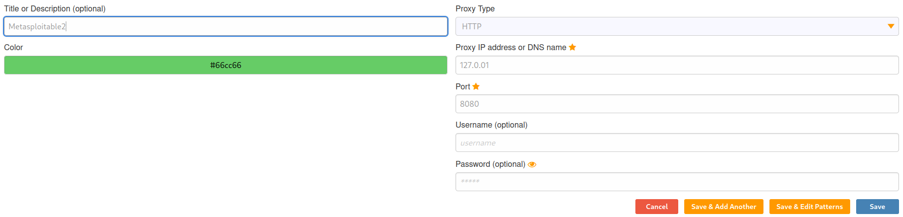
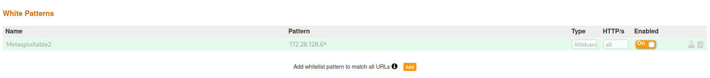
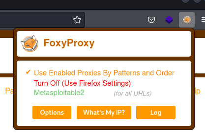
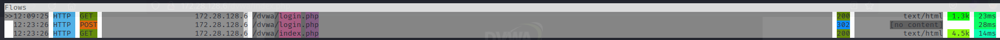
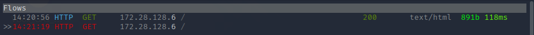
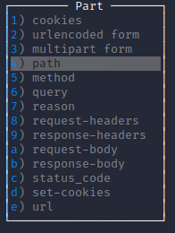

# h6 Final Countdown

Part of Penetration Testing ICT4TN027-3007 course of Haaga-Helia University of Applied Sciences held by Tero Karvinen. Course is in Finnish.  
    
Course page: https://terokarvinen.com/2021/penetration-testing-course-2022-spring/  

Palautus sovitusti Laksuun.

## a) Middle. Muuta hakupyyntöä välimiesproxylla.

Getting to know mitmproxy (sudo apt-get install mitmproxy) and FoxyProxy.

On Kali Linux mitmproxy was already installed. I continued by installing FoxyProxy add-on to FireFox through the 'Add-ons and Themes' section of the settings.  

### FoxyProxy with patterns set up

I clicked on the Fox icon that appeared on the browsers address bar and selected Options and Add from the next page. I decided to make this proxy just for the Metasploitable 2 computer with the following settings:

  

The default ip and port for mitm can be found from the official mitm documentation: https://docs.mitmproxy.org/stable/overview-getting-started/

I continued to choose 'Save & Edit Patterns' and added the following pattern to only route Metasploitable 2 traffic through the proxy:  

  

And finally turned on the proxy from the little Fox icon by choosing 'Use Enabled Proxies By Pattern and Order':  

  

### Intercepting traffic

I turned on mitmproxy from the command-line by typing `mitmprxy`, navigated to the site of DVWA (Damn Vulnerable Web Application) running on my Metasploitable 2 instance and logged in. mitmproxy is capturing packages:

  

I had Metasploitable 3 open in the same network. Browsed to its IP on Firefox. Page loaded and no packets went through the proxy so all worked as planned.  

### Modifying the packet

I set mitmproxy to intercept all packets from Metasploitable 2:
```
set intercept '172.28.128.6'
```

I browsed to the address 172.28.128.6 on FireFox and a packet was intercepted:



I scrolled to the intercepted packet with arrow keys and clicked 'Enter' to see the details, clicked 'e' to edit and chose 'path'. 



After that I returned back to the normal view by clicking 'Esc' and 'q'. Then I clicked 'a' to allow packet to go ahead. After releasing few more packages, instead of going to the Metasploitable 2 front page, the DVWA application opened for me.

I noticed afterwards that now, every time I try to go the M2 frontpage it redirects me to the DVWA app. Even after clearing cookies for 172.28.128.6, turning off mitmproxy and FoxyProxy. Only after clearing the cookies and data from the whole browser I was able to get to the front page again.  


## b) Cheatsheet - kerää parhaat kikat, käskyt ja tekniikat omasta ja toisten raporteista. (tässä alakohdassa pelkkä kirjoitus riittää, ei tarvitse testata koneella)  

I will only list some of the software and tools used on the course here as I didn't really pick up any specific methods or commands:  

### metasploit 

A prebuilt tool-kit for exploiting known vulnerabilites.  

- Fast setup:  
```
$ sudo msfdb init
$ sudo msfconsole
```
- nmap database scan:
```
$ db_nmap --options TARGET
$ services # Show the scanned ports and services in the databases
$ services TARGET # Filter the saved results by target
```
- Some commands:  
```
$ search # look for an exploit e.g. search vsftpf 2.3.4 or search CVE-xxxx-yyy
$ use # Choose a module to load e.g. use 0 to load the first item from search output
$ info # Show all available information for the loaded module
$ show options # Show currently chosen modules options
$ show payloads # Show payloads that could be compatible with the used module
$ set # Set various options e.g. set PAYLOAD -name or number- or set RHOSTS -target ip-
$ setg # Like previous but sets the options globally
$ check # Check if the set target system is vulnerable to chosen exploit
$ exloit # Run the exploit and try to trigger the chosen payload 
$ back # Return to previous state e.g. unload a module loaded with use
$ sessions # Show active sessions
$ sessions # Switch to session e.g. sessions 1
$ sessions -k # Kill a session
```

More commands here: https://www.offensive-security.com/metasploit-unleashed/using-databases/

### nmap

Powerful port-scanner that also has some vulnerability scanning features.  

Use with:
`nmap --options TARGET(s)`

- Scans
    - -sn (Ping sweep)
    - -Pn (Don't ping)
    - -sS ("Stealt scan", the most common scan)
    - -sV (Version scan that tries to collect version data from the ports)
    - -A (Everything possible, loud because runs a lot of scripts on target)
- Options
    - -v (verbose output, verbosity can be increased during scan with v)
    - -p (define port or port range to scan)
    - -p- (scan ALL the ports)

### OWASP ZAP and FoxyProxy

Owasp ZAP creates a local proxy that all your router traffic will be forwarded through.  
FoxyProxy makes it easier to set up and control FireFox's proxy settings.  

### dirbuster

Tool for brute-forcing URIs including directories and files as well as subdomains.

Comes with a graphical user interface. 

Takes as parameters the target URL and a wordlist (ready-made wordlists in Kali are at /usr/share/wordlists/) or can be used without a wordlist by choosing Pure Brute Force.  

Supports recursive scanning (unlike gobuster)

File search by extension.

### ExifTool

Reading and editing the metadata of files.  
https://www.exiftool.org/

For example extracting the location from an image file.  

### John The Ripper

Password cracker.

Haven't used this one myself but the name came up on this course a few times. 

### Legion 

>"This package contains an open source, easy-to-use, super-extensible and semi-automated network penetration testing tool that aids in discovery, reconnaissance and exploitation of information systems." https://www.kali.org/tools/legion/

Haven't used this one myself but bumbed into it on a course mates page: https://linuxputkis.wordpress.com/

## d) Kaikki tehtävät tähän. Listaa suora linkki kuhunkin palautukseesi.

Page | URL
---|---
Front Page |  https://github.com/pajaz/Penetration-Testing-2022/  
Lesson 1 | https://github.com/pajaz/Penetration-Testing-2022/blob/main/Homework/Lesson01.md  
Lesson 2 | https://github.com/pajaz/Penetration-Testing-2022/blob/main/Homework/Lesson02.md  
Lesson 3 | https://github.com/pajaz/Penetration-Testing-2022/blob/main/Homework/Lesson03.md  
Lesson 4 | https://github.com/pajaz/Penetration-Testing-2022/blob/main/Homework/Lesson04.md  
Lesson 5 | https://github.com/pajaz/Penetration-Testing-2022/blob/main/Homework/Lesson05.md  
Lesson 6 | https://github.com/pajaz/Penetration-Testing-2022/blob/main/Homework/Lesson06.md  


## ~~f) Vapaaehtoinen, Korkki: Jos olet korkannut koneita Challenge.fi:ssa tai HackTheBoxissa, listaa ne tähän. Erottele selkeästi käynnissä olevien kilpailujen (non-retired) koneet vanhoista, joiden ratkaisut on jo julkaistu.~~

## g) Vapaaehtoinen, HackStation 3000: Valmistele kone viimeisen kerran arvioitavaan labraan. Saat asentaa koneelle etukäteen mitä ohjelmia haluat ja tehdä haluamiasi asetuksia. Jos ohjelmat eivät ole yleisessä käytössä olevia vapaita ohjelmia, niistä pitää toimittaa opettajalle tarvittaessa luvallinen kopio (jos se ei jostain ohjelmasta onnistu, käytä jotain toista ohjelmaa). Koneella ei saa olla luottamuksellisia tietoja, koska labrassa kerätään automaattisesti tietoja koneelta.

Don't have enough available disk space for another Kali VM right now due to multiple courses and projects requiring VM's.  
Will install the following on Sunday 2022-05-12:  
  
System: Kali Linux (64-bit)  
Processors: 2  
Memory: 4000Mb  
Video Memory: 128Mb  
Disk-space: 30Gb (dynamic)  