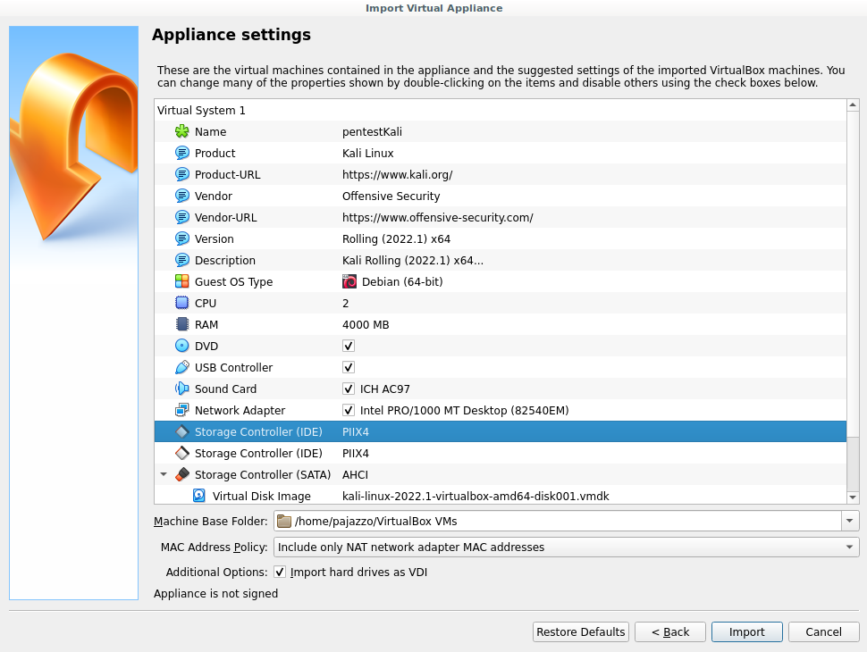
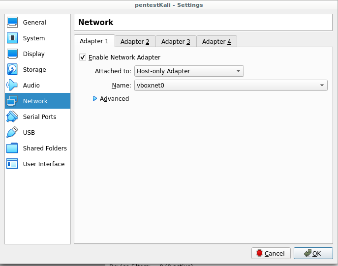
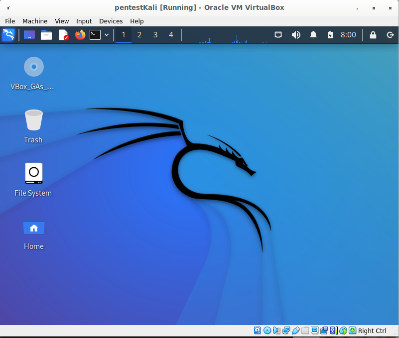
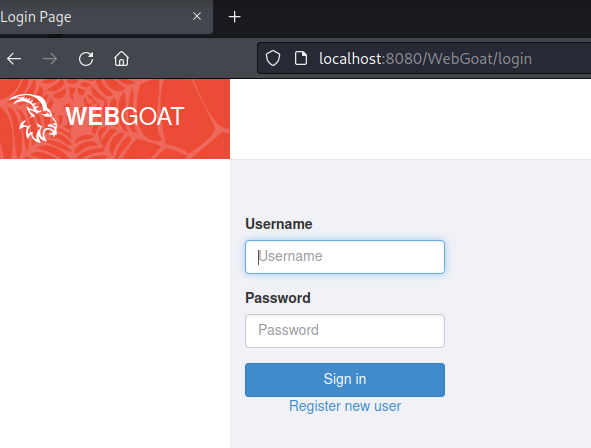
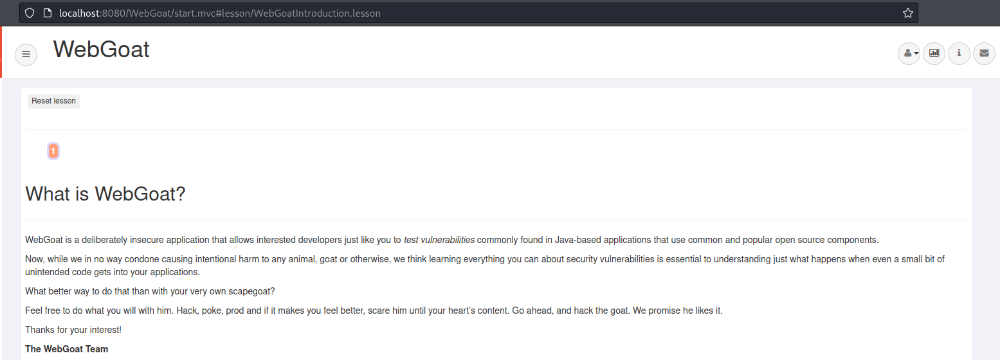
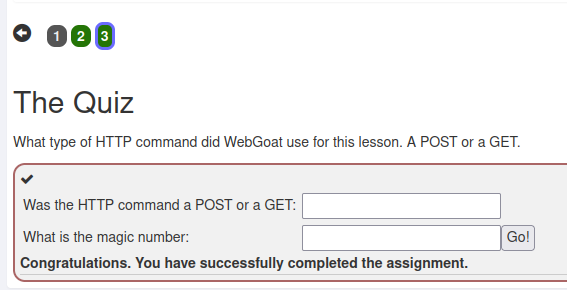
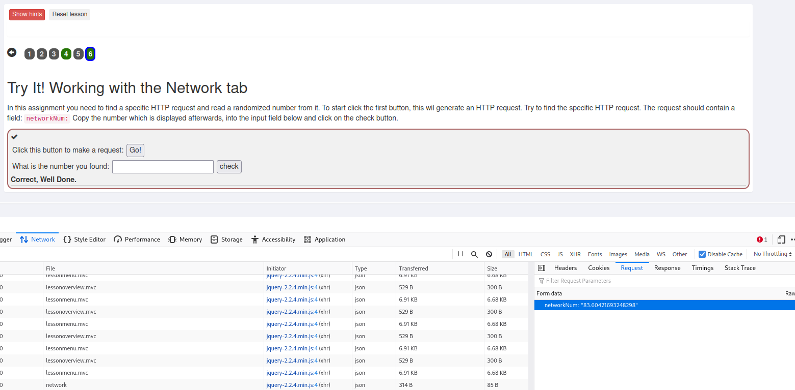
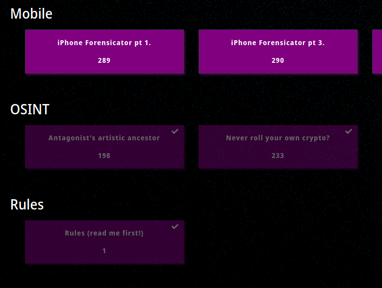
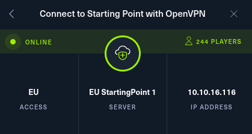
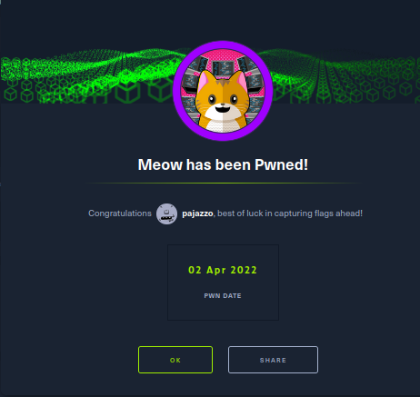

# h1 Vuohi, tappoketju ja pimeän verkon päiväkirjat  
  
Part of Penetration Testing ICT4TN027-3007 course of Haaga-Helia University of Applied Sciences held by Tero Karvinen. Course is held in Finnish.  
  
Course page: https://terokarvinen.com/2021/penetration-testing-course-2022-spring/
  
## z) Lue ja tiivistä.  
  
* [Hutchins et al 2011: Intelligence-Driven Computer Network Defense Informed by Analysis of Adversary Campaigns and Intrusion Kill Chains](https://lockheedmartin.com/content/dam/lockheed-martin/rms/documents/cyber/LM-White-Paper-Intel-Driven-Defense.pdf) Abstract sekä kappaleet 3.2 Intrusion Kill Chain ja 3.3 Courses of Action.  
  - Perinteiset puolustustyökalut, jotka keskittyvät havainnon jälkeisiin toimiin, ja yrittävät korjata virheitä onnistuneiden tunkeutumisten jälkeen, ovat vanhentuneet, kun vastustajat ovat kehittäneet menetelmiään.
  - Advanced Persistent Threat (APT) on uhkaluokka, joka keskittyy tietojen vaarantamiseen taloudellisten tai sotilaallisten hyötyjen saavuttamiseksi. Nämä toimijat käyttävät menetelmiä, joita AV-ohjelmisto ei välttämättä kykene korjaamaan tai havaitsemaan.
  - Intrusion Kill Chain kuvaa askel askeleelta prosessia, jota vastustaja noudattaa tiedon keräämisestä tavoitteen saavuttamiseen seitsemässä vaiheessa:
    1. Tiedustelu (Reconnaisance)
    2. Aseistaminen (Weaponization)
    3. Toimitus (Delivery)
    4. Hyväksikäyttö (Exploitation)
    5. Asennus (Installation)
    6. Komento ja ohjaus (Command and Control, C2)
    7. Toimenpiteet tavoitteita kohtaan (Actions on Objectives)
  - Artikkelissa kuvattu ajatus on, että puolustaja katkaisee minkä tahansa näistä tappoketjun vaiheista saadakseen hyökkääjän perääntymään. Tämän jälkeen kerätään tietoja sekä torjutuista että torjumattomista hyökkäyksistä jotta voidaan kehittää tehokkaampia toimenpiteitä tulevaisuutta varten.
    + Koska prosessi kuvataan ketjuna tarkoittaa tämä, että kun yhden linkin/askeleen epäonnistuessa, prosessi kokonaisuudessaan epäonnistuu.
  - Jatkuva hyökkäys vaatii jatkuvaa puolustusta. Keräämällä ja analysoimalla huolellisesti tiedustelutietoja aiemmista hyökkäyksistä puolustaja voi:
    + Kehittää uusia keinoja tulevia tunkeutumisia vastaan.
    + Tunnistaa jatkuvat tunkeutumiskampanjat.
      * Mahdollisesti myös tunnistaa vastustajat ja heidän tavoitteensa.
    + Saada vastustajien tavoitteet näyttämään vähemmän tuottoisilta laittamalla heidät jatkuvasti vaihtamaan tai kehittämään menetelmiään ja työkalujaan. 
    
Lähde: https://lockheedmartin.com/content/dam/lockheed-martin/rms/documents/cyber/LM-White-Paper-Intel-Driven-Defense.pdf  
   
* Darknet Diaries podcast, vapaavalintainen jakso. Voi kuunnella myös lenkillä, pyykiä viikatessa tms. Siisti koti / kesäkunto kaupan päälle.     
  
Tee ja raportoi:  
  
## a) ja g) Ratkaise [Over The Wire: Bandit](https://overthewire.org/wargames/bandit/) kymmenen ensimmäistä tasoa (0-10).  
  
Tässä siis Over The Wire: Banditin 0-10 tehtävät vastauksineen. Aluksi ajattelin, etten laita suoraan vastauksia näkyviin verkkoon, mutta tein tehtävät ja googletin "Over the wire bandit walkthrough". Huomasin, että vastaukset ovat verkossa jo sen verran helposti saatavilla, että laitan omanikin tähän näkyviin.  

SSH-palvelin: bandit.labs.overthewire.org  
Portti: 2220  
  
0.  
```
pajazzo@derpface:\$ ssh bandit0@bandit.labs.overthewire.org -p 2220
bandit0@bandit:\$ cat ~/readme
boJ9jbbUNNfktd78OOpsqOltutMc3MY1
```
1.  
```
pajazzo@derpface:\$ ssh bandit1@bandit.labs.overthewire.org -p 2220  
bandit1@bandit:\~\$ cat < -  
CV1DtqXWVFXTvM2F0k09SHz0YwRINYA9  
```
2.  
```
ssh bandit2@bandit.labs.overthewire.org -p 2220
bandit2@bandit:~$ cat spaces\ in\ this\ filename 
UmHadQclWmgdLOKQ3YNgjWxGoRMb5luK
```
3.  
```
pajazzo@derpface:$ ssh bandit3@bandit.labs.overthewire.org -p 2220
bandit3@bandit:~$ cat inhere/.hidden
pIwrPrtPN36QITSp3EQaw936yaFoFgAB
```
4.  
```
pajazzo@derpface:$ ssh bandit4@bandit.labs.overthewire.org -p 2220
bandit4@bandit:~$ file inhere/*
inhere/-file00: data
inhere/-file01: data
inhere/-file02: data
inhere/-file03: data
inhere/-file04: data
inhere/-file05: data
inhere/-file06: data
inhere/-file07: ASCII text
inhere/-file08: data
inhere/-file09: data
bandit4@bandit:~$ cat inhere/-file07
koReBOKuIDDepwhWk7jZC0RTdopnAYK
```
5.  
```
pajazzo@derpface:$ ssh bandit5@bandit.labs.overthewire.org -p 2220
bandit5@bandit:~$ find inhere/ \! -executable -type f -size 1033c
inhere/maybehere07/.file2
bandit5@bandit:~$ cat inhere/maybehere07/.file2
DXjZPULLxYr17uwoI01bNLQbtFemEgo7
```
6.  
```
pajazzo@derpface:$ ssh bandit6@bandit.labs.overthewire.org -p 2220
bandit6@bandit:~$ find / -size 33c -user bandit7 -group bandit6 2>/dev/null
/var/lib/dpkg/info/bandit7.password
bandit6@bandit:~$ cat /var/lib/dpkg/info/bandit7.password
HKBPTKQnIay4Fw76bEy8PVxKEDQRKTzs
```
How to exclude find -command error messages (2>/dev/null):
https://exploreinformatica.com/how-to-exclude-all-permission-denied-messages-when-using-find-command/  

7.  
```
pajazzo@derpface:$ ssh bandit7@bandit.labs.overthewire.org -p 2220
bandit7@bandit:~$ cat data.txt | grep "millionth"
millionth	cvX2JJa4CFALtqS87jk27qwqGhBM9pl
```
8.  
```
pajazzo@derpface:$ ssh bandit8@bandit.labs.overthewire.org -p 2220
bandit8@bandit:~$ man uniq
bandit8@bandit:~$ cat data.txt | sort | uniq -u
UsvVyFSfZZWbi6wgC7dAFyFuR6jQQUhR
```
uniq -command only searches for repeated occurences of lines. Thus sorting the data before searching for unique lines is necessary.  
-u only prints lines with single occurence.  
Source: man uniq  
9.  
```
pajazzo@derpface:$ ssh bandit9@bandit.labs.overthewire.org -p 2220
bandit9@bandit:~$ strings data.txt | grep "==\+"
========== the*2i"4
========== password
Z)========== is
&========== truKLdjsbJ5g7yyJ2X2R0o3a5HQJFuLk
```
10.  
```
pajazzo@derpface:$ ssh bandit10@bandit.labs.overthewire.org -p 2220  
bandit10@bandit:~$ cat data.txt 
VGhlIHBhc3N3b3JkIGlzIElGdWt3S0dzRlc4TU9xM0lSRnFyeEUxaHhUTkViVVBSCg==
bandit10@bandit:~$ man base64
bandit10@bandit:~$ cat data.txt | base64 -d  # decrypt
The password is IFukwKGsFW8MOq3IRFqrxE1hxTNEbUPR
```

## b) Asenna Kali Linux.  
  
**Isäntäkone**  
Käyttöjärjestelmä: Debian 11 Bullseye Non-Free  
Keskusmuistia: 8GB  
Kovelevytilaa: 40GB  

1. Latasin Kali Linuxin 64-bittisen VirtualBox imagen virallisesta lähteestä osoitteesta:  
https://www.kali.org/get-kali/#kali-virtual-machines  
2. Avasin Virtualbox sovelluksen ja valitsin File välilehdeltä Import Appliance ja File kohdasta lataamani Kali Linuxin .ova -tiedoston.  
    * Mikäli sinulla ei ole Virtualboxi sovellusta, asenna se Debian-pohjaiselle Linux käyttöjärjestelmälle komennolla `sudo apt-get install virtualbox`. Muilla käyttöjärjestelmillä asennustapa saattaa vaihdella.  
    * Tietokoneestasi riippuen saatat joutua säätämään myös BIOS/UEFI -asetuksia saadaksesi virtualisoinnin käyttöön.  

3. Seuraava näkymä aukesi, jossa nimesin virtuaalikoneen ja asetin käytössä olevan RAM -muistin määräksi 4000MB.  
    

4. Valitsin pentestKali virtuaalikoneeni ja Settings. Vaihdoin Network välilehdeltä käyttöön host-only adapterin. 
    * Pidän oletuksena koneen tässä paikallisessa verkossa, jottei tule tehtyä mitään vahinkoja oikeassa Internetissä. Yhteyttä on helppo kuitenkin vaihtaa Virtualboxin asetuksista lennossa, jos/kun siihen tulee tarvetta.  

      
  
5. Kun asetukset kunnossa, valitsin Start ja huomasin, että kaikkihan toimii mainiosti.  
    

6. Avasin heti aluksi terminaali-istunnon ja loin uuden käyttäjän itselleni jolle määritin vahvan salasanan.
    ```
    sudo adduser pajazzo
    sudo adduser pajazzo sudo
    ```
    Käynnistin virtuaalikoneen uudelleen ja kirjauduin uudella käyttäjälläni sisään, minkä jälkeen poistin oletuskäyttäjänä tulleen kali -käyttäjän.  
    ```
    sudo deluser --remove-all-files kali  
    ```

7. Kytkin verkkoyhteyden päälle päivitysten tekemiseksi.  
    1. Devices > Network > Network Settings > Attached to > Bridged Adapter ja valitsin oman verkkoadapterini  
    2. Devices > Network > Connect Network Adapter  
    3. Hetken päästä verkkoyhteys lähti toimimaan.  
  
8. Avasin terminaali-istunnon ja ajoin päivitykset.
    ```
    sudo apt-get update
    sudo apt-get upgrade -y
    sudo apt-get dist-upgrade -y
    ```
 
## c) Asenna WebGoat, luo paikallinen WebGoat-käyttäjä ja kirjaudu sisään  
  
Lähde asennukselle: https://terokarvinen.com/2020/install-webgoat-web-pentest-practice-target/  
  
1. Esityöt: 
    ```
    sudo apt-get update
    sudo apt-get -y install openjdk-11-jre ufw # Java development kit ja palomuurin asennus
    sudo ufw enable
    ┌──(pajazzo㉿kali)-[~]
    └─$ sudo ufw enable # Palomuurin päällekytkentä
    Firewall is active and enabled on system startup
    sudo reboot
    ```

2. WebGoat:
    ```
    ┌──(pajazzo㉿kali)-[~] # Tiedoston lataus
    └─$ wget https://github.com/WebGoat/WebGoat/releases/download/v8.0.0.M26/webgoat-server-8.0.0.M26.jar
    ┌──(pajazzo㉿kali)-[~]
    └─$ java -jar webgoat-server-8.0.0.M26.jar # WebGoatin käynnistys
    ```
      
     
  
    Huom. Tässä vaiheessa katkaisin myös virtuaalikoneeltani verkkoyhteyden, koska tämä on suositeltavaa WebGoatia käytettäessä.  
  
3. Käyttäjän luonti:
    1. Valitse Register
    2. Täytä lomake ja signup
    3. Kirjaudu sisään WebGoatiin  

      
      

## d) Ratkaise WebGoatista tehtävät  
  
* General  
  - HTTP Basics  

    
    
  Magic number löytyi Developer Tools > Network > File: attack2 Response välilehdeltä (FireFox selaimella).  
  
  - Developer tools  
  
    
    
  Tehtävän ratkaisussa ei ole juuri selitettävää, koska tehtävä ratkaistiin tekemällä kohta kohdalta ohjeistuksen mukaan.  
  
## e) Ratkaise 2021 Challenge.fi:stä yksi tehtävä, esim. 2021 Where was this picture taken, Encoding basics.
  
Aloin tekemään tämän vuoden tehtäviä, koska viime vuoden versioissa ei useammallakaan selaimella testattuna toimi esim. vihje painikkeet tai vastauksen tarkistus. Tämän vuoden tehtävistä saattaapi olla hieman epäeettistä laittaa suoria vastauksia saataville verkkoon, mutta tässä kuvakaappaus sivulta tehtävistä, jotka suoritin:  
  
  
  
Etenkin tuo tehtävä Never roll your own crypto? oli mukava, koska siinä verkkosivuilta tiedon etsinnän lisäksi joutui vähän katselemaan koodia vastauksen saamiseksi.  

## f) TryHackMe tai HackTheBox. Rekisteröidy, lue ja tallenna säännöt, avaa OpenVPN-yhteys, ratkaise yksi tehtävä (tai tehtävän alakohta) jommasta kummasta palvelusta: TryHackMe tai HackTheBox  
  
1. Rekisteröidytty HackTheBoxiin.  
2. Säännöt: https://app.hackthebox.com/rules  
3. OpenVPN ohjeistus: https://help.hackthebox.com/en/articles/5185687-introduction-to-lab-access  
    1. OpenVPN on jo Kali Linuxissa asennettuna.
    2. HackTheBoxin sivuilta valitsin oikeasta yläkulmasta CONNECT TO HTB ja Starting Point tehtävät. Valitsin pudotusvalikoista EU palvelimen ja latasin OpenVPN asetustiedoston.  
    3. Navigoin komentoriviltä kansioon Downloads ja ajoin komennon `sudo openvpn *tiedostonimi.ovpn*`  
      
       
        
    4. Testasin, että pääsen aloittamaan tehtävien teon.  

## h) Vapaaehtoinen: Korkkaa jokin käytössä oleva kone HackTheBoxista (non-retired machine).  


## i) Vapaaehtoinen: Laita linkki kotitehtäviisi sivun kommentiksi. Tarjolla viittauksia ja nousua hakukoneissa.

### Vinkkejä:

* Tässä tiivistelmään riittää muutama (5-10) ranskalaista viivaa. Kirjoita
  myös viivalla tai parilla jokin havainto, idea tai sovelluskohde, joka
  artikkelista tuli mieleesi.
* Lukutehtävät esittelevät erilaisia lähteitä, joista voit itse seurata alaa,
  podcastista vertaisarvioituun artikkeliin.
* Yleensä artikkelit luetaan ennen tehtäviä, mutta Hutchins ja Darknet
  Diaries voi nauttia myös käytännön harjoitusten jälkeen. Valitse jakso,
  jota et ole kuunnellut aiemmin.
* Darknet Diariesista kannattaa valita jokin muu jakso kuin uusin, niin
  saamme tiivistelmiä eri jaksoista
* Karvinen 2006: Raportin kirjoittaminen
* Olethan merkinnyt raporttiisi kurssin, tehtävänannot ja kaikki muutkin
  lähteet? Muista merkitä suorat lainaukset lainausmerkeillä tms.
* Ota testien olennaisista osista ruutukaappaukset
* Kalista sopivimmat versiot ovat Kalin 64-bittiset virtuaalikoneet,
  varsinkin VirtualBox-virtuaalikone.
* AntennaPod on hyvä kännykkäohjelma podcastien kuunteluun.
* Karvinen 2020 Install Webgoat 8 - Learn Web Pentesting
* Jokin tehtävä voi olla vaikea. Tee ja raportoi silloin kaikki mitä osaat.
  Listaa lähteet, joista hait ohjeita. Onko jotain vielä kokeiltavana? Mitä
  haasteita on vielä ratkaisun tiellä? Mitä virheimoituksia tai vastaavia
  tulee? Voit myös katsoa wepistä esimerkkiratkaisun - muista viitata
  lähteeseen ja merkitä, missä kohdassa katsoit ratkaisua. Ja katsotaan
  yhdessä tunnilla loput.
* Onko WebGoat tuttu? Jos olet jo ratkaissut nämä WebGoat-tehtävät, ratkaise
  jokin toinen kohta WebGoatista näiden sijaan.
* WebGoat
    - HTTP Basics
        + HTTP request ja response näkyvät F12: Network.
        + Lomakkeen tiedot näkyvät F12: Inspector. What's the magic number?
    - Voit jättää "HTTP Proxies" myöhemmäksi, niin tämän kotitehtävän voi
      ratkoa ilman proxya. OWASP Zap on hyvä, niin myös MitmProxy.
    - Developer Tools: F12 Network. Toimii mainiosti sekä Firefoxissa että
      Chromessa.
* HackTheBox: Suosittelen aloittamaan Starting Point -harjoitusverkosta
* Mikään näistä tehtävistä ei edellytä palveluiden ostamista.
* OpenVPN asennus (ulkomuistista): lataa tero.opvn -tiedosto, 'sudo openvpn
  tero.opvn'. Kannattaa kokeilla esim. avaamalla joku vain kohde/
  harjoitusverkossa näkyvä weppisivu, että harjoitusverkko näkyy. Ja
  kokeilla, että esim Google/Duck ei näy, jos kaikki liikenne on tarkoitus
  ohjata harjoitusverkkoon.
* TryHackMe lienee helpompi kuin HackTheBox
* Kopioi palveluista (HackTheBox, Challenge.fi, TryHackMe...) säännöt talteen
  itsellesi
* HackTheBoxissa riittää haastetta myös guruille
* HackTheBoxissa "Machines" (tms) kohdasta löytyy koneiden vaikeustaso,
  aloita helposta (nekin voivat olla aika vaikeita)